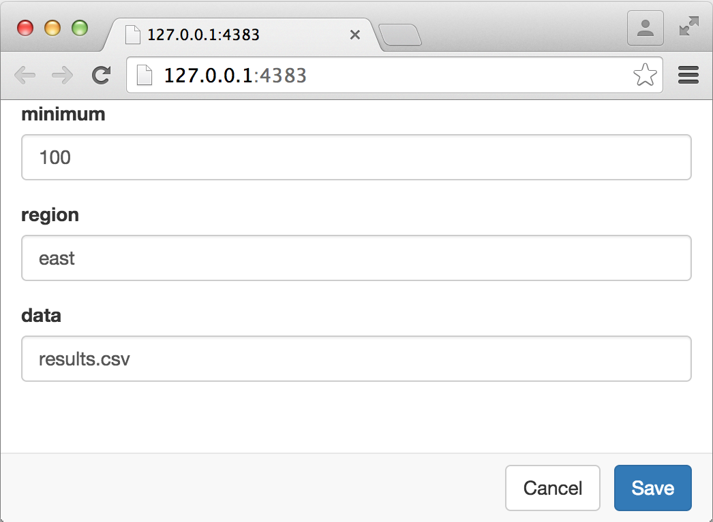
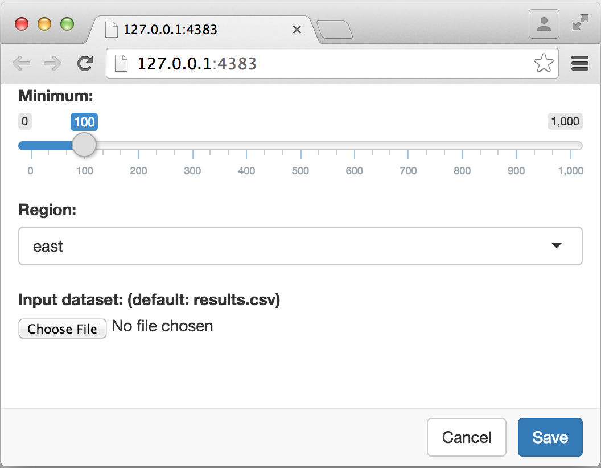

## Overview

R Markdown documents can optionally include one or more parameters. Parameters are useful when you want to re-render the same report with distinct values for various key inputs, for example:

1. Running a report specific to a department or geographic region.

2. Running a report that covers a specific period in time.

3. Running multiple versions of a report for distinct sets of core assumptions.

R Markdown parameter names, types, and default values are declared in the YAML section at the top of the document. To change these values for a given rendering you use the `params` argument to the `rmarkdown::render` function.

Note that parameterized reports are a new feature of R Markdown and therefore require very recent versions of the **knitr** (v1.11) and **rmarkdown** (v0.8) packages. You can install the most up to date versions with the following command:

```r
install.packages(c("knitr", "rmarkdown"))
```

## Declaring Parameters

### YAML Params Field

Parameters are declared using the `params` field within the YAML section at the top of the document, for example:

```yaml
---
title: My Document
output: html_document
params:
   region: east
---
```

Parameter values can be provided inline as illustrated above or can be included in a value sub-key. For example:

```yaml
---
title: My Document
output: html_document
params:
  region:
    value: east
---
```

This second form is useful when you need to provide additional details about the parameter (e.g. information about how parameters should be presented to end-users). 

### Parameter Types

All of the standard R types that can be parsed by the `yaml::yaml.load` function are supported including `character`, `integer`, `numeric`, and `logical`. In addition, you can use arbitrary other R object types by specifying the value using an R expression. For example, to specify a date or date-time you could use this code:

```yaml
---
title: My Document
output: html_document
params:
  start: !r as.Date("2015-01-01")
  snapshot: !r as.POSIXct("2015-01-01 12:30:00")
---
```

Note that the date and data-time values are prefaced with `!r`, which indicates that the value is an R expression rather than a literal value.

## Using Parameters

### Accessing from R

The declared parameters are automatically made available within the knit environment as components of a read-only list named `params`. For example, the values of the above two parameters can be accessed in a chunk with the following R code:

<pre class="markdown"><code>&#96;&#96;&#96;{r}
params$region
params$start
&#96;&#96;&#96;</code></pre>

When you preview the document in RStudio (or otherwise call the `rmarkdown::render` function with no arguments) the default parameter values listed in the YAML will be used.


### Passing Parameters

To vary the parameters of an R Markdown document from the defaults you use the `params` argument of the `rmarkdown::render` function. For example:

```r
rmarkdown::render("MyDocument.Rmd", params = list(
  region = "west",
  start = as.Date("2015-02-01")
))
```

You can of course specify only a subset of the available parameters in your call to render. For example:

```r
rmarkdown::render("MyDocument.Rmd", params = list(
  region = "west"
))
```

In this case the default values are used for any parameters not explicitly provided.

You might also find it convenient to wrap the call to render in an R function, for example:

```r
renderMyDocument <- function(region, start) {
  rmarkdown::render("MyDocument.Rmd", params = list(
    region = region,
    start = start
  ))
}
```

### Parameter User Interfaces

In the [Passing Parameters] section above we described wrapping the invocation of a report in an R funtion to allow customization of it's parameters. It's also possible to provide a user-interface for specifying parameter values.

If your document contains parameters and you specify the `params = "ask"` argument to the `render` function then a user-interface is provided to specify the parameter values. For example, consider the following parameter declarations:

```yaml
---
title: "My Document"
output: html_document
params:
  minimum: 100
  region: east
  data: results.csv
---
```

If you call the `render` function as follows:

```{r, eval=FALSE}
rmarkdown::render("MyDocument.Rmd", params = "ask")
```

Then you'll see the following user-interface for parameter entry:




The user-interface is generated using [Shiny](http://shiny.rstudio.com) and as a result can take advantage of standard Shiny input controls. You can customize inputs by adding the appropriate values to the parameter YAML. For example, the following parameters are customized to use the Shiny `sliderInput`, `selectInput`, and `fileInput` controls:

```yaml
---
title: "My Document"
output: html_document
params:
  minimum: 
    label: "Minimum:"
    value: 100
    input: slider
    min: 0
    max: 1000
  region:
    label: "Region:"
    value: east
    input: select
    choices: [east, west, north, south]
  data: 
    label: "Input dataset:"
    value: results.csv
    input: file
---
```

This results in the following user-interface for parameter editing:



The type of Shiny control used is controlled by the `input` field. The following input types are currently supported (see the help for the associated Shiny function for additional attributes which can be specified to customize the input):

| Input Type | Shiny Function |
|------|-----|
| checkbox  |  [checkboxInput](http://shiny.rstudio.com/reference/shiny/latest/checkboxInput.html)  |
| numeric  |  [numericInput](http://shiny.rstudio.com/reference/shiny/latest/numericInput.html)  |
| slider  |  [sliderInput](http://shiny.rstudio.com/reference/shiny/latest/sliderInput.html)  |
| date  |  [dateInput](http://shiny.rstudio.com/reference/shiny/latest/dateInput.html)  |
| text  |  [textInput](http://shiny.rstudio.com/reference/shiny/latest/textInput.html)  |
| file  |  [fileInput](http://shiny.rstudio.com/reference/shiny/latest/fileInput.html)  |
| radio  |  [radioButtons](http://shiny.rstudio.com/reference/shiny/latest/radioButtons.html)  |
| select  |  [selectInput](http://shiny.rstudio.com/reference/shiny/latest/selectInput.html)  |
| password  |  [passwordInput](http://shiny.rstudio.com/reference/shiny/latest/passwordInput.html)  |

Note that attributes provided for parameters are automatically passed as arguments to the respective Shiny input functions listed above.

#### RStudio Preview

When previewing an R Markdown document within RStudio you can use the **Knit with Parameters** command (available from the standard Knit toolbar menu) to specify parameters prior to previewing.


