```{r echo=FALSE}
library(knitr)
opts_chunk$set(echo=TRUE, eval=FALSE, message=FALSE)

# function for writing inline code with backticks
rinline <- function(code) {
  sprintf('``` `r %s` ```', code)
}
```

_This article is reposted from [graphdoctor.com](http://www.graphdoctor.com/archives/867) with the kind permission of Richard Layton._

### Introduction: who, why, and how? 

**Who this post is for.** This post is for RStudio users who want to use R Markdown (Rmd) scripts to create Word (docx) documents and would like to improve their control of Word styles and document design. I assume the reader has RStudio and MSWord installed but otherwise I try not to skip any details.  

**Why we need Rmd to docx.** Nearly all my professional work is collaborative and nearly all my collaborators are MSOffice users. For my portions of the work, I use R and RStudio and my reports are dynamic and reproducible. My collaborators, like many folks, use Word and Excel and their work-flows include a lot of point and click, copy and paste, and manual formatting.

But R Markdown (v2) has given me  collaboration superpowers!  

 

I can do reproducible work in R (making me happy) and format the output report in Word (making my collaborators happy). This post is about how you can learn to do that too (making you happy).  

**How to do it (briefly).** The first step towards developing your own Rmd-to-docx superpowers is to heed one sentence from the
<a href="http://rmarkdown.rstudio.com/word_document_format.html" target="_blank">R Markdown  website</a>, "For best results, the reference docx should be a modified version of a docx file produced using R Markdown." In other words:

- Use R Markdown to create a Word document  
- Edit the Word styles you find there  
- Save this document as your style reference docx file  
- Format an Rmd report using the styles reference docx file  

**How to do it (in detail)** is the rest of the article, covering  all of the above plus

- Incremental style editing
- Editing margins  
- Relative paths   
- Tables using *kable()*  
- Tables using *pander()*   
- Bibliographies

**What I cannot do** includes

- Reproducibly assigning headers and footers.  (This is possible in Rmd to PDF, but not in Rmd to docx as far as I can tell). If you need control over more than Word styles, for example, placing a company logo in the header, you might try the [ReporteRs](https://davidgohel.github.io/ReporteRs/index.html) package. I compared ReporteRs to R Markdown (v2) in an [earlier  post](http://www.graphdoctor.com/archives/3).  


### Use R Markdown to create a Word document
 
In RStudio, open a new R Markdown file.

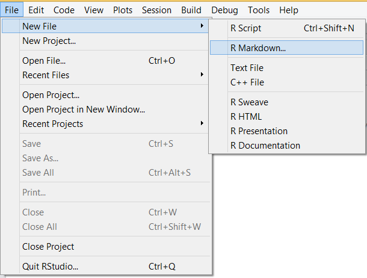

In the dialog box that appears, set the output format to Word. Title and Author are unimportant at this point. 

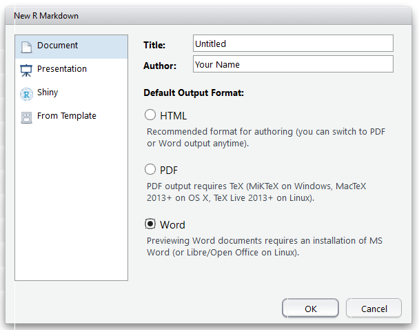

An Rmd file appears with front matter and some sample text. 

```{r}
---
title: "Untitled"
author: "Your Name"
date: "July 3, 2015"
output: word_document
---
This is an R Markdown document. Markdown is a simple 
formatting syntax for authoring HTML, PDF, and MS Word 
documents. For more details ...
```

Save this Rmd file to a convenient directory using a descriptive name. I called mine *draft-styles.Rmd*.

In RStudio, click the *Knit Word* button. 

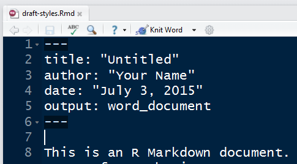

A Word document should appear.

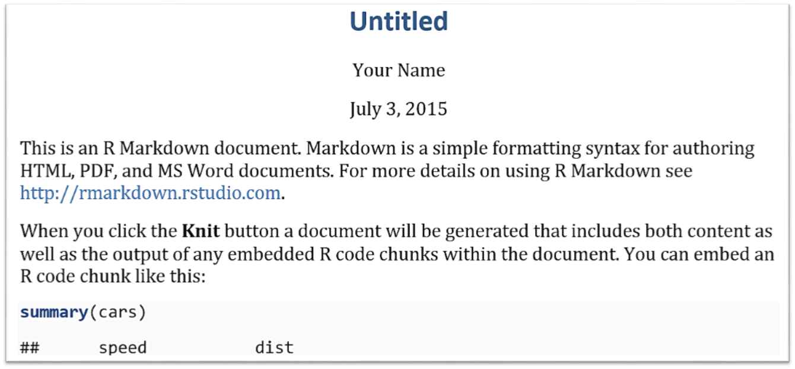

Save this Word file under a new name (for example, *word-styles-reference-01.docx*) in the same directory as the R Markdown file.

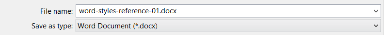

This Word document is the first draft of your styles reference docx file. Its textual content is irrelevant---its Style settings are what you will be using. 


### Edit the Word styles you find there

Continue to work with the *word-styles-reference-01.docx* file.  Select the Home ribbon tab and in the Styles group click the Styles window launcher (in the lower right corner of the group). 

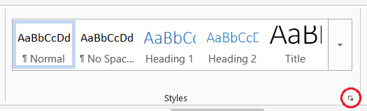

Suppose I want to change the format of the main title. I select the title in the Word document. Then in the Styles window, I scroll down until I find the style  **already assigned** to the text I selected. In this case, the assigned style is *Title*.

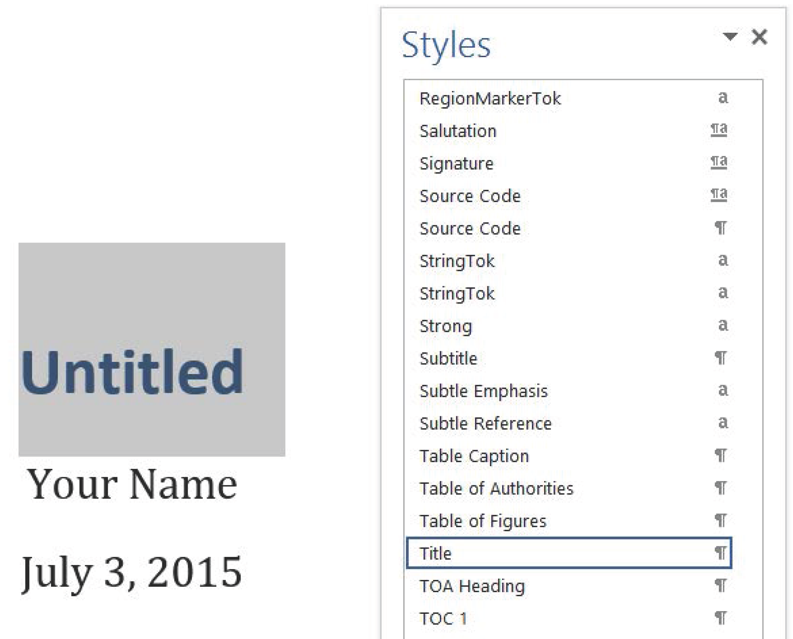

In the Word document, I reformat the title in Palatino Linotype, italic, not bold, and change the color to black (though you may assign any settings you like). In the Styles window, click on the Title style drop-down menu and select *Update Title to match selection*. 

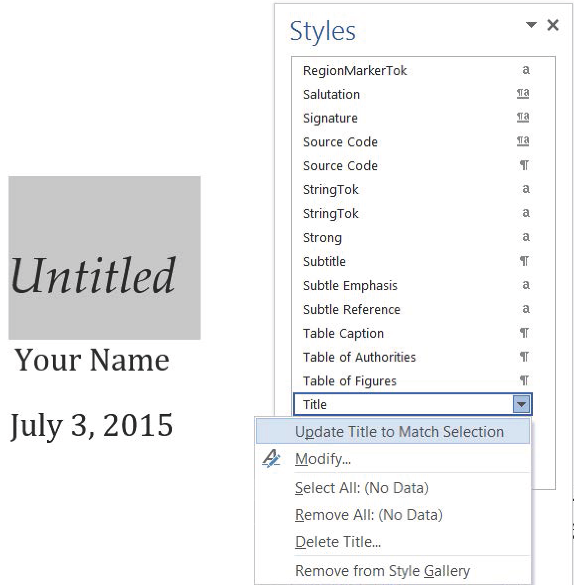

Save *word-styles-reference-01.docx*. 

You can repeat for as many styles as you like, but I suggest **incremental style editing** (described after the next section). 

> Caution. Reformat assigned styles only. Neither add new styles, change a style name, nor assign styles different from the rendered defaults. 


### Format an Rmd report using the styles reference docx file

Close the *word-styles-reference-01.docx* file. 

Return to RStudio. Close the *draft-styles.Rmd* file. We won't use it again. 

Create a new Rmd report file called *test-report.Rmd* with title *Test Report* and output format *Word*. 

Delete all the text after the header and add a new sentence, "My report starts here."

*Save* and *Knit Word*.

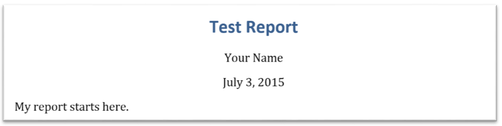

In the Rmd front matter, add new output arguments to format the report using the styles reference document.  

```{r}
---
title: "Test Report"
author: "Your Name"
date: "July 3, 2015"
output:
  word_document:
    reference_docx: word-styles-reference-01.docx
---

My report starts here.
```

*Save* and *Knit Word*.

A new Word document should appear, with the title correctly formatted. 

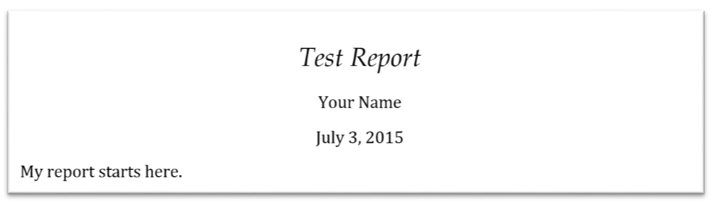


### Incremental style editing 

While you are free at any time to edit any style in the style reference docx file, I prefer editing only those styles currently in use in a document to be certain that I can see the effects of a style change---what I call incremental style editing. The process works like this:

- I write a new Rmd report with my latest style reference docx file  as the output format, then *Knit Word*.    
- I review the formatting of the new Word document. If all formatting is fine, no change to the style reference docx file is needed.  
- If style editing is needed, the cause could be that a style is in use that I've not used before or a style I have used before is applied in an unexpected way. In either case, I save the report as my new style reference document, e.g., overwriting  *word-styles-reference-01.docx* or saving it with a new number *word-styles-reference-02.docx* and use it as the    *reference_docx:* argument in the front matter.   

To illustrate, return to *test-report.Rmd* and add some headings and text as follows. 

```{r}
# Heading 1
My report starts here.

## Heading 2
And I have this next subsection. 
```

*Save* and *Knit Word*.

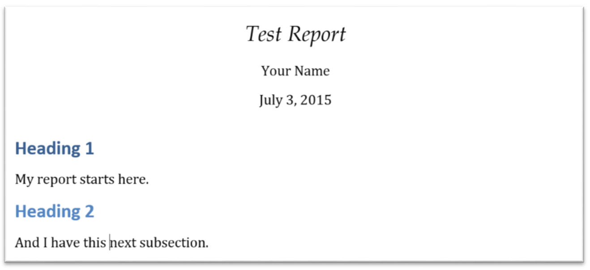

Open the Word Styles dialog box. You'll find that the styles in use are Title (a style we edited earlier), Author, Date, Heading 1, Heading 2, and Normal.   

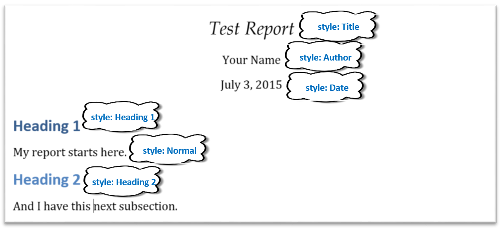

For practice, edit these styles. Try changing the font type, font size, line spacing, space before and after paragraphs, etc., until the formatting meets your needs.  

Return to the Rmd file. If needed, edit the front matter to include the correct *reference_docx:*, then *Knit Word*. The draft report should be correctly formatted. My styles changes are shown here. 

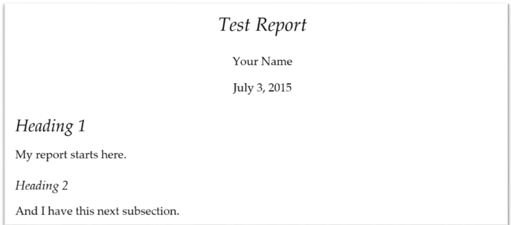

That's pretty much all there is to basic management of Word Styles from an R Markdown script.

Congratulations! You now have Rmd-to-docx superpowers. 

 


### Beyond the basics

In the next sections, I offer tips for other commonly encountered situations in document design:  

- Editing margins  
- Relative paths   
- Tables using *kable()*  
- Tables using *pander()*   
- Bibliography


### Editing margins

Setting margins is not the same as setting styles, but the margins set in the styles reference docx are applied in reports calling  that reference. 

Open the styles reference docx file. Select the Page Layout ribbon, Page Setup group, Margins list. Select the margins you want. *Save*. 

Open the *test-report.Rmd*, click *Knit Word*, and the new report should have the margins you set in the styles reference file. (This tip did not work for me a year ago but seems to work today. I don't know why, so it may be a fragile method.)


### Relative paths 

If making your work reproducible is important to you (and it should be!), you are probably organizing your directories and files in some systematic way. My current approach is to assign the project working directory to the project top-level directory by using the RStudio project feature and then create the following sub-directories.

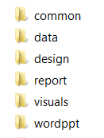

The two directories I want to discuss here are *common* and *reports*.  The common directory is for document elements I re-use from project to project, e.g., business logo, LaTeX preambles, bibliography files, etc. I save my styles reference files in this directory. The reports directory is for Rnw or Rmd markup scripts that produce reproducible reports. 

In the main directory you are using for this tutorial, create subdirectories called *common* and *reports*. Close and move the *word-styles-reference-01.docx* file to the common  sub-directory and close and move the *test-report.Rmd* file to the reports sub-directory. Open the Rmd file. In the front matter edit the name of the styles reference file to include its path relative to the report file as shown below. (On my machine, the quotation marks seem to be optional.)

```{r}
output:
  word_document:  
    reference_docx: "../common/word-styles-reference-01.docx"
```


### Tables using *kable()*

In Ch. 8 of (Stodden, Leisch, & Peng, ed. 2014), Hoefling & Rossini note that support for tables is one of the impediments to reproducibility. Packages *knitr* and *pander* have made some progress in this area. 

The *knitr* package provides a *kable()* function for creating tables with a minimum of fuss but with limited control of formatting. However, the default alignments are good, making this a useful function for initial drafts. 

Returning to the *test-report.Rmd* file, at the end of the current file add some text, 

```{r}
# Make a table
Create a subset of the mtcars data. 
```

and a code chunk to extract a subset of data from the *mtcars* data set. 

```{r}
library(dplyr)
# extract a subset of the mtcars data
df <- mtcars %>%
	mutate(make_model = row.names(mtcars)) %>%
	filter(cyl == 4) %>%	
	select(make_model, mpg, wt) %>%
	mutate(wt = wt*1000) %>%
	arrange(make_model) 
```

Add some text followed by a code chunk,

```{r}
Then use *knitr::kable()* to create the table.

library(knitr)
kable(df) 
```

*Save* and *Knit Word*. 

The document output includes:

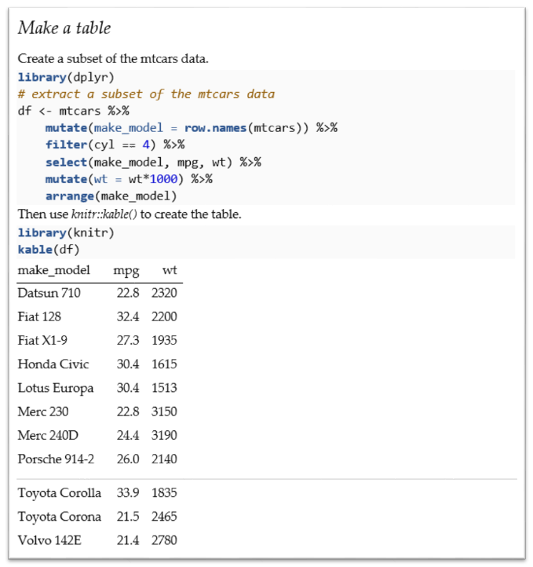

The first thing I notice is that I need some white space to separate text from the code chunks and from the table. We can use the HTML line break tag &lt;br&gt; on its own line to create the extra white space. ([Markdown](http://daringfireball.net/projects/markdown/) began, after all, as a "text-to-HTML conversion tool for web writers.") Note too the *message=FALSE* option in the first code chunk and the *echo=FALSE* option in the second code chunk. 

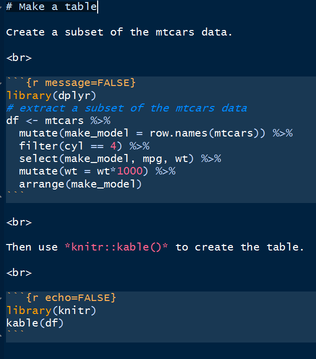

*Save* and *Knit Word*.  

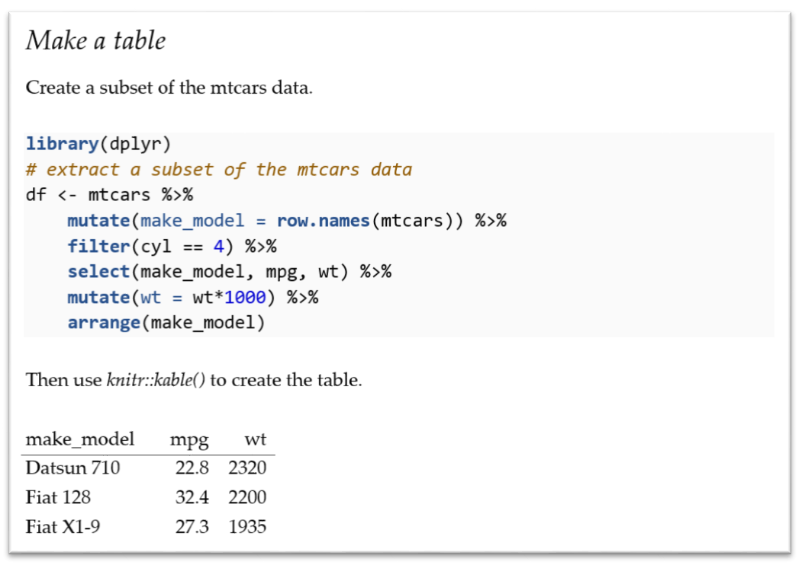

To edit style of the table entries, select one entry, reduce the font size and change the typeface to a sans serif font, find the style in the Styles menu (Compact), and *Update Compact to match selection*. 

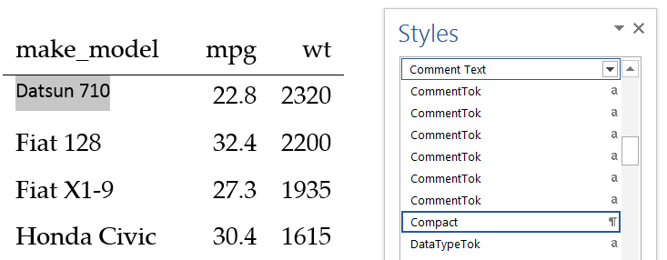

*Save As* and overwrite *word-styles-reference-01.docx*. 

Return to *test-report.Rmd* and *Knit Word*. All the table entries should match your new style. 

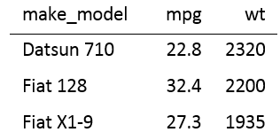


### Tables using *pander()*

If the *kable()* output does not meet your needs, the [pander](https://cran.r-project.org/web/packages/pander/index.html) package is an R pandoc writer that offers additional control for tables and other elements. 

Install the *pander* package. 

In the Rmd file, add a code chunk to set some pander table-layout options. I usually place initializing code chunks like this at the top of a script. 

```{r}
# set pander table-layout options
library(pander)
panderOptions('table.alignment.default', function(df)
	ifelse(sapply(df, is.numeric), 'right', 'left'))
panderOptions('table.split.table', Inf)
panderOptions('big.mark', ",")
panderOptions('keep.trailing.zeros', TRUE)
```

Then in the body of the report, print the data frame as a table using *pander()*

```{r}
pander(df)
```

*Save* and *Knit Word* produces this table:

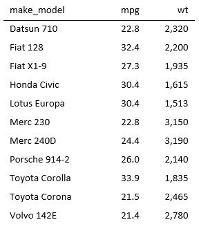

The style of the table entries using *pander()*  is the same (Compact) as the style in the earlier table made with *kable()*.   As specified in the *pander* options, numeric values are right-aligned, character values are left-aligned, and the thousands separator (big mark) is a comma. 


### Bibliographies

I use the bib format for bibliographies (other formats are available). The  basic steps are: 

- Write the bib file  
- Specify the bibliography file in the front matter  
- Cite references in markdown format  
- Include a references section heading at the end of the Rmd script
- Format the bibliography style in the styles reference docx file


*Write the bib file* following conventional BibTeX practice. For example, to cite the 2014 book *Implementing Reproducible Research* edited by Stodden, Leisch, and Peng, the bib file includes

```{r}
@book{Stodden2014,
    editor    = "Victoria Stodden and Friedrich Leisch 
    and Roger D. Peng",
    title     = "Implementing Reproducible Research",
    year      = "2014",
    publisher = "Taylor \& Francis Group LLC",
    address   = "Boca Raton, FL",  
}
```

The first line includes my label *Stodden2014* to identify this reference. The file is saved as *RepResRef.bib* in my common directory. See any BibTeX reference, for example, the page at [verbosus](https://verbosus.com/bibtex-style-examples.html), for style possibilities and arguments. 


*Specify the bibliography file.* Add the bibliography argument to the front matter including the relative path if needed.  

```{r}
---
title: "Test Report"
author: "Your Name"
date: "July 3, 2015"
output:
  word_document:
    reference_docx: ../common/word-styles-reference-01.docx
bibliography: ../common/RepResRef.bib 
---
```


*Cite references* in markdown format. To illustrate, in the Rmd report file, add some text with the citation. 

```{r}
In [@Stodden2014], authors mentioned Word tables as one of the
obstacles to effective collaboration.
```


*Include a references section heading* at the end of the Rmd script.

```{r}
### References
```

*Save* and *Knit Word*.


*Format the bibliography style.*  In the Word report document, select the reference. Select the Home ribbon tab, and in the Paragraph group, click the Paragraph settings window launcher. 

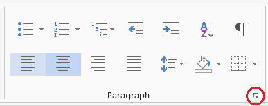

In the Paragraph settings window, change the indent to *Hanging*. Click *OK*.

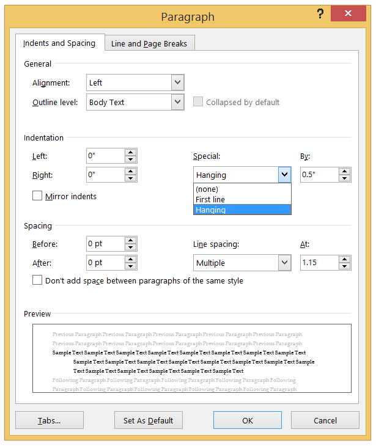

In the Home ribbon tab, in the Font group, change the font size to 9. 

In the Home ribbon tab, in the Styles group, launch the styles window. Find that style already assigned to the reference (Bibliography style) and, as we've done before, select *Update Bibliography to match selection*.

*Save* and *Knit Word*.

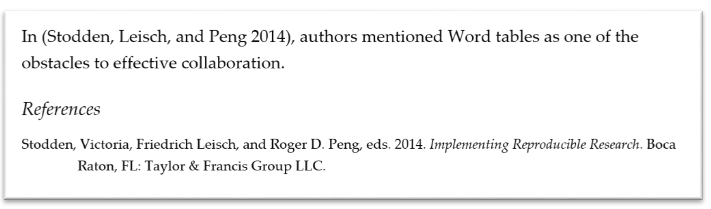

*Save As* and overwrite *word-styles-reference-01.docx*. 

Return to *test-report.Rmd* and *Knit Word*. The format of the reference should match the style changes we made. It will apply to future bibliography entries too. 

More collaboration superpowers!

 


### Session information

- RStudio version 0.99.447  
- Word 2013  

```{r echo=FALSE, eval=TRUE}
print(sessionInfo(), locale=FALSE)
```


<br>

### Image credits 

"Pow" by [Sean MacEntee](https://www.flickr.com/photos/smemon/albums) is licensed under [CC BY 2.0](https://creativecommons.org/licenses/by-sa/2.0/). 


### References

Stodden, Victoria, Friedrich Leisch, and Roger D. Peng, eds. 2014. *Implementing Reproducible Research*. Boca Raton, FL: Taylor & Francis Group LLC.


