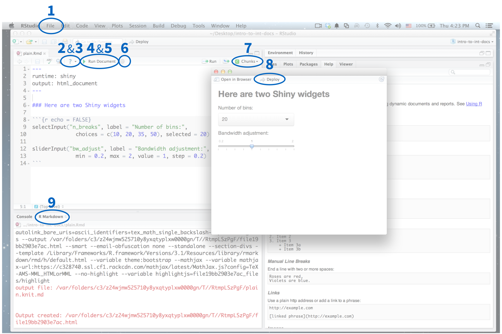
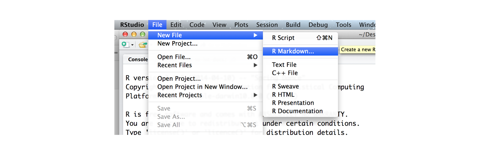
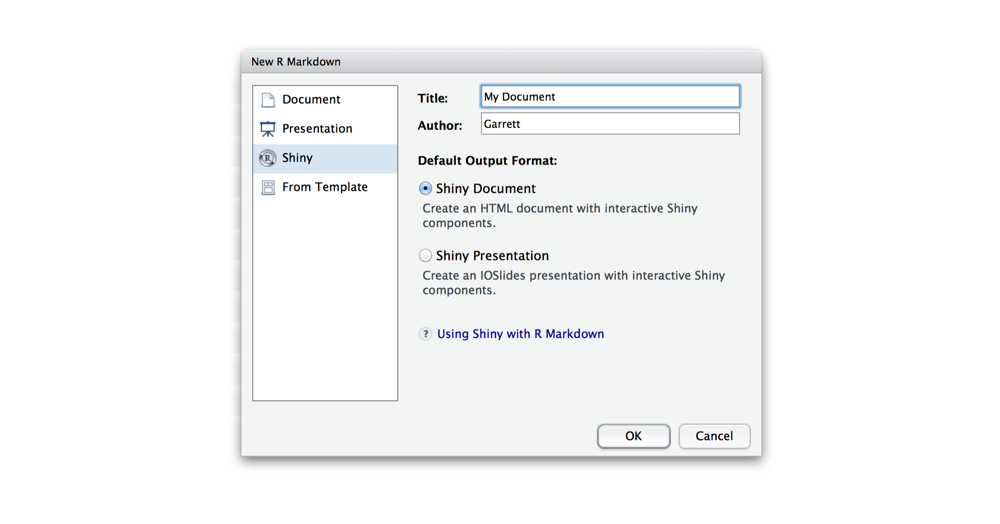
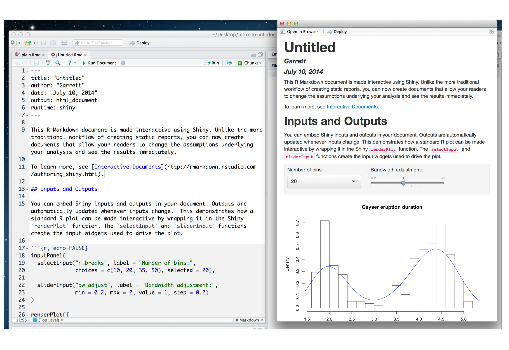
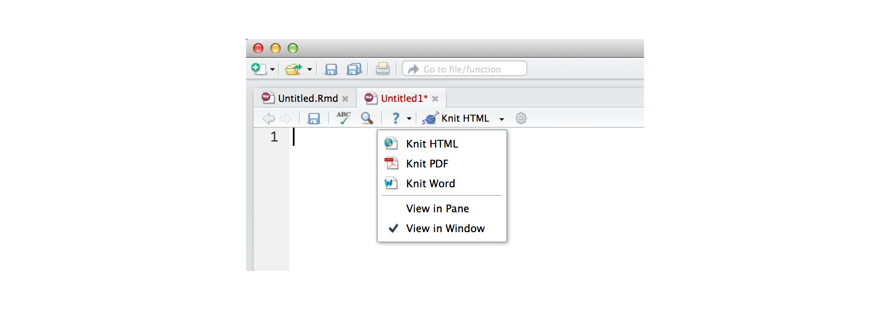
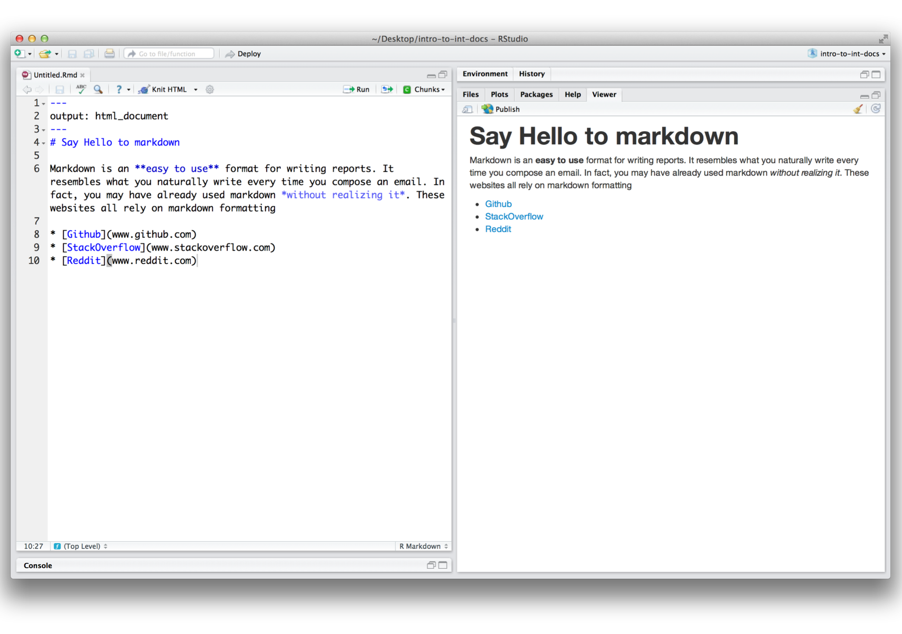
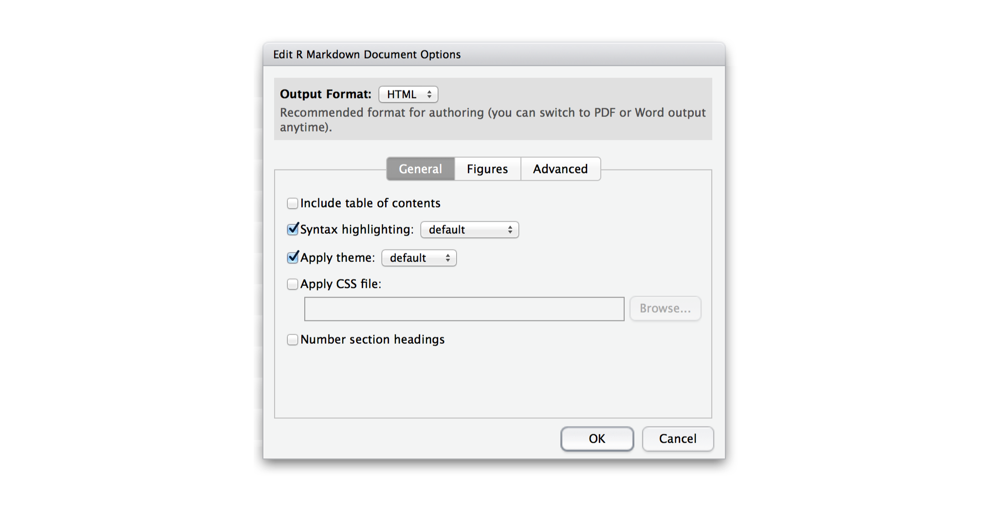
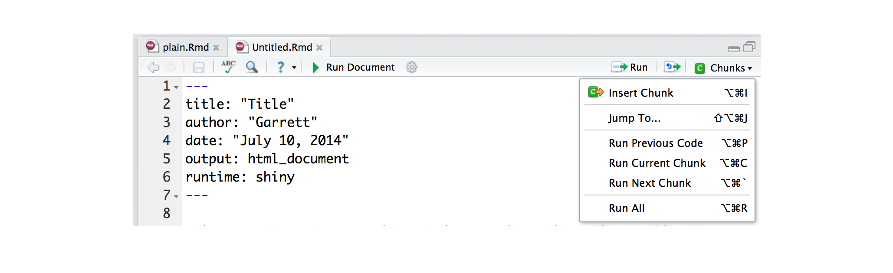

[Introduction to interactive documents](../articles/interactive-docs.html) describes how to use R Markdown to build light-weight Shiny apps that are easy to assemble. 

The RStudio IDE contains many features that make it easy to write and run interactive documents. This article will highlight some of the most useful:

1. File templates
2. _Using R Markdown_
3. _Markdown Quick Reference_
4. The Run Document button
5. The Viewer Pane
6. Document options
7. Insert Chunk
8. Deploy to shinyapps.io
9. The R Markdown console

 

## 1. File templates

The RStudio IDE provides a template document when you open a new .Rmd file. To open a new file, click File > New File > R Markdown in the RStudio menu bar. 

A window will pop up that helps you build the YAML frontmatter for the .Rmd file. 

From the window's sidebar, select the category of output that you plan to convert your .Rmd file into. You can select

* __Document__ - a static document
* __Presentation__ - an ioslides or beamer slideshow
* __Shiny__ - an interactive document
* __From Template__ - a format that you have pre-saved as a template (if you have one)

Use the radio buttons to select the specific type of output that you wish to build. Your options will depend on the category you selected in the sidebar.

You can also use the window to give your file a title and author field.

To make an interactive document, select Shiny from the sidebar and Shiny Document from the radio buttons. Then click OK.

RStudio will open a new .Rmd file for you to use. The file will contain a YAML header that includes all of the parameters that your file will need to correctly render with `rmarkdown::render()`. You can manually change these parameters afterwords if you like.

RStudio will fill the rest of the file with a template that demonstrates the basic features of .Rmd files. The templates work right out of the box, which means that you can immediately knit or run one. The image below shows the template for interactive documents.

Study the template as a refresher on R Markdown, or erase it and begin writing your own document.

## 2. Using R Markdown

The IDE places a question mark icon in the scripts pane whenever you open a .Rmd file. The question mark opens a drop down menu with two helpful resources.

The first option, "Using R Markdown," opens the development website for the `rmarkdown` package, [rmarkdown.rstudio.com](http://rmarkdown.rstudio.com). Here you can look up the many useful features of R Markdown.

## 3. Markdown Quick Reference

The second link, "Markdown Quick Reference," opens a reference guide to the markdown syntax. This guide will appear in the help pane of the RStudio IDE. 

The guide uses examples to explain the different formatting options of markdown. It is like a markdown cheatsheet that is built right in to the RStudio IDE.

## 4. The Run Document button

If your .Rmd file contains `runtime: shiny` in its YAML header, the RStudio IDE will display a "Run Document" button at the top of the scripts pane.

The "Run Document" button is a shortcut for the `rmarkdown::render` command. It let's you quickly render your .Rmd file into an interactive document hosted locally on your computer. The RStudio IDE will diplay your document in a preview window.

You can edit the .Rmd file while the preview is running. To see your changes, save the .Rmd file. Then click the refresh icon in the top left corner of the preview window.

If your .Rmd file does not contain `runtime: shiny`, the RStudio IDE will display a "Knit HTML" button in place of the "Run Document" button. The "Knit HTML" button works in the same way. It renders your .Rmd file and launches a preview of your output document. 

The Knit HTML button contains a dropdown menu that let's you choose which type of output to knit your file into (this will override the output type specified in your file's YAML header).

## 5. Viewer Pane

By default, the RStudio IDE opens a preview window to display the output of your .Rmd file. However, you can choose to display the output in a dedicated viewer pane.

To do this, select "View in Pane" for m the drop down menu that appears when you click on the "Run Document" button (or "Knit HTML" button).

The viewer pane provides a side-by-side view that resembles some text and Latex editors.

## 6. Document options

The gear icon beside "Run Document" opens a wizard that lets you customize your interactive document. You can use this wizard to 

* Include a table of contents
* Apply syntax highlighting to code chunks
* Apply one of eight built in bootstrap CSS themes to your document
* Link to your own custom CSS file to style your document
* Number section headings
* Size figures and add captions, and
* Tweak the render process

Set the features you like, and the RStudio IDE will apply them when you click "Run Document".

## 7. Insert Chunk

The Chunks button in the top left corner of the Scripts pane opens a dropdown menu that you can use to manage code chunks in your .Rmd file.

The first option in the menu is the most useful. "Insert Chunk" will insert a blank code chunk into your .Rmd file at the location of your cursor. You can then fill this chunk with code.

You can use basic RStudio tab completion to write arguments inside the `{r}` braces at the top of each code chunk.

## 8. Deploy to shinyapps.io

If you've set up the `shinyapps` package as described in [Getting started with shinyapps.io](../articles/shinyapps.html), the RStudio IDE will place a deploy button at the top of your interactive document's preview window.

You can click this button to deploy your document directly to your shinyapps.io account. Shinyapps.io will host the document at its own web URL for people to visit.

## 9. The R Markdown console

When you render a .Rmd file, the RStudio IDE opens a second console pane that displays R Markdown output. This pane shows the status of the render process and displays any errors or warnings that occur while rendering your document. If your document is an interactive document, the pane will also display errors that occur while you navigate the app.

This extra pane keeps your original R console clean and uncluttered.
