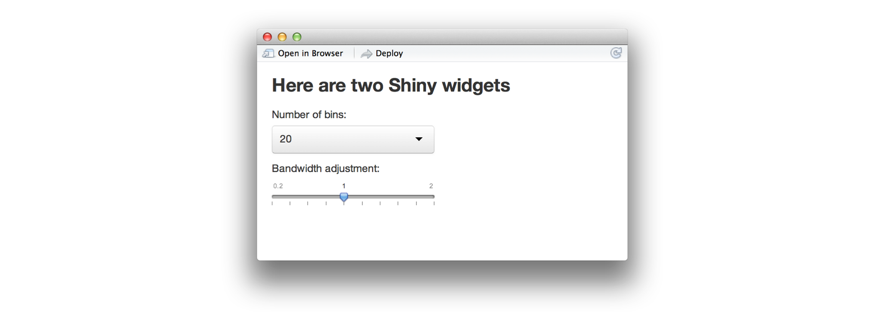
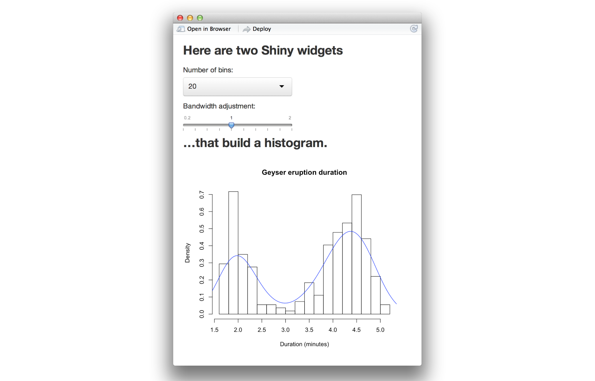
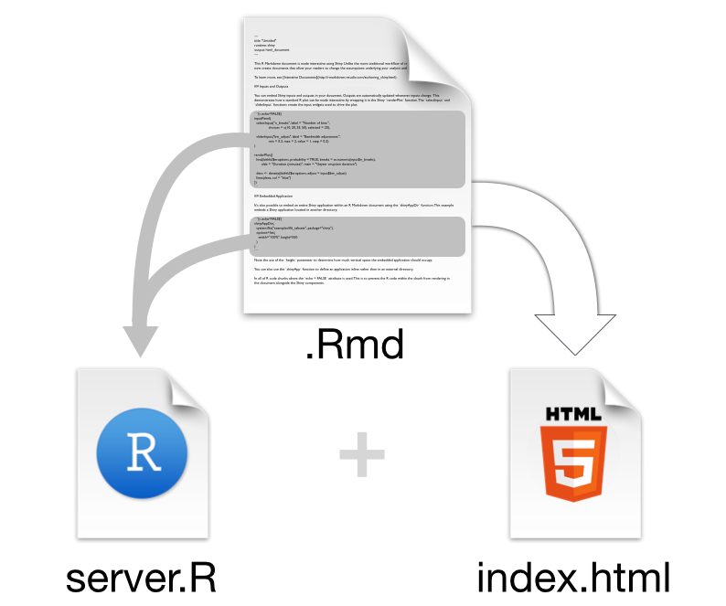

Interactive documents are a new way to build Shiny apps. An interactive document is an [R Markdown](http://rmarkdown.rstudio.com) file that contains Shiny widgets and outputs. You write the report in [markdown](http://daringfireball.net/projects/markdown/basics), and then launch it as an app with the click of a button.

## R Markdown

The previous article, [Introduction to R Markdown](rmarkdown.html), described how to write R Markdown files. R Markdown files are useful because

* They are quick and easy to write.
* You can embed executable R code into your file, which saves manual labor and creates a reproducible report.
* You can convert R Markdown files into HTML, PDF, and Word documents with the click of a button.
* You can convert R Markdown files into ioslides and beamer slideshows with the click of a button.

In fact, R Markdown files are the ultimate R reporting tool. 

This article will show you one more thing that R Markdown files can do: you can embed Shiny components in an R Markdown file to create an interactive report or slideshow.

Your report will be a complete Shiny app. In fact, R Markdown provides the easiest way to build light-weight Shiny apps. I will refer to apps that combine Shiny with R Markdown as _interactive documents_.

## Interactive documents

You can make an R Markdown document interactive in two steps:

1. add `runtime: shiny` to the document's YAML header.
2. add Shiny widgets and Shiny render functions to the file's R code chunks

The `rmarkdown` package will compile your document into a reactive Shiny app. The document will look just as it would otherwise, but it will include reactive components.

### runtime: shiny

Notify `rmarkdown` that your file contains Shiny components by adding `runtime: shiny` to the file's YAML header. RStudio will change its "Knit" icon to a "Run Document" icon when you save this change.

"Run Document" is a cue that `rmarkdown` will no longer compile your document into a static file. Instead it will "run" the document as a live Shiny app.

Since the document is a Shiny app, you must render it into an HTML format. Do this by selecting either `html_document` or `ioslides_presentation` for your final output.

### Widgets

To add a widget to your document, call a Shiny widget function in an R code chunk. R Markdown will add the widget to the code chunk's output. 

For example, the file below creates an HTML document with two widgets.

<pre class="r"><code>
---
runtime: shiny
output: html_document
---

### Here are two Shiny widgets

&#96``{r echo = FALSE}
selectInput("n_breaks", label = "Number of bins:",
              choices = c(10, 20, 35, 50), selected = 20)
  
sliderInput("bw_adjust", label = "Bandwidth adjustment:",
              min = 0.2, max = 2, value = 1, step = 0.2)
&#96``
</code></pre>

The document looks like this when rendered. (_This is a static image of the output, the actual widgets are "live"; you can manipulate them_).

### Rendered output

To add reactive output to your document, call one of the `render*` functions below in an R code chunk. 

render function  | creates
------------- | -------------
`renderImage`  | images (saved as a link to a source file)
`renderPlot`  | plots
`renderPrint` | any printed output
`renderTable` | data frame, matrix, other table like structures
`renderText` | character strings
`renderUI` | a Shiny tag object or HTML

 
R Markdown will include the rendered output in the result of the code chunk. 

This output will behave like rendered output in a standard Shiny app. The output will automatically update whenever you change a widget value or a reactive expression that it depends on.

The file below uses `renderPlot` to insert a histogram that reacts to the two widgets.

<pre class="r"><code>
---
runtime: shiny
output: html_document
---

### Here are two Shiny widgets

&#96``{r echo = FALSE}
selectInput("n_breaks", label = "Number of bins:",
              choices = c(10, 20, 35, 50), selected = 20)
  
sliderInput("bw_adjust", label = "Bandwidth adjustment:",
              min = 0.2, max = 2, value = 1, step = 0.2)
&#96``

### ...that build a histogram.

&#96``{r echo = FALSE}
renderPlot({
  hist(faithful$eruptions, probability = TRUE, breaks = as.numeric(input$n_breaks),
       xlab = "Duration (minutes)", main = "Geyser eruption duration")
  
  dens <- density(faithful$eruptions, adjust = input$bw_adjust)
  lines(dens, col = "blue")
})
&#96``
</code></pre>

The document creates the app below when you click "Run Document."

### The structure of an interactive document

When you run an interactive document, `rmarkdown` extracts the code in your code chunks and places them into a pseudo server.R file. R Markdown uses the html output of the markdown file as an [index.html](html-ui.html) file to place the reactive elements into.

As a result, outputs in one code chunk can use widgets and reactive expressions that occur in other code chunks.

Since the R Markdown document provides a layout for the app, you do not need to write a ui.R file.

## Sharing interactive documents

Interactive documents are a type of Shiny app, which means that you can share them in the same way that you share other Shiny apps. You can

1. Email a .Rmd file to a colleague. He or she can run the file locally by opening the file and clicking "Run Document"
2. Host the document with [Shiny Server](http://www.rstudio.com/products/shiny/shiny-server/) or [Shiny Server Pro](http://www.rstudio.com/products/shiny/shiny-server/)
3. Host the document at [ShinyApps.io](http://www.shinyapps.io)

_Note: If you are familiar with R Markdown, you might expect RStudio to save an HTML version of an interactive document in your working directory. However, this only works with static HTML documents. Each interactive document must be served by a computer that manages the document. As a result, interactive documents cannot be shared as a standalone HTML file._

## Conclusion

Interactive documents provide a new and easy way to make Shiny apps. 

Interactive documents will not replace standard Shiny apps since they cannot provide the design options that come with a ui.R or index.html file. However, interactive documents do create some easy wins:

* The R Markdown workflow makes it easy to build light-weight apps. You do not need to worry about laying out your app or building an HTML user interface for the app. 

* You can use R Markdown to create interactive slideshows, something that is difficult to do with Shiny alone. To create a slideshow, change `output: html_document` to `output: ioslides_presentation` in the YAML front matter of your .Rmd file. R Markdown will divide your document into slides when you click "Run Document." A new slide will begin whenever a header or horizontal rule (`***`) appears.

* Interactive documents enhance the existing R Markdown workflow. R Markdown makes it easy to write literate programs and reproducible reports. You can make these reports even more effective by adding Shiny to the mix.

To learn more about R Markdown and interactive documents, please visit [rmarkdown.rstudio.com](http://rmarkdown.rstudio.com).
