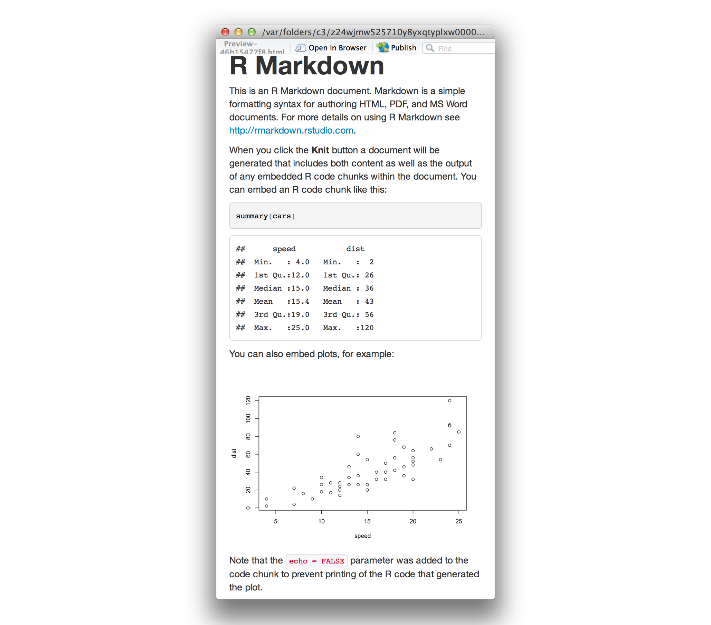
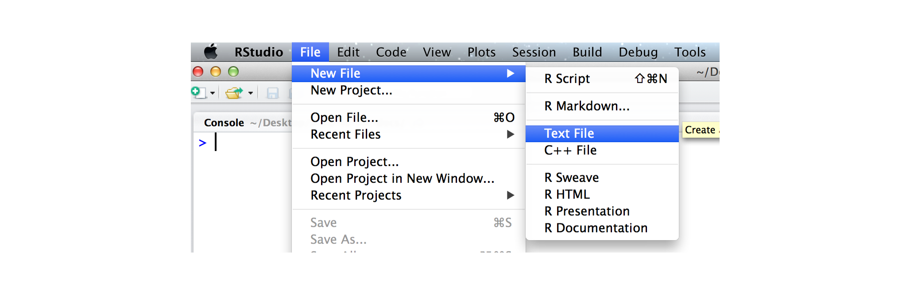
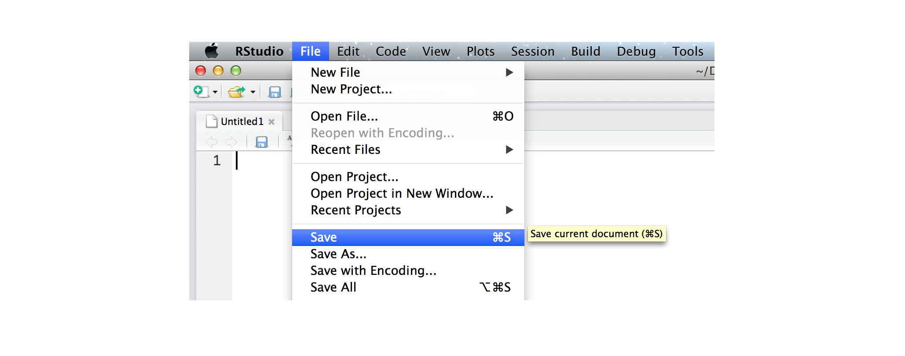
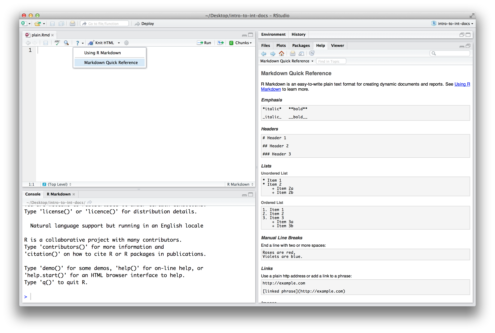
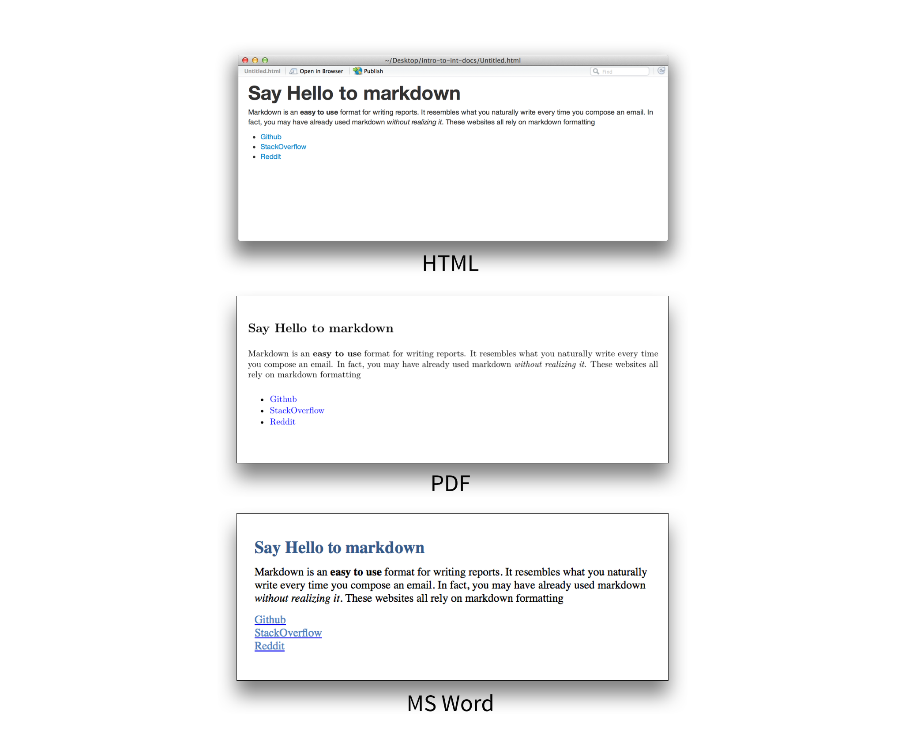
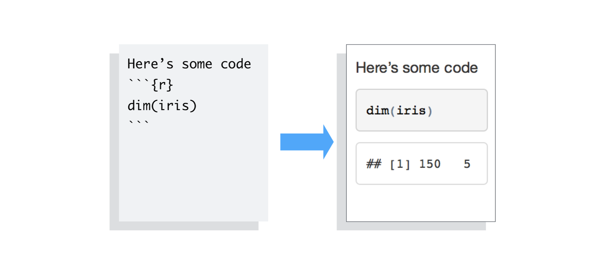
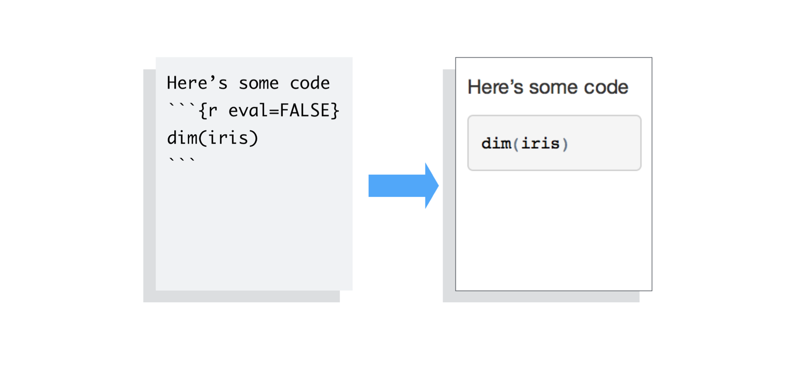
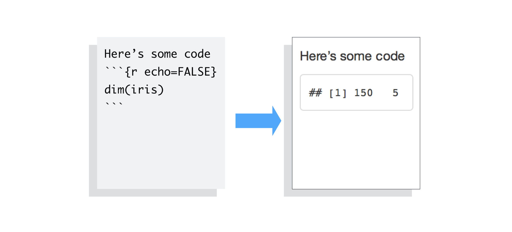
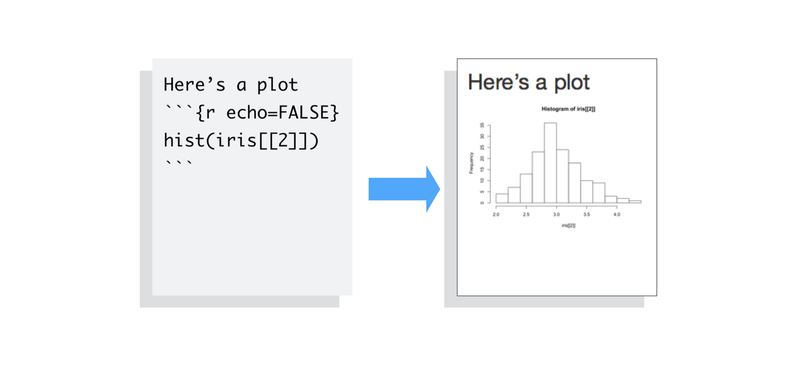
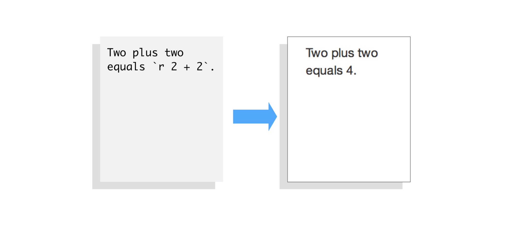

Interactive documents are a new way to build Shiny apps. An interactive document is an [R Markdown](http://rmarkdown.rstudio.com) file that contains Shiny widgets and outputs. You write the report in [markdown](http://daringfireball.net/projects/markdown/basics), and then launch it as an app with the click of a button.

This article will show you how to write an R Markdown report.

The companion article, [Introduction to interactive documents](interactive-docs.html), will show you how to turn an R Markdown report into an interactive document with Shiny components.


## R Markdown

R Markdown is a file format for making dynamic documents with R. An R Markdown document is written in markdown (an easy-to-write plain text format) and contains chunks of embedded R code, like the document below. 

<pre><code>---
output: html_document
---

This is an R Markdown document. Markdown is a simple formatting syntax for authoring HTML, PDF, and MS Word documents. For more details on using R Markdown see <http://rmarkdown.rstudio.com>.

When you click the **Knit** button a document will be generated that includes both content as well as the output of any embedded R code chunks within the document. You can embed an R code chunk like this:

&#96``{r}
summary(cars)
&#96``

You can also embed plots, for example:

&#96``{r, echo=FALSE}
plot(cars)
&#96``

Note that the `echo = FALSE` parameter was added to the code chunk to prevent printing of the R code that generated the plot.</code></pre>

R Markdown files are designed to be used with the `rmarkdown` package. `rmarkdown` comes installed with the RStudio IDE, but you can acquire your own copy of `rmarkdown` from CRAN with the command

<pre class="r"><code>install.packages("rmarkdown")</code></pre>

R Markdown files are the source code for rich, reproducible documents. You can transform an R Markdown file in two ways.

1. **knit** - You can _knit_ the file. The `rmarkdown` package will call the `knitr` package. `knitr` will run each chunk of R code in the document and append the results of the code to the document next to the code chunk. This workflow saves time and facilitates reproducible reports. 

    Consider how authors typically include graphs (or tables, or numbers) in a report. The author makes the graph, saves it as a file, and then copy and pastes it into the final report. This process relies on manual labor. If the data changes, the author must repeat the entire process to update the graph.

    In the R Markdown paradigm, each report contains the code it needs to make its own graphs, tables, numbers, etc. The author can automatically update the report by re-knitting.

2. **convert** - You can _convert_ the file. The `rmarkdown` package will use the `pandoc` program to transform the file into a new format. For example, you can convert your .Rmd file into an HTML, PDF, or Microsoft Word file. You can even turn the file into an HTML5 or PDF slideshow. `rmarkdown` will preserve the text, code results, and formatting contained in your original .Rmd file.

    Conversion lets you do your original work in markdown, which is very easy to use. You can include R code to knit, and you can share your document in a variety of formats.

In practice, authors almost always knit and convert their documents at the same time. In this article, I will use the term _render_ to refer to the two step process of knitting and converting an R Markdown file.

You can manually render an R Markdown file with `rmarkdown::render()`. This is what the above document looks like when rendered as a HTML file.



In practice, you do not need to call `rmarkdown::render()`. You can use a button in the RStudio IDE to render your reprt. R Markdown is heavily [integrated into the RStudio IDE](../articles/rmd-integration.html).

## Getting started

To create an R Markdown report, open a plain text file and save it with the extension _.Rmd_. You can open a plain text file in your scripts editor by clicking File > New File > Text File in the RStudio toolbar.



Be sure to save the file with the extension _.Rmd_. The RStudio IDE enables several helpful buttons when you save the file with the .Rmd extension. You can save your file by clicking File > Save in the RStudio toolbar.



R Markdown reports rely on three frameworks

1. markdown for formatted text
2. `knitr` for embedded R code
3. YAML for render parameters

The sections below describe each framework.

## Markdown for formatted text

.Rmd files are meant to contain text written in [markdown](http://daringfireball.net/projects/markdown/basics). Markdown is a set of conventions for formatting plain text. You can use markdown to indicate

* bold and italic text
* lists
* headers (e.g., section titles)
* hyperlinks
* and much more

The conventions of markdown are very unobtrusive, which make Markdown files easy to read. The file below uses several of the most useful markdown conventions.

<pre class="r"><code>
# Say Hello to markdown

Markdown is an **easy to use** format for writing reports. It resembles what you naturally write every time you compose an email. In fact, you may have already used markdown *without realizing it*. These websites all rely on markdown formatting

* [Github](www.github.com)
* [StackOverflow](www.stackoverflow.com)
* [Reddit](www.reddit.com)

</code></pre>

The file demonstrates how to use markdown to indicate:

1. **headers** - Place one or more hashtags at the start of a line that will be a header (or sub-header). For example, `# Say Hello to markdown`. A single hashtag creates a first level header. Two hashtags, `##`, creates a second level header, and so on.
2. **italicized and bold text** - Surround italicized text with asterisks, like this `*without realizing it*`. Surround bold text with two asterisks, like this `**easy to use**`.
3. **lists** - Group lines into bullet points that begin with asterisks. Leave a blank line before the first bullet, like this

        This is a list

        * item 1
        * item 2
        * item 3

4. **hyperlinks** - Surround links with brackets, and then provide the link target in parentheses, like this `[Github](www.github.com)`.

You can learn about more of markdown's conventions in the _Markdown Quick Reference_ guide, which comes with the RStudio IDE.

To access the guide, open a _.md_ or _.Rmd_ file in RStudio. Then click the question mark that appears at the top of the scripts pane. Next, select "Markdown Quick Reference". RStudio will open the _Markdown Quick Reference_ guide in the Help pane.



### Rendering

To transform your markdown file into an HTML, PDF, or Word document, click the "Knit" icon that appears above your file in the scripts editor. A drop down menu will let you select the type of output that you want.


When you click the button, `rmarkdown` will duplicate your text in the new file format. `rmarkdown` will use the formatting instructions that you provided with markdown syntax. 

Once the file is rendered, RStudio will show you a preview of the new output and save the output file in your working directory.

Here is how the markdown script above would look in each output format.



_Note: RStudio does not build PDF and Word documents from scratch. You will need to have a distribution of Latex installed on your computer to make PDFs and Microsoft Word (or a similar program) installed to make Word files._

## knitr for embedded R code

The `knitr` package extends the basic markdown syntax to include chunks of executable R code. 

When you render the report, `knitr` will run the code and add the results to the output file. You can have the output display just the code, just the results, or both.

To embed a chunk of R code into your report, surround the code with two lines that each contain three backticks. After the first set of backticks, include `{r}`, which alerts `knitr` that you have included a chunk of R code. The result will look like this

<pre class="r"><code>
Here’s some code
```{r}
dim(iris)
```
</code></pre>

When you render your document, `knitr` will run the code and append the results to the code chunk. `knitr` will provide formatting and syntax highlighting to both the code and its results (where appropriate).

As a result, the markdown snippet above will look like this when rendered (to HTML).



To omit the _results_ from your final report (and not run the code) add the argument `eval = FALSE` inside the brackets and after `r`. This will place a copy of your code into the report.



To omit the _code_ from the final report (while including the results) add the argument `echo = FALSE`. This will place a copy of the results into your report.



`echo = FALSE` is very handy for adding plots to a report, since you usually do not want to see the code that generates the plot.



`echo` and `eval` are not the only arguments that you can use to customize code chunks. You can learn more about formatting the output of code chunks at the [rmarkdown](http://rmarkdown.rstudio.com/authoring_rcodechunks.html) and [knitr](http://yihui.name/knitr/options) websites.

### Inline code

To embed R code in a line of text, surround the code with a pair of backticks and the letter `r`, like this.

<pre class="r"><code>
Two plus two equals `r 2 + 2`.
</code></pre>

`knitr` will replace the inline code with its result in your final document (inline code is _always_ replaced by its result). The result will appear as if it were part of the original text. For example, the snippet above will appear like this:



## YAML for render parameters

You can use a YAML header to control how `rmarkdown` renders your .Rmd file. A YAML header is a section of `key: value` pairs surrounded by `---` marks, like below

<pre class="r"><code>
---
title: "Untitled"
author: "Garrett"
date: "July 10, 2014"
output: html_document
---

Some inline R code, `r 2 + 2`.
</code></pre>

The `output:` value determines what type of output to convert the file into when you call `rmarkdown::render()`. _Note: you do not need to specify `output:` if you render your file with the RStudio IDE knit button._

`output:` recognizes the following values:

* `html_document`, which will create HTML output (default)
* `pdf_document`, which will create PDF output
* `word_document`, which will create Word output

If you use the RStudio IDE knit button to render your file, the selection you make in the gui will override the `output:` setting.

### Slideshows

You can also use the `output:` value to render your document as a slideshow. 

* `output: ioslides_presentation` will create an ioslides (HTML5) slideshow 
* `output: beamer_presentation` will create a beamer (PDF) slideshow

_Note: The knit button in the RStudio IDE will update to show slideshow options when you include one of the above output values and save your .Rmd file._

`rmarkdown` will convert your document into a slideshow by starting a new slide at each header or horizontal rule (e.g., `***`).

Visit [rmakdown.rstudio.com](http://rmarkdown.rstudio.com/html_document_format.html) to learn about more YAML options that control the render process.

## Recap

R Markdown documents provide quick, reproducible reporting from R. You write your document in markdown and embed executable R code chunks with the `knitr` syntax. 

You can update your document at any time by re-knitting the code chunks.

You can then convert your document into several common formats.

R Markdown documents implement Donald's Knuth's idea of literate programming and take the manual labor out of writing and maintaining reports. Moreover, they are quick to learn. You already know ecnough about markdown, knitr, and YAML to begin writing your own R Markdown reports.

In the next article, [Introduction to interactive documents](interactive-docs.html), you will learn how to add interactive Shiny components to an R Markdown report. This creates a quick workflow for writing light-weight Shiny apps.

To learn more about R Markdown and interactive documents, please visit [rmarkdown.rstudio.com](http://rmarkdown.rstudio.com).
