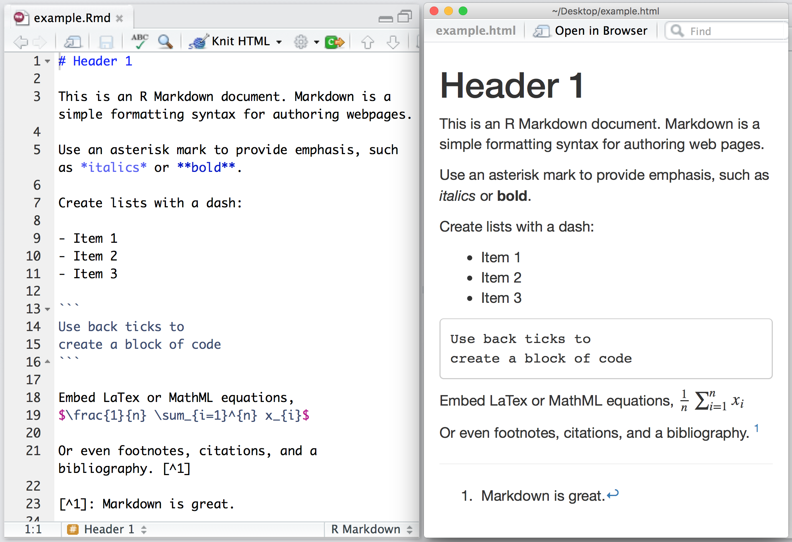
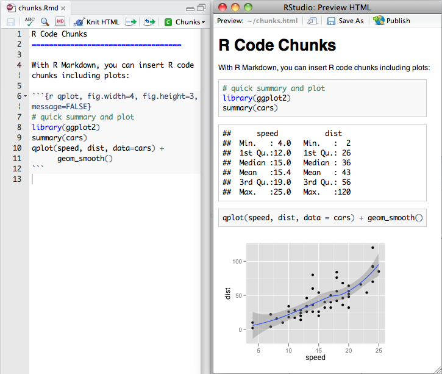
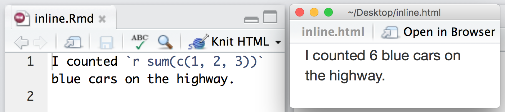
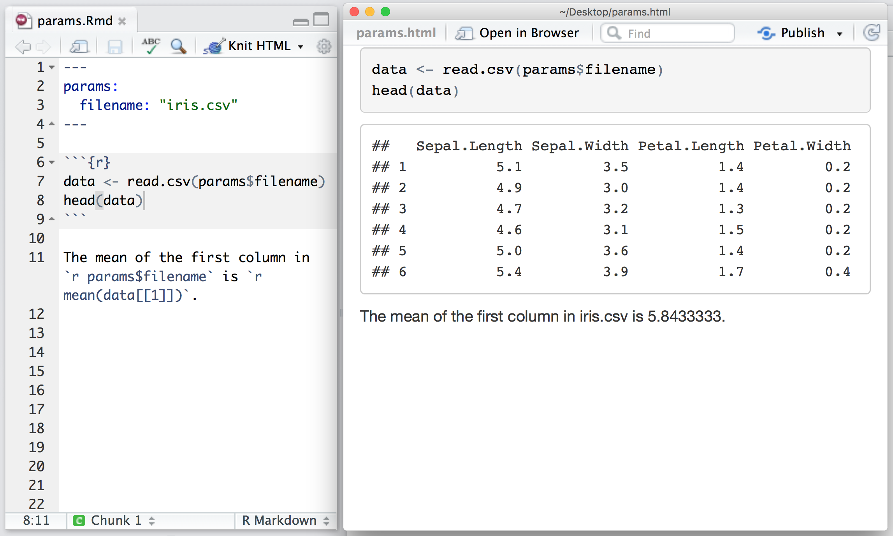
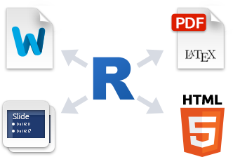

```{css, echo=FALSE}
img {
  margin-bottom: 15px;
}
```

### Overview

<iframe src="https://player.vimeo.com/video/177254549?color=428bca&title=0&byline=0&portrait=0" width="800" height="450" frameborder="0" style="margin-bottom: 2em;" webkitallowfullscreen mozallowfullscreen allowfullscreen></iframe>


Creating documents with R Markdown starts with an .Rmd file that contains a combination of markdown (content with simple text formatting) and R code chunks. The .Rmd file is fed to [knitr](http://yihui.name/knitr/), which executes all of the R code chunks and creates a new markdown (.md) document which includes the R code and it's output.

The markdown file generated by knitr is then processed by [pandoc](http://pandoc.org/) which is responsible for creating a finished web page, PDF, MS Word document, slide show, handout, book, dashboard, package vignette or other format.

This may sound complicated, but R Markdown makes it extremely simple by encapsulating all of the above processing into a single `render` function. Better still, RStudio includes a "Knit" button that enables you to render an .Rmd and preview it using a single click or keyboard shortcut.

### Installation

You can install the R Markdown package from CRAN as follows:

```r
install.packages("rmarkdown")
```

You can open a new .Rmd file in the RStudio IDE by going to File > New File > R Markdown...

### Markdown Basics

Markdown is a simple formatting language designed to make authoring content easy for everyone. Rather than write in complex markup code (e.g. HTML or LaTex), you write in plain text with formatting cues. Pandoc uses these cues to turn your document into attractive output. For example, the file on the left shows basic Markdown and the resulting output on the right:



### R Code Chunks

Within an R Markdown file, R Code Chunks can be embedded with the native Markdown syntax for fenced code regions. For example, the following code chunk computes a data summary and renders a plot as a PNG image:




### Inline R Code

You can also evaluate R expressions inline by enclosing the expression within a single back-tick qualified with 'r'. For example, the following code embeds R results as text in the output at right



### Rendering Output

There are two ways to render an R Markdown document into it's final output format. If you are using RStudio, then the "Knit" button (Ctrl+Shift+K) will render the document and display a preview of it.

If you are not using RStudio then you simply need to call the `rmarkdown::render` function, for example:

```r
rmarkdown::render("input.Rmd")
```

Note that both methods use the same mechanism; RStudio's "Knit" button calls `rmarkdown::render()` under the hood.

### Using Parameters

R Markdown documents can contain a metadata section that includes title, author, and date information as well as options for customizing output. For example, this metadata included at the top of an .Rmd file adds a table of contents and chooses a different HTML theme:

```
---
title: "Sample Document"
output:
  html_document:
    toc: true
    theme: united
---
```

You can add a `params:` field to the metadata to provide a list of values for your document to use. R Markdown will make the list available as `params` within any R code chunk in the report. For example, the file below takes a filename as a parameter and uses the name to read in a data set.



Parameters let you quickly apply your data set to new data sets, models, and parameters. You can set new values for the parameters when you call `rmarkdown::render()`, 

```r
rmarkdown::render("input.Rmd", params = list())
```

as well as when you press the "Knit" button:


### Output Formats

</img>

You can create many types of output from a single .Rmd file. R Markdown has built in support for HTML, PDF, MS_Word, ODT, RTF, Markdown, and Github flavored Markdown documents; Beamer, slidy.js, ioslides, and reveal.js slideshows; and websites, dashboards, books, handouts, package vignettes, and Shiny apps. These formats can be specified in metadata, for example:

```
---
title: "Sample Document"
output: pdf_document
---
```

And you can set sub-options to customize each formats:

```
---
title: "Sample Document"
output:
  pdf_document:
    toc: true
    highlight: zenburn
---
```

Multiple formats can be specified in metadata:

```
---
title: "Sample Document"
output:
  html_document:
    toc: true
    theme: united
  pdf_document:
    toc: true
    highlight: zenburn
---
```

If you are using `rmarkdown::render` then you can pass a format name to `render` to select from the available formats. For example:

```r
render("input.Rmd", "pdf_document")
```

You can also render all formats defined in an input file with:

```r
render("input.Rmd", "all")
```

