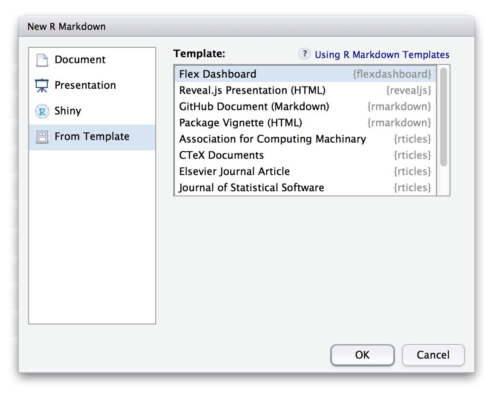

```{r setup, include=FALSE}
source("utils.R")
```

<div id="main-banner" class="row">

<div class="col-sm-8">

* Use [R Markdown](http://rmarkdown.rstudio.com) to publish a group of related data visualizations as a dashboard.

* Support for a wide variety of components including [htmlwidgets](http://www.htmlwidgets.org); base, lattice, and grid graphics; tabular data; gauges and value boxes; and text annotations.

* Flexible and easy to specify row and column-based [layouts](layouts.html). Components are intelligently re-sized to fill the browser and adapted for display on mobile devices.

* [Storyboard](using.html#storyboards) layouts for presenting sequences of visualizations and related commentary.

* Optionally use [Shiny](http://shiny.rstudio.com) to drive visualizations dynamically.

</div>

</div>

```{r, echo=FALSE}
examples(caption = FALSE, showcaseOnly = TRUE)
```

## Getting Started

Install the **flexdashboard** package from CRAN as follows:

```r
install.packages("flexdashboard")
```

To author a flexdashboard you create an [R Markdown](http://rmarkdown.rstudio.com) document with the `flexdashboard::flex_dashboard` output format. You can do this from within RStudio using the **New R Markdown** dialog:

{width=579 height=465}

If you are not using RStudio, you can create a new `flexdashboard` R Markdown file from the R console:

```r
rmarkdown::draft("dashboard.Rmd", template = "flex_dashboard", package = "flexdashboard")
```

## Dashboard Basics

### Components

You can use flexdashboard to publish groups of related data visualizations as a dashboard. A flexdashboard can either be static (a standard web page) or dynamic (a [Shiny](http://shiny.rstudio.com) interactive document). A wide variety of components can be included in flexdashboard layouts, including:

1. Interactive JavaScript data visualizations based on [htmlwidgets](http://www.htmlwidgets.org). 

2. R graphical output including base, lattice, and grid graphics. 

3. Tabular data (with optional sorting, filtering, and paging).

4. Value boxes for highlighting important summary data. 

5. Gauges for displaying values on a meter within a specified range.

6. Text annotations of various kinds.

See the [dashboard components](using.html#components) documentation for additional details on the use of each component type.

### Layout

#### Single Column (Fill)

Dashboards are divided into columns and rows, with output components delineated using level 3 markdown headers (`###`). By default, dashboards are laid out within a single column, with charts  stacked vertically within a column and sized to fill available browser height. For example, this layout defines a single column with two charts that fills available browser space:

<div class="row">

<div class="col-md-5">
<div id="singlecolumn"></div>
<script type="text/javascript">loadSnippet('singlecolumn')</script>
</div>

<div class="col-md-7">
<div height="420px" width="100%">


</div>
</div>

</div>

#### Single Column (Scroll)

Depending on the nature of your dashboard (number of components, ideal height of components, etc.) you may prefer a scrolling layout where components occupy their natural height and the browser scrolls when additional vertical space is needed. You can specify this behavior via the `vertical_layout: scroll` option. For example, here is the definition of a single column scrolling layout with three charts:

<div class="row">

<div class="col-md-5">
<div id="singlecolumnscroll"></div>
<script type="text/javascript">loadSnippet('singlecolumnscroll')</script>
</div>

<div class="col-md-7">
<div height="470px" width="100%">


</div>
</div>

</div>


#### Multiple Columns

To lay out charts using multiple columns you introduce a level 2 markdown header (`--------------`) for each column. For example, this dashboard displays 3 charts split across two columns:

<div class="row">

<div class="col-md-5">
<div id="multiplecolumns"></div>
<script type="text/javascript">loadSnippet('multiplecolumns')</script>
</div>

<div class="col-md-7">
<div height="470px" width="100%">
<div style="float: left; width: 60%;">

</div>
<div style="margin-left: 60%;">


</div>
</div>
</div>

</div>

In this example we've moved Chart 1 into its own column which it will fill entirely. We've also given the column a larger size via the `data-width` attribute to provide additional emphasis to Chart 1.

#### Row Orientation

You can also choose to orient dashboards row-wise rather than column-wise by specifying the `orientation: rows` option. For example, this layout defines two rows, the first of which has a single chart and the second of which has two charts:

<div class="row">

<div class="col-md-5">
<div id="roworientation-home"></div>
<script type="text/javascript">loadSnippet('roworientation-home')</script>
</div>

<div class="col-md-7">
<div height="496px" width="100%">

<div>
<div style="float: left; width: 50%;">

</div>
<div style="margin-left: 50%;">

</div>
</div>
</div>
</div>

</div>

## Learning More

The [Using](using.html) page includes documentation on all of the features and options of flexdashboard, including layout orientations (row vs. column based), chart sizing, the various supported components, theming, and creating dashboards with multiple pages.

The [Shiny](shiny.html) page describes how to create dashboards that enable viewers to change underlying parameters and see the results immediately, or that update themselves incrementally as their underlying data changes.

The [Layouts](layouts.html) page includes a variety of sample layouts which you can use as a starting point for your own dashboards.

The [Examples](examples.html) page includes several examples of flexdashboard in action (including links to source code if you want to dig into how each example was created).

