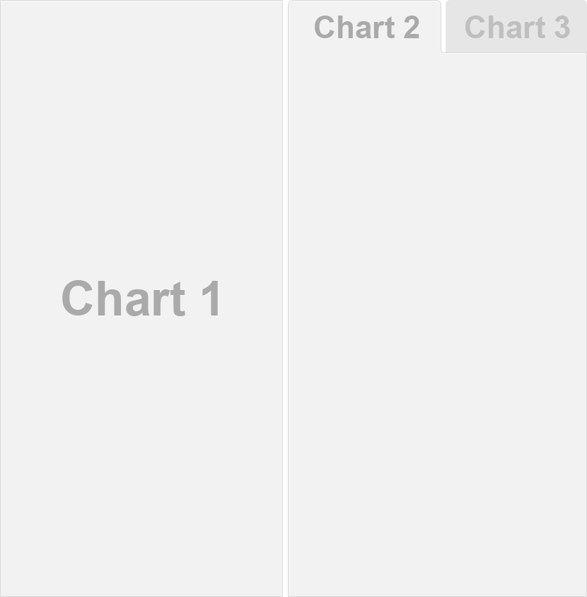
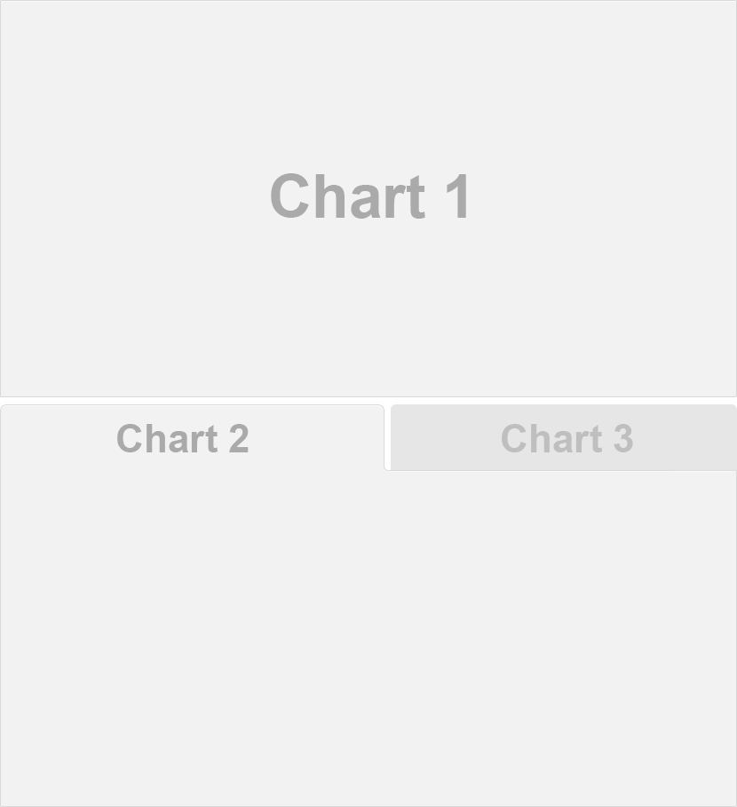

## Overview

This page includes a variety of sample layouts which you can use as a starting point for your own dashboards.

When creating a layout, it's important to decide up front whether you want your charts to fill the web page vertically (changing in height as the browser changes) or if you want the charts to maintain their original height (with the page scrolling as necessary to display all of the charts).

This behavior is controlled via the `vertical_layout` output option, which defaults to `vertical_layout: fill`. Filling the page is generally a good choice when you have only one or two charts vertically stacked. Alternatively you can use `vertical_layout: scroll` to specify a scrolling layout, which is generally a better choice for three or more charts vertically stacked.

## Chart Stack (Fill)

This layout is a simple stack of two charts. Note that one chart or the other could be made vertically taller by specifying the `data-height` attribute.

## Chart Stack (Scrolling)

This layout is a simple stack of three charts. To provide enough room to display all the charts a scrolling layout is used (`vertical_layout: scroll`). Note that because of its ability to scroll this layout could easily accommodate many more charts (although for large numbers of charts you might consider organizing them into [Multiple Pages]).

## Focal Chart (Top)

This layout fills the page completely and gives prominence to a single chart at the top (with two secondary charts included below). To achieve this layout it uses `orientation: rows` and specifies `data-height` attributes on each row to establish their relative sizes.

## Focal Chart (Left)

This layout fills the page completely and gives prominence to a single chart on the left (with two secondary charts included to the right). Note that `data-width` attributes are specified on each column to establish their relative sizes.

## Chart Grid (2x2)

This layout is a 2x2 grid of charts. This layout uses the default `vertical_scroll: fill` behavior however depending on the ideal display size for the charts it might be preferable to allow the page to scroll (`vertical_layout: scroll`). Note also that `orientation: rows` is used to ensure that the chart baselines line up horizontally.

## Tabset Column

This layout displays the right column as a set of two tabs. Tabs are especially useful when you have a large number of components to display and prefer not to require the user to scroll to access everything.

## Tabset Row

This layout displays the bottom row as a set of two tabs. Note that the `{.tabset-fade}` attribute is also used to enable a fade in/out effect when switching tabs.

## Multiple Pages

This layout defines multiple pages using a level 1 markdown header (`==================`). Each page has its own top-level navigation tab. Further, the second page uses a distinct orientation via the `data-orientation` attribute. The use of multiple columns and rows with custom `data-width` and `data-height` attributes is also demonstrated.

## Storyboard

This layout provides an alternative to the row and column based layout schemes described above that is well suited to presenting a sequence of data visualizations and related commentary. 

Note that the `storyboard: true` option is specified and that additional commentary is included alongside the storyboard frames (the content after the `***` separator in each section).

## Input Sidebar

This layout demonstrates how to add a sidebar to a flexdashboard page (Shiny-based dashboards will often present user input controls in a sidebar). To include a sidebar you add the `.sidebar` class to a level 2 header (`-------------------`):

## Input Sidebar (Global)

If you have a layout that uses [Multiple Pages] you may want the sidebar to be global (i.e. present for all pages). To include a global sidebar you add the `.sidebar` class to a level 1 header (`======================`):

## Mobile Specific

To customize your dashboard for display on small mobile screens you can either exclude selected components entirely or create mobile-specific variations of components. To exclude components you apply the `{.no-mobile}` class attribute. To use a mobile-specific rendering you create two identically titled components and apply the `{.mobile}` attribute to one of them. 

For example, the following dashboard has a "Chart 1" that is included in mobile and desktop layouts, a "Chart 2" that is excluded from mobile layouts, and a "Chart 3" that has a custom variation for mobile:

