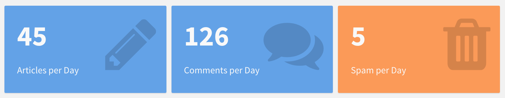
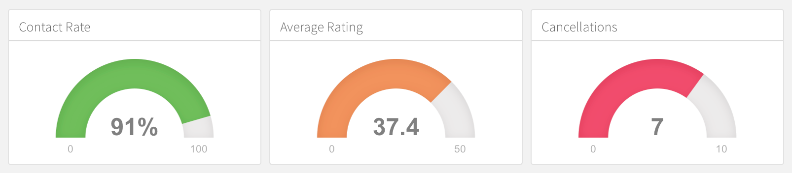
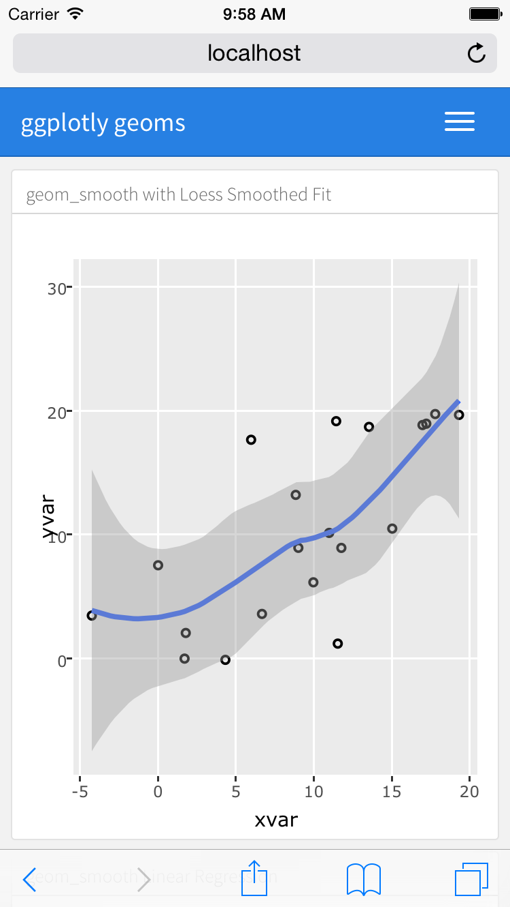

## Overview

You can use flexdashboard to publish groups of related data visualizations as a dashboard. A wide variety of components can be included in flexdashboard layouts, including:

1. Interactive JavaScript data visualizations based on [htmlwidgets](http://www.htmlwidgets.org). 

2. R graphical output including base, lattice, and grid graphics.

3. Tabular data (with optional sorting, filtering, and paging).

4. Value boxes for highlighting important summary data. 

5. Gauges for displaying values on a meter within a specified range.

6. Text annotations of various kinds.

Flexible options for [component layout](#layout) are available and dashboards with many components can be organized into [multiple pages]. The flexdashboard layout system also adapts itself intelligently for display on [mobile devices](#mobile-layout).

There are also several ways to add interactivity to flexdashboards. You can use [htmlwidgets](#html-widgets) to add client-side JavaScript interactivity (data tips, panning, zooming, etc.) and [Shiny](shiny.html) to build fully custom interactions in R.

## Layout 

### Orientation

#### Layout by Column

By default, level 2 markdown headers (`------------------`) within dashboards define columns, with individual charts stacked vertically within each column. Here's the definition of a two column dashboard with one chart on the left and two on the right:

<div class="row">

<div class="col-md-6">
<div id="columnorientation"></div>
<script type="text/javascript">loadSnippet('columnorientation')</script>
</div>

<div class="col-md-6 nopadding">
<div height="422px" width="100%">
<div style="float: left; width: 50%;">

</div>
<div style="margin-left: 50%;">


</div>
</div>
</div>

</div>

#### Layout by Row

You can also choose to orient dashboards row-wise rather than column-wise, by specifying the `orientation: rows` option. For example, this layout defines two rows, the first of which has a single chart and the second of which has two charts:

<div class="row">

<div class="col-md-6">
<div id="roworientation"></div>
<script type="text/javascript">loadSnippet('roworientation')</script>
</div>

<div class="col-md-6 nopadding">
<div height="454px" width="100%">

<div>
<div style="float: left; width: 50%;">

</div>
<div style="margin-left: 50%;">

</div>
</div>
</div>
</div>

</div>

### Scrolling Layout

By default flexdashboard charts are laid out to automatically fill the height of the browser. This works well for a small number of vertically stacked charts, however if you have lots of charts you'll probably want to scroll rather than fit them all onto the page. You can control this behavior using the `vertical_layout` option. Specify `fill` to vertically re-size charts so they completely fill the page and `scroll` to layout charts at their natural height, scrolling the page if necessary.

For example, the following layout includes 3 charts and requests that the page scroll as necessary to accommodate their natural height:

<div class="row">

<div class="col-md-6">
<div id="chartstack-scrolling"></div>
<script type="text/javascript">loadSnippet('chartstack-scrolling')</script>
</div>

<div class="col-md-6 nopadding">
<div height="406px" width="100%">


</div>
</div>

</div>

### Tabsets

If you have several components you'd like to display within a row or column then rather than attempting to fit them all on screen at the same time you can lay them out as a tabset. This is especially appropriate when one component is primary (i.e. should be seen by all readers) and the others provide secondary information that might be of interest to only some readers. 

In many cases tabsets are a better solution than `vertical_layout: scroll` for displaying large numbers of components since they are so straightforward to navigate.

To layout a row or column as a tabset you simply add the `{.tabset}` attribute to the section heading. For example, the following code lays out the second column in tabset:

<div id="tabsetcolumn"></div>
<script type="text/javascript">loadSnippet('tabsetcolumn')</script>

<!--
<div class="row">

<div class="col-md-6">
<div id="tabsetcolumn"></div>
<script type="text/javascript">loadSnippet('tabsetcolumn')</script>
</div>

<div class="col-md-6 nopadding">
<div height="422px" width="100%">
<div style="float: left; width: 50%;">

</div>
<div style="margin-left: 50%;">

</div>
</div>
</div>

</div>
-->

Rows can also be laid out as a tabset as illustrated here:

<div id="tabsetrow"></div>
<script type="text/javascript">loadSnippet('tabsetrow')</script>

<!--
<div class="row">

<div class="col-md-6">
<div id="tabsetrow"></div>
<script type="text/javascript">loadSnippet('tabsetrow')</script>
</div>

<div class="col-md-6 nopadding">
<div height="454px" width="100%">


</div>
</div>

</div>
-->

Note that here we also apply the `{.tabset-fade}` attribute which results in a fade in/out effect when switching tabs.


## Components

### HTML Widgets

The [htmlwidgets](http://www.htmlwidgets.org) framework provides high-level R bindings for JavaScript data visualization libraries. Charts based on htmlwidgets are ideal for use with flexdashboard because they can dynamically re-size themselves, so will nearly always fit perfectly within the bounds of their flexdashboard containers.

Available htmlwidgets include:

1. [Leaflet](http://rstudio.github.io/leaflet/), a library for creating dynamic maps that support panning and zooming, with various annotations like markers, polygons, and popups.

2. [dygraphs](http://rstudio.github.io/dygraphs), which provides rich facilities for charting time-series data and includes support for many interactive features including series/point highlighting, zooming, and panning.

3. [Plotly](https://plot.ly/r/), which via it's ggplotly interface allows you to easily translate your ggplot2 graphics to an interactive web-based version.

4. [rbokeh](http://hafen.github.io/rbokeh), an interface to Bokeh, a powerful declarative Bokeh framework for creating web-based plots.

5. [Highcharter](http://jkunst.com/highcharter/), a rich R interface to the popular Highcharts JavaScript graphics library. 

6. [visNetwork](http://dataknowledge.github.io/visNetwork), an interface to the network visualization capabilities of the vis.js library.

There are over 30 packages on CRAN which provide htmlwidgets. You can find example uses of several of the more popular htmlwidgets in the htmlwidgets [showcase](http://www.htmlwidgets.org/showcase_leaflet.html) and browse all available widgets in the [gallery](http://gallery.htmlwidgets.org/).

You include htmlwidgets in an R Markdown document just like you include R plots. For example, the following is a simple dashboard definition that includes 3 dygraphs time-series charts:

<div id="htmlwidgetsdygraphs"></div>
<script type="text/javascript">loadSnippet('htmlwidgetsdygraphs')</script>

Note that one disadvantage of htmlwidgets is that they embed their data directly in their host web page, so may encounter performance problems for larger datasets. For larger dataset sizes the use of standard R graphics (described below) may be preferable.

### R Graphics 

You can use any chart created with standard R graphics (base, lattice, grid, etc.) with flexdashboard. 

Within dynamic ([Shiny](shiny.html)) dashboards these charts are automatically sized to fit within their dashboard containers so long as they are wrapped within a call to [renderPlot](http://shiny.rstudio.com/reference/shiny/latest/renderPlot.html).

Within static dashboards standard R graphics are also scaled (with aspect ratios preserved so there is no stretching or distortion). However, since these charts are PNG images it's not possible for them to seamlessly fill the bounds of their container. The following section provides tips on how to get the best possible fit for a given graphic.

#### Figure Scaling 

When creating static (non-Shiny) dashboards containing standard R graphics it's critical to define knitr `fig.width` and `fig.height` values as close as possible to what they'll actually be on the page. This enables them to fit into their layout container as closely as possible when the dashboard is laid out.

Here's an example of a row based layout that includes 3 charts from R base graphics:

<div id="figuresizes"></div>
<script type="text/javascript">loadSnippet('figuresizes')</script>


We've specified an explicit `fig.height` and `fig.width` for each chart so that their rendered size fits their flex container as closely as possible. Note that the ideal values for these dimensions typically need to be determined by experimentation. 

### Tabular Data

You can include tabular data within flexdashboards in one of two ways:

1. As a simple tabular display.

2. As a DataTable that includes sorting, filtering, and pagination.

#### Simple Table

A simple table is ideal for smaller numbers of records (i.e. 40-50 or less). The code required for simple tables differs depending on whether you are building a static or dynamic (Shiny-based) flexdashboard. For static dashboards, you should use the `knitr::kable` function to output your dataset, for example:

<div id="tabularkable"></div>
<script type="text/javascript">loadSnippet('tabularkable')</script>

For Shiny based dashboards you should use the `shiny::renderTable` function, for example:

<div id="tabularrendertable"></div>
<script type="text/javascript">loadSnippet('tabularrendertable')</script>

This ensures that the tabular display is updated when the inputs upon which it depends change.

#### Data Table

The [DT](http://rstudio.github.io/DT/) package (an interface to the DataTables JavaScript library) can display R matrices or data frames as interactive HTML tables that support filtering, pagination, and sorting.

Note that if you want to use DataTables with flexdashboard you should install the development version of the DT package from GitHub (it contains some changes required for flexdashboard compatibility):

```r
devtools::install_github("rstudio/DT")
```

To include a DataTable you use the `DT::datatable` function:

<div id="datatablesimple"></div>
<script type="text/javascript">loadSnippet('datatablesimple')</script>

Note that we specified the `bPaginate = FALSE` option. This is appropriate for smaller datasets where scrolling provides a comfortable way of navigating through the data. 

If you have a large dataset where you want to enable pagination, you should be sure to specify the `pageLength` option to show more than the default 10 rows of your dataset per page:

<div id="datatablepaginate"></div>
<script type="text/javascript">loadSnippet('datatablepaginate')</script>

##### Shiny

To include a DataTable within a Shiny flexdashboard you need to be sure to wrap the datatable output in `DT::renderDataTable` (so that it is updated when inputs it depends on change). For example:

<div id="datatableshiny"></div>
<script type="text/javascript">loadSnippet('datatableshiny')</script>

#### Mobile Display

On desktop and tablet displays, both the [Simple Table] and [Data Table] components will fit exactly within the bounds of their flexdashboard container and provide a scroll bar to view records that don't fit on screen. However, on mobile phones both components will never use a scroll bar (as that would compete with scrolling the overall dashboard). Rather, on mobile phone layouts:

1. The [Simple Table] will display all available records; and

2. The [Data Table] will use pagination (i.e. force `bPaginate = TRUE`).

### Value Boxes

Sometimes you want to include one or more simple values within a dashboard. You can use the `valueBox` function to display single values along with a title and optional icon. For example, here are three side-by-side sections each displaying a single value:

{.snippet}

Here is the code which was used to generate these value boxes:

<div id="valuebox"></div>
<script type="text/javascript">loadSnippet('valuebox')</script>

The `valueBox` function is called to emit a value and specify an icon (see [Icon Sets] below for details on available icons).

The third code chunk ("Spam per Day") makes the background color of the value box dynamic using the `color` parameter. Available colors include "primary", "info", "success", "warning", and "danger" (the default is "primary"). For custom colors you can also specify any valid CSS color (e.g. "#ffffff", "rgb(100,100,100)", etc.).


#### Icon Sets

You can specify icons from three different icon sets:

1. [Font Awesome](https://fortawesome.github.io/Font-Awesome/icons/)

2. [Ionicons](http://ionicons.com/)

3. [Bootstrap Glyphicons](https://getbootstrap.com/components/#glyphicons)

When referring to an icon you should use it's full name including the icon set prefix (e.g. "fa-github", "ion-social-twitter", "glyphicon-time", etc.). 

#### Shiny

To include a value box within a Shiny flexdashboard you need to be sure to wrap the value box output in `renderValueBox` (so that it is updated when inputs it depends on change). For example:

<div id="valueboxshiny"></div>
<script type="text/javascript">loadSnippet('valueboxshiny')</script>

### Gauges

Gauges display values on a meter within a specified range. For example, here is a set of 3 gauges:

{.snippet}

Here is the code used to generate these gauges:

<div id="justgage"></div>
<script type="text/javascript">loadSnippet('justgage')</script>

There are a few things to note about this example:

1. The `gauge` function is used to output a gauge. It has three required arguments: `value`, `min`, and `max` (these can be any numeric values).

2. You can specify an optional `symbol` to be displayed alongside the value (in the example "%" is used to denote a percentage).

3. You can specify a set of custom color `sectors` using the `gaugeSectors` function. By default the current theme's "success" color (typically green) is used for the gauge color. The `sectors` option enables you to specify a set of three value ranges ("success", "warning", and "danger") which cause the gauge's color to change based on it's value. 

#### Shiny

To include a gauge within a Shiny flexdashboard you need to be sure to wrap the gauge output in `renderGauge` (so that it is updated when inputs it depends on change). For example:

<div id="justgageshiny"></div>
<script type="text/javascript">loadSnippet('justgageshiny')</script>


### Navigation Bar

By default, the flexdashboard navigation bar includes only the dashboard title. When a dashboard has [Multiple Pages], links to the various pages are also included on the left side of the navigation bar. You can add custom links to navigation bar using the `navbar` option. For example, the following adds an "About" link to the left side of the navigation bar and a Source Code link to the right side of the navigation bar:

<div id="navbarlinks"></div>
<script type="text/javascript">loadSnippet('navbarlinks')</script>

Navigation bar items must include either a `title` or `icon` field (both can also be specified as the "Source Code" item demonstrates). You should also include a `href` as the navigation target. The `align` field is optional (it can be "left" or "right" and defaults to "right").

See [Icon Sets] above for details on the icons available for use within the navigation bar.

#### Social Links

You can include links to social sharing services via the `social` option. For example, the following dashboard includes Twitter and Facebook links as well as a drop-down menu with a more complete list of services:

<div id="navbarsociallinks"></div>
<script type="text/javascript">loadSnippet('navbarsociallinks')</script>

The `social` option can include any number of the following services: "facebook", "twitter", "google-plus", "linkedin", and "pinterest". You can also specify "menu" to provide a generic sharing drop-down menu that includes all of the services.

#### Source Code

You can include a link to the dashboard's source code using the `source_code` option. Source code can either be embedded into the document (`source_code: embed`) or can be a link to a URL where the source code can be found online (e.g. `source_code: "https://github.com/user/repo"`). For example, the following dashboard includes an embedded copy of the source code which can be viewed by clicking the "Source Code" button on the navigation bar:

<div id="navbarsourcecode"></div>
<script type="text/javascript">loadSnippet('navbarsourcecode')</script>

### Text Annotations

#### Text Sections

If you need to include [additional narrative or explanation](http://stephanieevergreen.com/problem-with-dashboards/) within your dashboard you can do so in the following ways:

1. You can include content at the top of the page before dashboard sections are introduced.

2. You can define dashboard sections that don't include a chart but rather include arbitrary content (text, images, equations, etc.)

For example, the following dashboard includes some content at the top and a dashboard section that contains only text:

<div id="textannotation"></div>
<script type="text/javascript">loadSnippet('textannotation')</script>

#### Title and Notes

Each component within a dashboard includes optional title and notes sections. The title is simply the text after the level 3 (`###`) section heading. The notes are any text prefaced with `>` after the code chunk which yields the component's output. For example:

<div id="texttitleandnotes"></div>
<script type="text/javascript">loadSnippet('texttitleandnotes')</script>

You can exclude the title entirely by applying the `.no-title` attribute to a section heading, for example:

<div id="textnotitle"></div>
<script type="text/javascript">loadSnippet('textnotitle')</script>

## Sizing

To create an ideal layout for your dashboard, it's important to understand how the size of individual charts is determined. This section describes the layout algorithm and the various ways you can tweak its behavior.

### Width and Height

The width of charts in flexdashboard is ultimately determined by the width of the browser. If your layout has a single column then charts will occupy the full width of the browser. If your layout has multiple columns then the columns will split the available width evenly (unless overridden via the `data-width` attribute as described below).

The height of charts is determined in one of two ways depending on whether your dashboard is configured to fit itself into the vertical confines of the page (`vertical_layout: fill`) or to scroll (`vertical_layout: scroll`):

1. For dashboards that fill the page the height of charts will be determined by the height of the browser, with vertically stacked charts splitting the available height evenly (unless overridden via the `data-height` attribute as described below).

2. For scrolling dashboards, the height of charts will be determined by the knitr `fig.height` option, which defaults to 5 inches (480 pixels).

### Size Attributes

The nature of the charts within your dashboard (desired emphasis, visualization types, etc.) will often dictate that you'll want to change the default sizing behavior. If no size attributes are specified then the relative size of each chart will be determined by it's knitr figure size (this is 6 x 4.8 inches or 576 x 460 pixels by default).

You can modify the default sizing behavior by applying the `data-width` and `data-height` attributes to rows, columns, or even individual charts. These attributes establish the relative size between charts laid out in the same dimension (horizontal or vertical).

#### Examples

This example use the `data-height` attribute to dictate a larger vertical size for the first row, resulting in a layout that more clearly emphasizes the first chart.

<div class="row">
<div class="col-md-6">
<div id="chartsizing"></div>
<script type="text/javascript">loadSnippet('chartsizing')</script>
</div>

<div class="col-md-6 nopadding">
<div height="454px" width="100%">

<div>
<div style="float: left; width: 50%;">

</div>
<div style="margin-left: 50%;">

</div>
</div>
</div>
</div>

</div>


This example is a variation of the single-column layout demonstrated above with a `data-height` attribute applied to the first chart:

<div class="row">
<div class="col-md-6">
<div id="chartdataheight"></div>
<script type="text/javascript">loadSnippet('chartdataheight')</script>
</div>

<div class="col-md-6 nopadding">
<div height="360px" width="100%">


</div>
</div>

</div>

#### Chart Padding

By default flexdashboard places 8 pixels of padding around the edges of charts. For some chart types this might not be ideal. In this case you can either add the `.no-padding` attribute to specify no padding at all or the `data-padding` attribute to specify a specific number of pixels. For example:

<div id="chartpadding"></div>
<script type="text/javascript">loadSnippet('chartpadding')</script>

### Flexbox Layout

Dashboard layout is done using the browser [flexbox](https://developer.mozilla.org/en-US/docs/Web/CSS/CSS_Flexible_Box_Layout/Using_CSS_flexible_boxes) engine, which alters its items' width and/or height to best fill the available space on any display device. A flexbox layout expands items to fill available free space, or shrinks them to prevent overflow.

The implication of this is that chart dimensions established via either knitr figure sizes or `data-width` and `data-height` attributes are used to establish relative sizes between charts within the same horizontal or vertical dimension as opposed to absolute sizes (this corresponds to the `flex-grow` and `flex-shrink` CSS properties).


## Multiple Pages

If you have more than a handful of charts you'd like to include in a dashboard, you may want to consider dividing the dashboard into multiple pages. To define a page just use a level 1 markdown header (`==================`). Each page you define will have its own top-level navigation tab.

For example, this code creates a dashboard with two pages, each containing two charts:

<div id="multiplepages"></div>
<script type="text/javascript">loadSnippet('multiplepages')</script>

### Page Orientation

Note that in this example both pages use the default "columns" orientation. It is however possible to specify a distinct orientation for an individual page. This is done by adding the `data-orientation` attribute to the header of the page you want to change the orientation of. For example:

<div id="pageorientation"></div>
<script type="text/javascript">loadSnippet('pageorientation')</script>

### Page Navigation 

By default each page you define is given it's own top level tab on the navigation bar. However, if you have a large number of pages (more than 5) you might want to organize your pages into menus on the navigation bar. 

To specify that a page should be accessed via a navigation bar menu you use the `data-navmenu` attribute. For example, the following dashboard has 4 pages, 2 of which are located on "Menu A" and two of which are located on "Menu B":

<div id="pagenavmenu"></div>
<script type="text/javascript">loadSnippet('pagenavmenu')</script>

### Page Links

You can form links directly to dashboard pages using markdown link syntax: `[Page 2]`. To use custom link text you can also create a link via the page's anchor: `[Page Two](#page-2)`. Both styles of page linking are demonstrated in this example:

<div id="pagelinks"></div>
<script type="text/javascript">loadSnippet('pagelinks')</script>


### Page Icons

You can add an icon to the navigation menu for a page using the `data-icon` attribute. For example, the following specifies a navigation bar icon for each of two pages:

<div id="pageicons"></div>
<script type="text/javascript">loadSnippet('pageicons')</script>

You can specify icons for navigation bar items from three different icon sets:

1. [Font Awesome](https://fortawesome.github.io/Font-Awesome/icons/)

2. [Ionicons](http://ionicons.com/)

3. [Bootstrap Glyphicons](https://getbootstrap.com/components/#glyphicons)

When referring to an icon you should use it's full name including the icon set prefix (e.g. "fa-github", "ion-social-twitter", "glyphicon-time", etc.).

## Mobile Layout

The flexdashboard layout system adapts itself intelligently for display on mobile devices. This section describes layout behavior for various screen sizes as well as some guidelines for ensuring that your dashboards work well on smaller screens.

### Medium Screens

The layout of dashboard components for medium sized mobile screens (e.g. tablets) is the same as for larger desktop screens (any screen with width greater than 768 pixels is considered a medium screen). 

Rows and columns are allocated using the default figure sizes and respect the relative proportions established via the use of `data-width`attributes. The only exception are [sidebars](shiny.html#input-sidebar), which are reduced to 220 pixels wide whenever the screen is less than 993 pixels wide.

### Small Screens

{.screenshot .screenshot-right width=187 height=332} 

For mobile phones (any screen less than or equal to 768 pixels wide) flexdashboard uses special layout behavior. Since these screens don't generally have the width to show multiple side-by-side columns, all dashboard components are "flattened" into one single column layout. 

In addition, some flexdashboard components have special behavior to adapt themselves to smaller mobile screens:

1) By default R graphics are rendered twice, once at their natural `fig.width` and `fig.height`, and once at a mobile-optimized size (3.75 x 4.8 inches). When displaying on a mobile phone in portrait orientation the mobile size is used (this can be controlled via the `fig_mobile` option).

2) [Simple tables](#simple-table) always show all of their rows (this is so that scrolling the table doesn't interfere with scrolling the mobile display).

3) [DataTables](#data-table) always use pagination (again, so that scrolling the DataTable doesn't interfere with scrolling the overall display).

### Mobile CSS

If certain components of your dashboard don't work well on smaller mobile devices you can exclude them by applying the `{.no-mobile}` class attribute to a dashboard section. For example, this dashboard hides it's second component on mobile devices:

<div id="nomobile"></div>
<script type="text/javascript">loadSnippet('nomobile')</script>

It's also possible to create a mobile-specific version of a given dashboard component that will be used in place of the default version. You can do this by creating two identically titled sections and applying the `{.mobile}` class attribute to one of them. For example:

<div id="mobile"></div>
<script type="text/javascript">loadSnippet('mobile')</script>

## Themes

A variety of themes are available to modify the appearance of flexdashboard. Supported themes include "default", "bootstrap", "cerulean", "journal", "flatly", "readable", "spacelab", "united", "cosmo", "lumen", "paper", "sandstone", "simplex", and "yeti". Note that the "cosmo" theme is used when "default" is specified.

These themes are all based on the themes available in the [R Markdown](http://rmarkdown.rstudio.com) package (which are in turn based on [Bootswatch](https://bootswatch.com/) themes).

Use the `theme` option to specify an alternate theme:

<div id="themesexample"></div>
<script type="text/javascript">loadSnippet('themesexample')</script>

If you are looking for a theme that embeds well inside another content frame (e.g. one that doesn't use such a strong color for the navigation bar) then the "bootstrap" theme is a good choice. 

#### Custom Colors

You can use CSS to customize the colors used within the navigation bar of each theme. If you do this, realize that themes define colors for many elements and states, so you should be careful to override all of the required elements. 

The navigation bar for flexdashboard uses the `navbar-inverse` class for each of its themes. Here is the `navabar-inverse` CSS for the default "cosmo" theme used by flexdashboard:

https://github.com/thomaspark/bootswatch/blob/v3.3.5/cosmo/bootstrap.css#L4643-L4744

If you want to customize these colors you should create a CSS stylesheet with the requisite `navbar-inverse` entries and include it using the `css` option of the `flex_dashboard` format.

## Learning More

The [Shiny](shiny.html) page describes how to create dashboards that enable viewers to change underlying parameters and see the results immediately, or that update themselves incrementally as their underlying data changes.

The [Layouts](layouts.html) page includes a variety of sample layouts which you can use as a starting point for your own dashboards.

The [Examples](examples.html) page includes several examples of flexdashboard in action (including links to source code if you want to dig into how each example was created).

