<!--html_preserve-->

  
Gallery

  
Check out the range of outputs and formats you can create using R Markdown.

  

    
Documents

    
With R Markdown, you write a single .Rmd file and then use it to render finished output in a variety of formats.

    

      

        <a href="http://timelyportfolio.github.io/rCharts_nyt_home_price/">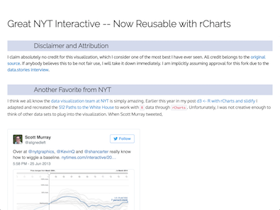</a>
        <a href="http://timelyportfolio.github.io/rCharts_nyt_home_price/" class="galleryItemLabel">HTML</a>
        
HTML documents for web publishing.

      

      

        <a href="https://github.com/svmiller/svm-r-markdown-templates/blob/master/svm-rmarkdown-article-example.pdf">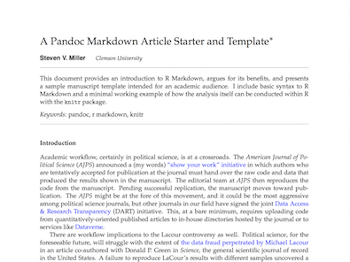</a>
        <a href="https://github.com/svmiller/svm-r-markdown-templates/blob/master/svm-rmarkdown-article-example.pdf" class="galleryItemLabel">PDF</a>
        
PDF documents for printing. <a href="https://raw.githubusercontent.com/svmiller/svm-r-markdown-templates/master/svm-rmarkdown-article-example.Rmd">Example Code</a>

      

      

        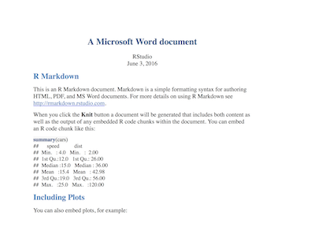
        <a class="galleryItemLabel">Microsoft Word</a>
        
Microsoft Word documents for Office workflows.

      

      

        <a href="https://rstudio.github.io/tufte/">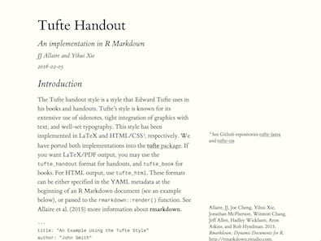</a>
        <a href="https://rstudio.github.io/tufte/" class="galleryItemLabel">Handouts</a>
        
Tufte styled documents for handouts. <a href="https://raw.githubusercontent.com/rstudio/tufte/master/inst/rmarkdown/templates/tufte_html/skeleton/skeleton.Rmd">Example Code</a>

      

    

  

  

    
Interactive Documents

    
Combine R Markdown with htmlwidgets or the shiny package to make interactive documents.

    

      

        <a href="https://rpubs.com/jcheng/leaflet-layers-example">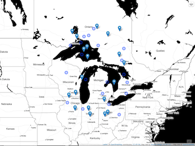</a>
        <a href="https://rpubs.com/jcheng/leaflet-layers-example" class="galleryItemLabel">HTML Widgets</a>
        
Add interactive graphics with htmlwidgets, such as the leaflet map widget.

      

      

        <a href="https://gallery.shinyapps.io/UNCCC2/">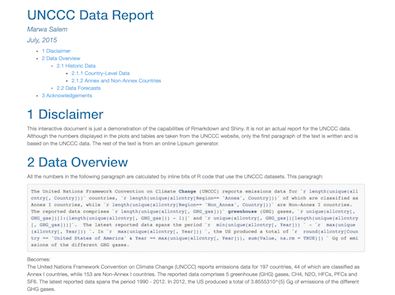</a>
        <a href="https://gallery.shinyapps.io/UNCCC2/" class="galleryItemLabel">HTML Widgets</a>
        
Embed htmlwidgets such as dygraphs and datatables directly into your reports.

      

      

        <a href="https://uasnap.shinyapps.io/ex_leaflet/">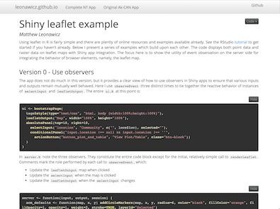</a>
        <a href="https://uasnap.shinyapps.io/ex_leaflet/" class="galleryItemLabel">Shiny</a>
        
Add interactive analysis with shiny, which lets your user rerun the actual analysis within your report.

      

      

        <a href="https://bookdown.org/csgillespie/shiny_components/">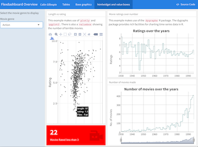</a>
        <a href="https://bookdown.org/csgillespie/shiny_components/" class="galleryItemLabel">Shiny</a>
        
Shiny components and htmlwidgets will work in any HTML based output, such as a file, slide show or dashboard.

      

    

  

  

    
Dashboards

    
Combine R Markdown with the flexdashboard package to quickly assemble R components into administrative dashboards. Each example below contains a link to the source code within the dashboard.

    

      

        
        <a href="https://gallery.shinyapps.io/cran-gauge/" class="galleryItemLabel">Dashboard with gauges and value boxes</a>
        
Use flexdashboard to create dashboards with gauges and value boxes.

      

      

        <a href="https://beta.rstudioconnect.com/jjallaire/htmlwidgets-highcharter/">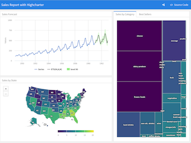</a>
        <a href="https://beta.rstudioconnect.com/jjallaire/htmlwidgets-highcharter/" class="galleryItemLabel">Dashboard with htmlwidgets</a>
        
Add interactive graphics to a dashboard with htmlwidgets.

      

      

        <a href="https://walkerke.shinyapps.io/neighborhood_diversity/">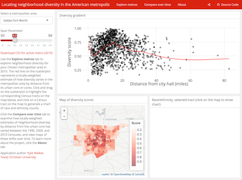</a>
        <a href="https://walkerke.shinyapps.io/neighborhood_diversity/" class="galleryItemLabel">Dashboard with Shiny</a>
        
Add interactive analysis to a dashboard with Shiny.

      

      

        <a href="https://beta.rstudioconnect.com/jjallaire/htmlwidgets-showcase-storyboard/">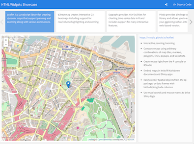</a>
        <a href="https://beta.rstudioconnect.com/jjallaire/htmlwidgets-showcase-storyboard/" class="galleryItemLabel">Dashboard with storyboard</a>
        
Organize dashboards around a storyboard.

      

    

  

  

    
Presentations

    
R Markdown supports several presentation (slide show) formats.

    

      

        <a href="http://svmiller.com/rmarkdown-example.pdf">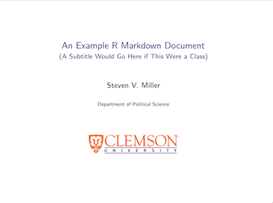</a>
        <a href="http://svmiller.com/rmarkdown-example.pdf" class="galleryItemLabel">Beamer slideshow</a>
        
Create pdf slides with Beamer. Example Code.

      

      

        <a href="https://rpubs.com/sdplus/vulcan74">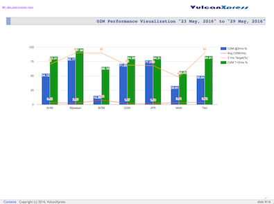</a>
        <a href="https://rpubs.com/sdplus/vulcan74" class="galleryItemLabel">Slidy slideshow</a>
        
Create HTML-based slides with Slidy.

      

      

        
        <a href="https://github.com/rstudio/ShinyDeveloperConference/tree/master/Debugging" class="galleryItemLabel">ioslides slideshow</a>
        
Create HTML-slides with ioslides. Example Code

      

      

        
        <a href="https://github.com/rstudio/ShinyDeveloperConference/tree/master/Reactivity" class="galleryItemLabel">reveal.js slideshow</a>
        
Create HTML-based slides with reveal.js. Example Code

      

    

  

  

    
Books

    
Use R Markdown alongside bookdown to author books and then distribute the books as PDF, HTML, EPUB documents and more. Here are some books that have been authored in R Markdown.

    

      

        
        <a href="https://bookdown.org/yihui/bookdown/" class="galleryItemLabel">Bookdown: Authoring Books with R Markdown</a>
        
The Bookdown book explains how to author books in R Markdown.

      

      

        <a href="http://r4ds.had.co.nz/">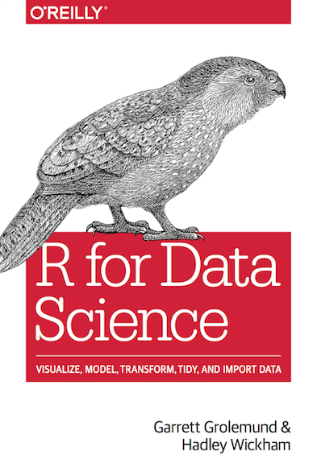</a>
        <a href="http://r4ds.had.co.nz/" class="galleryItemLabel">R for Data Science</a>
        
R for Data Science teaches how to do Data Science with R.

      

      

        <a href="https://bookdown.org/csgillespie/efficientR/">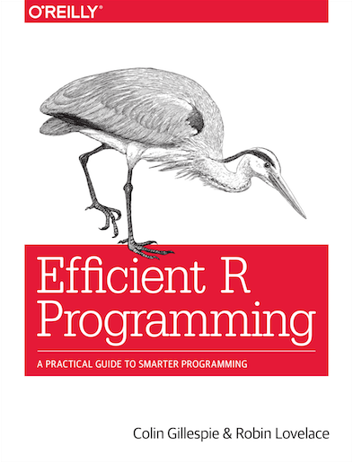</a>
        <a href="https://bookdown.org/csgillespie/efficientR/" class="galleryItemLabel">Efficient R Programming</a>
        
Efficient R Programming explains how to write nimble, performant R code.

      

      

        <a href="https://bookdown.org/nowosad/Geostatystyka/">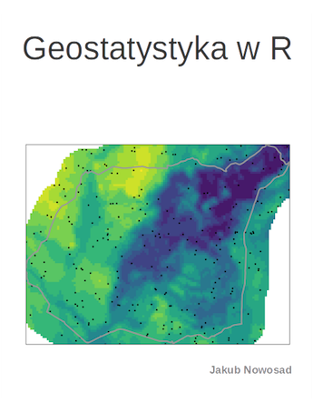</a>
        <a href="https://bookdown.org/nowosad/Geostatystyka/" class="galleryItemLabel">Geostatystyka w R</a>
        
Geostatystyka w R is a Polish introduction to geostatistics.

      

    

  

  

    
Websites

    
R Markdown makes it easy to build webpages straight from .Rmd files.

    

      

        <a href="http://rmarkdown.rstudio.com/">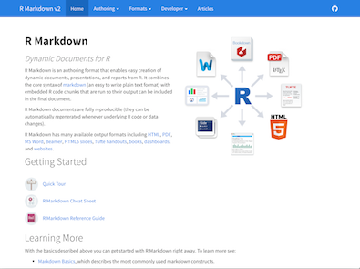</a>
        <a href="http://rmarkdown.rstudio.com/" class="galleryItemLabel">R Markdown</a>
        
The <a href="http://rmarkdown.rstudio.com/">R Markdown website</a> is itself built with R Markdown. <a href="https://github.com/rstudio/rmarkdown/tree/gh-pages">Example Code</a>.

      

      

        <a href="https://rstudio.github.io/flexdashboard">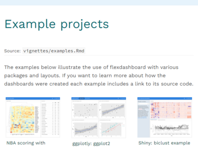</a>
        <a href="https://rstudio.github.io/flexdashboard" class="galleryItemLabel">flexDashboard</a>
        
flexdashboard extends R Markdown to make administrative dashbords. Its website is also built from R Markdown. <a href="https://github.com/rstudio/flexdashboard/tree/gh-pages">Example Code</a>.

      

      

        <a href="https://bookdown.org/">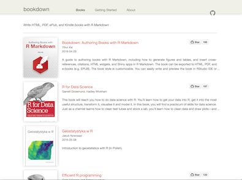</a>
        <a href="https://bookdown.org/" class="galleryItemLabel">bookdown</a>
        
Bookdown extends R Markdown to make books. Its website is built with R Markdown and CSS styling. <a href="https://github.com/rstudio/bookdown/tree/master/inst/homepage">Example Code</a>.

      

      

        <a href="https://rstudio.github.io/profvis/">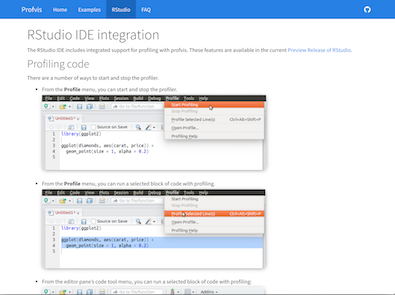</a>
        <a href="https://rstudio.github.io/profvis/" class="galleryItemLabel">profvis</a>
        
profvis provides profiling tools for R code, as well as a website made with R Markdown. <a href="https://github.com/rstudio/profvis/tree/gh-pages">Example Code</a>.

      

    

  

  

    
Templates

    
Create reusable templates to quickly apply styling and content to yan R Markdown document.

    

      

        <a href="https://github.com/rstudio/rticles/tree/master/inst/rmarkdown/templates/jss_article">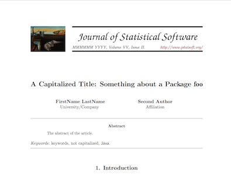</a>
        <a href="https://github.com/rstudio/rticles/tree/master/inst/rmarkdown/templates/jss_article" class="galleryItemLabel">JSS</a>
        
The JSS article template in the rticles package formats an R Markdown document to meet the style guidelines of the Journal of Statistical Software. <a href="https://github.com/rstudio/rticles/tree/master/inst/rmarkdown/templates/jss_article">Example Code</a>

      

      

        <a href="https://github.com/rstudio/rticles/tree/master/inst/rmarkdown/templates/rjournal_article">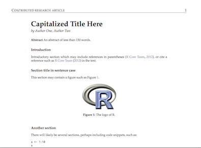</a>
        <a href="https://github.com/rstudio/rticles/tree/master/inst/rmarkdown/templates/rjournal_article" class="galleryItemLabel">R Journal</a>
        
The rjournal article template in the rticles package formats an R Markdown document to meet the style guidelings of the R Journal. <a href="https://github.com/rstudio/rticles/tree/master/inst/rmarkdown/templates/rjournal_article">Example Code</a>

      

      

        <a href="https://github.com/hrbrmstr/markdowntemplates">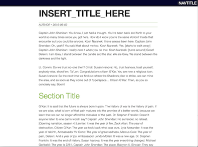</a>
        <a href="https://github.com/hrbrmstr/markdowntemplates" class="galleryItemLabel">Skeleton</a>
        
The skeleton template is one of several provided in Bob Rudis’ markdowntemplates package. <a href="https://github.com/hrbrmstr/markdowntemplates/tree/master/inst/rmarkdown/templates/default">Example Code</a>

      

      

        
        <a href="http://svmiller.com/blog/2016/03/svm-r-markdown-cv/" class="galleryItemLabel">CV</a>
        
Steve Miller’s CV template formats an R Markdown file into a Curriculum Vitae (CV). <a href="https://raw.githubusercontent.com/svmiller/svm-r-markdown-templates/master/svm-rmarkdown-cv.Rmd">Example Code</a>

      

    

  

  

    
Package Vignettes

    
The html_vignette template makes it easy to write R package vignettes with R Markdown. These vignettes were each written with R Markdown.

    

      

        
        <a href="https://cran.r-project.org/web/packages/httr/vignettes/quickstart.html" class="galleryItemLabel">httr</a>
        
The Quickstart vignette in the httr package. <a href="https://github.com/hadley/httr/blob/master/vignettes/quickstart.Rmd">Example Code</a>

      

      

        <a href="https://cran.r-project.org/web/packages/rvest/vignettes/selectorgadget.html">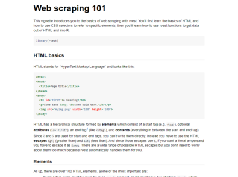</a>
        <a href="https://cran.r-project.org/web/packages/rvest/vignettes/selectorgadget.html" class="galleryItemLabel">rvest</a>
        
The Selector Gadget vignette in the rvest package. <a href="https://github.com/hadley/rvest/blob/master/vignettes/selectorgadget.Rmd">Example Code</a>

      

      

        <a href="https://cran.r-project.org/web/packages/knitr/vignettes/docco-linear.html">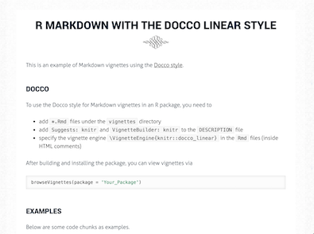</a>
        <a href="https://cran.r-project.org/web/packages/knitr/vignettes/docco-linear.html" class="galleryItemLabel">R Markdown with the Docco Linear Style (knitr)</a>
        
The Docco Linear example vignette in the knitr package. <a href="https://github.com/yihui/knitr/blob/master/vignettes/docco-linear.Rmd">Example Code</a>

      

      

        <a href="https://cran.r-project.org/web/packages/knitr/vignettes/docco-classic.html">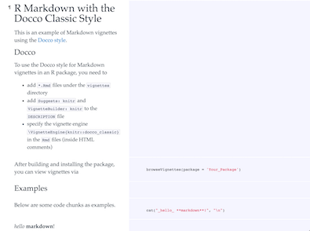</a>
        <a href="https://cran.r-project.org/web/packages/knitr/vignettes/docco-classic.html" class="galleryItemLabel">R Markdown with the Docco Classic Style (knitr)</a>
        
The Docco Classical example vignette in the knitr package. <a href="https://github.com/yihui/knitr/blob/master/vignettes/docco-classic.Rmd">Example Code</a>

      

    

  

<!--/html_preserve-->
