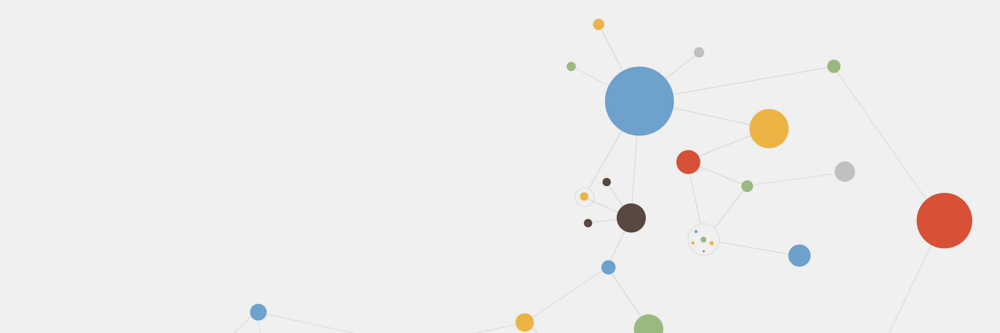

```{js, echo=FALSE}
$("#rStudioHeader").removeClass("alwaysShrunk");
$("#pageContent").removeClass("standardPadding");
```


<!--html_preserve-->

<div id="homeContent">
  <div class="band full blue first rightText">
    <div class="bandContent vCenter">
      <div class="blurb">
        <div class="tagline">Analyze. Share. Reproduce.</div>
        <div>Your data tells a story. Tell it with R Markdown. Turn your analyses into high quality documents, reports, presentations and dashboards.</div>
      </div>
    </div>
    
  </div>

  <div class="band full gray1 second leftText">
    <div class="bandContent vCenter">
      <div class="blurb">
        <div>R Markdown documents are fully reproducible. Use a productive <a href="https://bookdown.org/yihui/rmarkdown/notebook.html">notebook interface</a> to weave together narrative text and code to produce elegantly formatted output. Use <a href="https://bookdown.org/yihui/rmarkdown/language-engines.html">multiple languages</a> including R, Python, and SQL.</div>
      </div>
    </div>
    
  </div>

  <div class="band full third rightText">
    
    <div class="bandContent vCenter">
      <div class="blurb">
        <div>
          R Markdown supports dozens of static and dynamic output formats including
          <a href="https://bookdown.org/yihui/rmarkdown/html-document.html">HTML</a>, <a href="https://bookdown.org/yihui/rmarkdown/pdf-document.html">PDF</a>, <a href="https://bookdown.org/yihui/rmarkdown/word-document.html">MS Word</a>, <a href="https://bookdown.org/yihui/rmarkdown/beamer-presentation.html">Beamer</a>, <a href="https://bookdown.org/yihui/rmarkdown/ioslides-presentation.html">HTML5 slides</a>, <a href="https://bookdown.org/yihui/rmarkdown/tufte-handouts.html">Tufte-style handouts</a>, <a href="https://bookdown.org">books</a>, <a href="flexdashboard/">dashboards</a>,
          <a href="https://bookdown.org/yihui/rmarkdown/shiny-documents.html">shiny applications</a>, <a href="https://github.com/rstudio/rticles">scientific articles</a>, <a href="https://bookdown.org/yihui/rmarkdown/rmarkdown-site.html">websites</a>, and more.
        </div>
        <div class="actions">
          <div><a href="lesson-1.html"><button class="bigButton getStarted">Get Started</button></a></div>
          <div><a href="gallery.html"><button class="bigButton gallery">See Gallery</button></a></div>
        </div>
      </div>
    </div>
  </div>
  <div class="band full gray2 fourth leftText">
    <div class="bandContent vCenter">
      <div class="blurb">
        <div>Need R Markdown in production? Learn how to <a href="https://docs.rstudio.com/connect/user/publishing/">publish</a> and <a href="https://docs.rstudio.com/connect/user/scheduling/">schedule</a> reports, <a href="https://docs.rstudio.com/connect/user/param-rmarkdown/">enable self-service customization</a>, and distribute beautiful emails using <a href='https://rstudio.com/products/connect'> RStudio Connect</a>.
        </div>
      </div>
    </div>
    
  </div>
</div>

<!--/html_preserve-->
