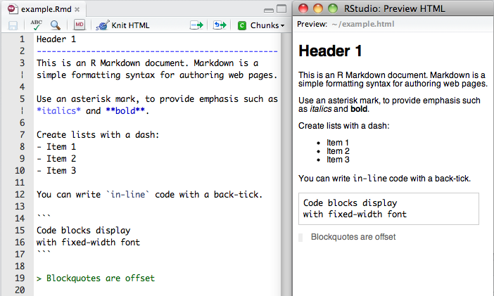
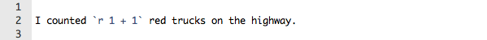
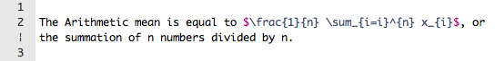

***

R Markdown is an authoring format that enables easy creation of dynamic documents, presentations, and reports from R. It combines the core syntax of [markdown](http://daringfireball.net/projects/markdown/basics) (an easy-to-write plain text format) with embedded R code chunks that are run so their output can be included in the final document. R Markdown documents are fully *reproducible* (they can be automatically regenerated whenever underlying R code or data changes).

This website describes R Markdown v2, a next generation implementation of R Markdown based on  [knitr](http://yihui.name/knitr/) and [pandoc](http://johnmacfarlane.net/pandoc/). This implementation brings many enhancements to R Markdown, including:

* Create HTML, PDF, and MS Word documents as well as [Beamer](https://bitbucket.org/rivanvx/beamer/wiki/Home), [ioslides](https://code.google.com/p/io-2012-slides/) and [reveal.js](http://lab.hakim.se/reveal-js/#/) presentations.
* New markdown syntax including expanded support for tables and bibliographies.
* Hooks for customizing HTML and PDF output (include CSS, headers, and footers).
* Include raw LaTeX within markdown for advanced customization of PDF output.
* Compile HTML, PDF, or MS Word notebooks from R scripts.
* Extensiblity: create custom templates and even entirely new output formats.
* Use Shiny within R Markdown documents

Note that PDF output (including Beamer slides) requires an installation of TeX. On Windows, [MiKTeX](http://miktex.org/) should be used rather than TeX Live.

#### Installing R Markdown

You can use R Markdown either through the the integrated support for R Markdown within RStudio or via the rmarkdown package:

1. RStudio --- Install the current [RStudio Preview Release](http://www.rstudio.com/ide/download/preview).

2. Other environments --- Install the [rmarkdown package](https://github.com/rstudio/rmarkdown).

## Quick Tour

### Markdown Basics

Markdown is a simple formatting language designed to make authoring content easy for everyone. Rather than writing complex markup code (e.g. HTML or LaTeX), Markdown enables the use of a syntax much more like plain-text email. For example the file on the left shows basic Markdown and the resulting output on the right:



### R Code Chunks

Within an R Markdown file, R Code Chunks can be embedded using the native Markdown syntax for fenced code regions. For example, the following code chunk computes a data summary and renders a plot as a PNG image:


### Inline R Code

You can also evaluate R expressions inline by enclosing the expression within a single back-tick qualified with 'r'. For example, the following code:



Results in this output: "I counted 2 red trucks on the highway."

### Embedding Equations

You can embed LaTeX or MathML equations in R Markdown files using the following syntax:

* *`$equation$`* for inline equations (note there must not be white space adjacent to the $ delimiters)
* *`$$ equation $$`* for display equations
* *`<math ...> </math>`* for MathML equations.

For example:



### Rendering Output

There are two ways to render an R Markdown document into it's final output format. If you are using RStudio, then the "Knit" command (Ctrl+Shift+K) will render the document and display a preview of it.

If you are not using RStudio then you simply need to call the `rmarkdown::render` function, for example:

```r
rmarkdown::render("input.Rmd")
```

Note that in the case using the "Knit" button in RStudio the basic mechanism is the same (RStudio calls the `rmarkdown::render` function under the hood).

### Output Options

R Markdown documents can contain a metadata section that includes both title, author, and date information as well as options for customizing output. For example, this metadata included at the top of an Rmd file adds a table of contents and chooses a different HTML theme:

```
---
title: "Sample Document"
output:
  html_document:
    toc: true
    theme: united
---
```

R Markdown has built in support for several output formats (HTML, PDF, and MS Word documents as well as Beamer presentations). These formats can also be specified in metadata, for example:

```
---
title: "Sample Document"
output:
  pdf_document:
    toc: true
    highlight: zenburn
---
```

If you aren't specifying format options you can also just use a simple format name:

```
---
title: "Sample Document"
output: pdf_document
---
```

Multiple formats can be specified in metadata:

```
---
title: "Sample Document"
output:
  html_document:
    toc: true
    theme: united
  pdf_document:
    toc: true
    highlight: zenburn
---
```

If you are using `rmarkdown::render` then you can pass a format name to `render` to select from the available formats. For example:

```r
render("input.Rmd", "pdf_document")
```

You can also render all formats defined in an input file with:

```r
render("input.Rmd", "all")
```


## Learning More

With the basics described above you can get started with R Markdown right away. To learn more see:

* [Markdown Basics](authoring_basics.html), which describes the most commonly used markdown constructs.

* [R Code Chunks](authoring_rcodechunks.html), which goes into more depth on customizing the behavior of embedded R code.

* [Interactive Documents with Shiny](authoring_shiny.html), which describes how to include Shiny components within R Markdown documents.

* [Compiling Notebooks](authoring_compile_notebook.html), which describes how to compile HTML, PDF, or MS Word notebooks from R scripts.

* Document output formats: [HTML](html_document_format.html), [PDF](pdf_document_format.html), [Word](word_document_format.html)

* Presentation output formats: [ioslides](ioslides_presentation_format.html), [reveal.js](revealjs_presentation_format.html), [Beamer](beamer_presentation_format.html)


For even more in-depth documentation see:

* The website for the [knitr package](http://yihui.name/knitr/). Knitr is an extremely powerful tool for dynamic content generation and the website has a wealth of documentation and examples to help you utilize it to its full potential.

* The full specification of [Pandoc Markdown](authoring_pandoc_markdown.html), which describes all of the markdown features and syntax available within R Markdown documents.

* If you are migrating documents from R Markdown v1 or wish to continue using RMarkdown v1 see the article on [Migrating from R Markdown v1](authoring_migrating_from_v1.html).

See also the R Markdown developer documentation including:

* Creating re-usable [Document Templates](developer_document_templates.html)
    
* Guide to [Creating New Formats](developer_custom_formats.html) for R Markdown
    
* Adding new types of HTML output to R Markdown documents using [HTML Widgets](developer_html_widgets.html) and [Shiny Widgets](developer_shiny_widgets.html).

