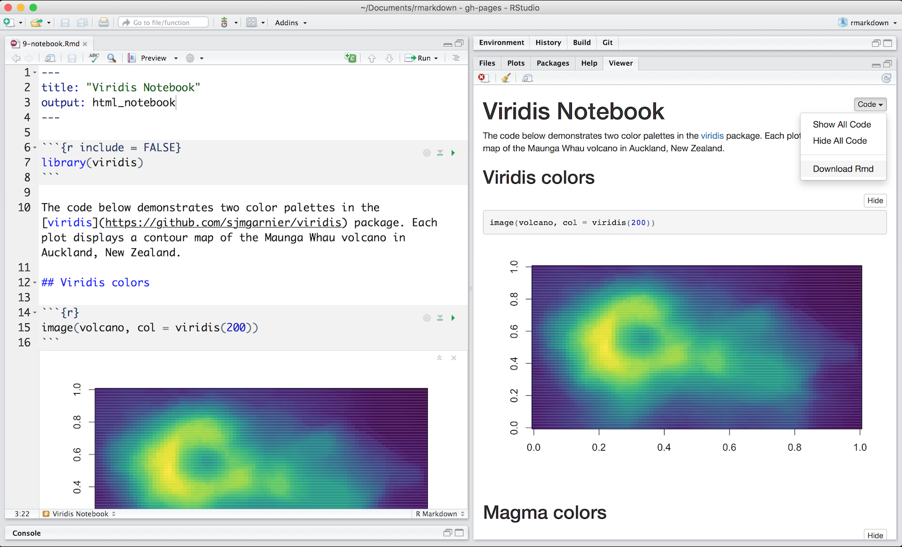

In [How It Works](lesson-2.html), you learned that R Markdown files provide a [notebook interface](https://bookdown.org/yihui/rmarkdown/notebook.html) that makes it easy to test and iterate when writing code. 

Share this experience by sharing your .Rmd file with colleagues for them to open in their RStudio IDE. Or recreate the notebook interface for non-R users by rendering your file to an HTML notebook with `output: html_notebook`, as in [this example](https://rstudio.cloud/project/181957).

 

R Markdown will create a `nb.html` version of your file: a self-contained HTML file that contains both a rendered copy of the notebook with all current chunk outputs (suitable for display on a website) and a copy of the notebook .Rmd itself.

You can view the .nb.html file in any ordinary web browser, or open it in RStudio. In this case, RStudio will extract and open the .Rmd file that underlies the nb.html file.

##  Version Control

One of the major advantages of R Notebooks compared to other notebook systems is that they are plain-text files and therefore work well with version control. We recommend checking in both the .Rmd and .nb.html files into version control so that both your source code and output are available to collaborators. However, you can choose to include only the .Rmd file (with a .gitignore that excludes the .nb.html) if you want each collaborator to work with their own private copies of the output.

See [R Notebooks](https://bookdown.org/yihui/rmarkdown/notebook.html) to learn more about notebooks with R Markdown.

***

## [Continue to Slide Presentations](lesson-11.html){.continue-link}
