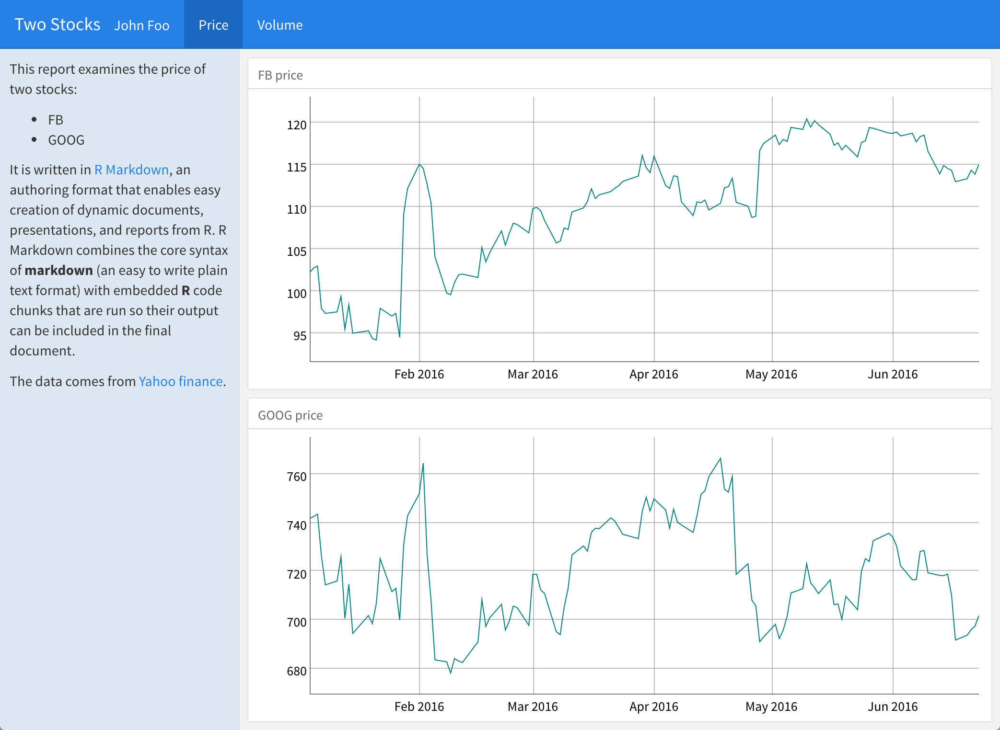

With flexdashboard, layout options are easy to customize. For example, you can group columns (or rows) into separate pages with level 1 headers (`==========` or `#`). The title of the header will appear as the title of the page in the dashboard's navbar. The page will contain every box, column, or row in the section that is associated with the header.

To further customize pages, columns (or rows) and boxes, place options surrounded by brackets next to the title of the element. For example, the option below would turn a page into a sidebar for the dashboard.

```
# Introduction {.sidebar}
```

flexdashboard also provides simple tools for creating tabsets, value boxes, and gauges. Learn more about flexdashboard at [flexdashboard: Easy interactive dashboards for R](http://rmarkdown.rstudio.com/flexdashboard/).

## Exercise

Use `{.sidebar}` to move the text at the top of [your dashboard](lesson-exercises/exercise-10.Rmd) into a sidebar. Then migrate each column to its own page. The results should look like this:

***



***

## Show Answer

## Model Answer

```{r echo = FALSE, comment = ""}
cat(htmltools::includeText("lesson-solutions/solution-10.Rmd"))
```

## [Continue to next lesson](lesson-11.html)
