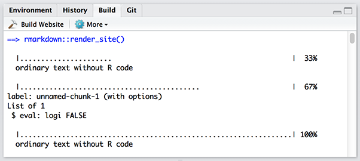
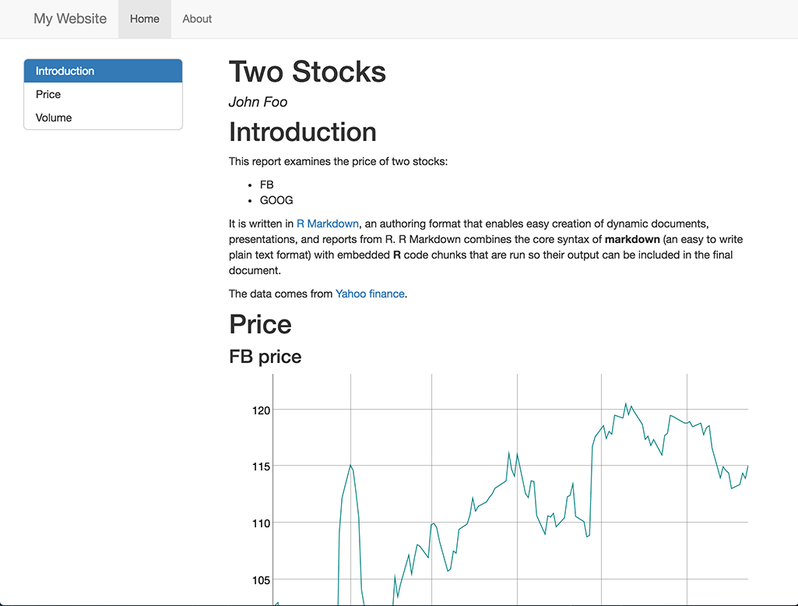
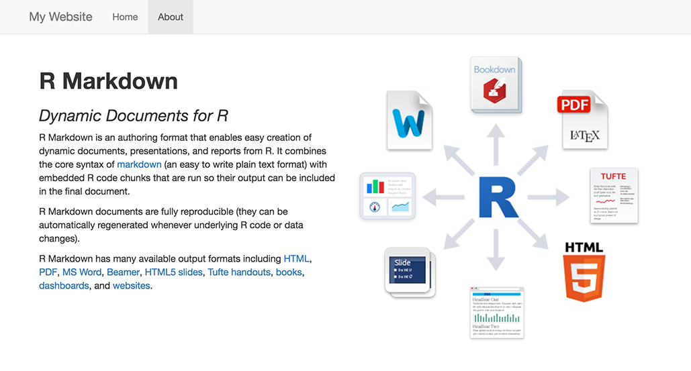

#### | **[ 1 ](lesson-1.html)** |  **[ 2 ](lesson-2.html)** |  **[ 3 ](lesson-3.html)** | **[ 4 ](lesson-4.html)** | **[ 5 ](lesson-5.html)** | **[ 6 ](lesson-6.html)** | **[ 7 ](lesson-7.html)** | **[ 8 ](lesson-8.html)** | **[ 9 ](lesson-9.html)** | **[ 10 ](lesson-10.html)** | Lesson 11 | **[ 12 ](lesson-12.html)** |
***

# R Markdown Websites

You can render collections of R Markdown documents as a website using the `rmarkdown::render_site` function. To do so, you will need the most recent version of the **rmarkdown** package (v0.9.6) which you can install from CRAN as follows:

```r
install.packages("rmarkdown", type = "source")
```

## Overview

An R Markdown website is a collection of files. Each website contains a file named `_site.yml` and a .Rmd file named `index.Rmd`, which provides the content for the home page of your website. You add pages to your website by adding additional .Rmd files, one per page.

Here is the file structure of a very simple R Markdown website. This website has two pages, and a navbar to navigate between them.

**\_site.yml**

```yaml
name: "my-website"
navbar:
  title: "My Website"
  left:
    - text: "Home"
      href: index.html
    - text: "About"
      href: about.html
```

**index.Rmd**

```markdown
---
title: "My Website"
---

Hello, Website!
```

**about.Rmd**

```markdown
---
title: "About This Website"
---

More about this website.
```

When you execute the `rmarkdown::render_site` function from within the directory containing the website, R Markdown generates HTML files and places them into a directory named `_site`. These files are now ready to deploy as a standalone static website.

### RStudio IDE integration

The RStudio IDE also includes integrated support for developing R Markdown websites. These features are available in the current Preview Release of RStudio (v0.99.1242) which you can install from here: [RStudio Preview Release](https://www.rstudio.com/products/rstudio/download/preview/).

To use these features, create an [RStudio Project](https://support.rstudio.com/hc/en-us/articles/200526207-Using-Projects) that is associated with your website directory. You can then build and preview your website by clicking "Build Website" in the Build tab.



Learn more about generating websites with R Markdown at [R Markdown Websites](http://rmarkdown.rstudio.com/rmarkdown_websites.html).


## Exercise

This [zip file](lesson11-website/website.zip) contains an R Markdown website, but it is missing an `index.Rmd` file.

Unzip the file and open the .Rproj file on your computer. Then save [your report](lesson-exercises/exercise-11.Rmd) to the directory as `index.Rmd` and build the website. You'll want to change the `output:` field back to `html_document`. For added effect, restore the floating table of contents.

When you are finished, your website should look like this.





***
#### [Continue to lesson 12](lesson-12.html)
