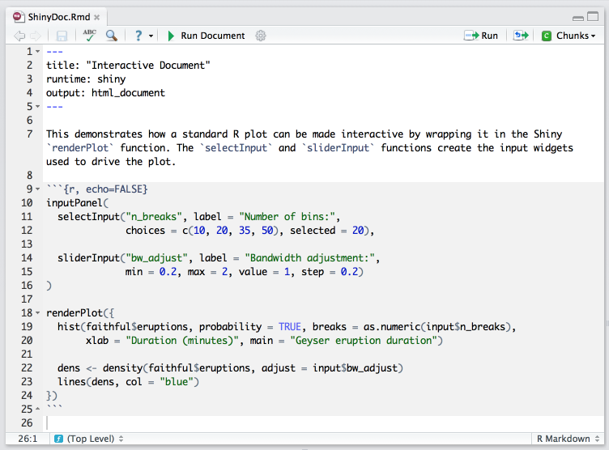

There are two ways to make R Markdown output interactive. You can add:

1. Interactive JavaScript data visualizations based on [htmlwidgets](http://www.htmlwidgets.org/)
2. Reactive components made with [Shiny](http://shiny.rstudio.com/)

The [dygraphs](http://rstudio.github.io/dygraphs/) in our examples are JavaScript visualizations created by htmlwidgets. Htmlwidgets run on the client side, they embed into your document all of the JavaScript code and data that your user's web browser will need to execute interactions. Since htmlwidgets are exported in JavaScript, any common web browser can execute the code.

Shiny components execute on the server side. They provide a way for the user to trigger the execution of R code, which you write, and to see the results. Since web browsers cannot execute R code, Shiny components must be run locally (e.g. in your RStudio IDE) or hosted by a Shiny server that can execute the R code on the server side (e.g. [shinyapps.io](http://www.shinyapps.io/)). This arrangement has the side benefit of not requiring you to share data, which could be private or burdensomely large, with the user. Shiny components also let you run arbitrary R code to respond to an interaction, whereas htmlwidgets are limited to prepackaged routines.

## Using Shiny

To get started, download the Shiny R package from CRAN:

```r
install.packages("shiny")
```

To include Shiny components in an R Markdown document, add `runtime: shiny` to the YAML header of the document. This will ensure the R Markdown deploys the document as an interactive Shiny app connected with a live R session to handle interactions.

To render the document, click the "Run Document" button that appears at the top of the window.



You can use Shiny components in any HTML based R Markdown output including HTML documents, slide presentations, and flexdashboards.

Learn more about interactive documents with R Markdown at [Interactive Documents](http://rmarkdown.rstudio.com/authoring_shiny.html). Learn more about the Shiny package at the [Shiny Development Center](http://shiny.rstudio.com/).

## Exercise

Install the shiny package. Then copy and paste the text below into your own R Markdown file.

Run the document and move with the sliders to see interactivity in action.

Close the document to return to your R session when you are finished.

```{r echo = FALSE, comment = ""}
cat(htmltools::includeText("lesson-solutions/solution-12.Rmd"))
```

You can see this document hosted at shinyapps.io [here](https://gallery.shinyapps.io/solution-12/).
