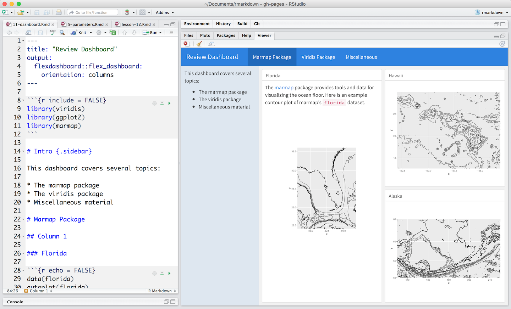

Dashboards are a useful way to communicate large amounts of information visually and quickly. Create one with the `flexdashboard::flex_dashboard` output format, as in the [.Rmd file below](demos/11-dashboard.Rmd):

 

Flexdashboard makes it easy to organize your content into a visual layout:

* Each Level 1 Header (`#`) begins a new page in the dashboard.
* Each Level 2 Header (`##`) begins a new column.
* Each Level 3 Header (`###`) begins a new box.

You can further modify elements with attributes, as in the `{.sidebar}` above.

Flexdashboard also provides simple tools for creating tabsets, value boxes, and gauges. Learn more about flexdashboard at [flexdashboard: Easy interactive dashboards for R](http://rmarkdown.rstudio.com/flexdashboard/).

***

## [Continue to Websites](lesson-13.html){.continue-link}

