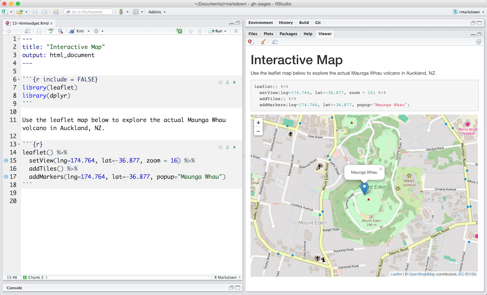
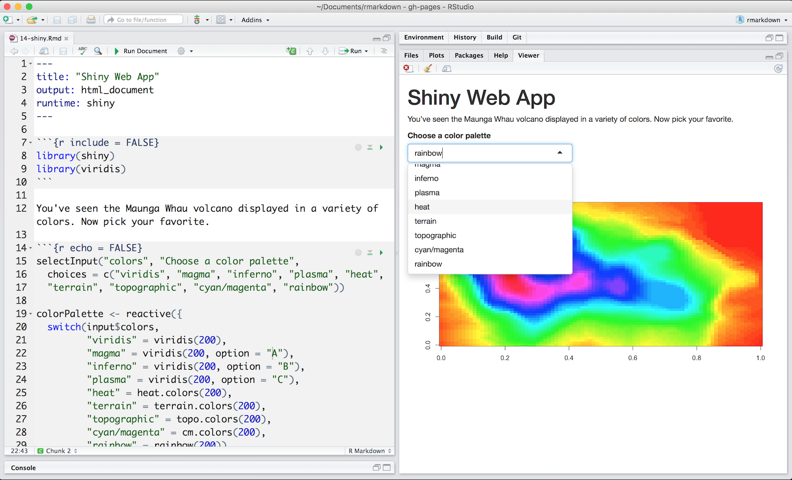

R Markdown documents are a perfect platform for interactive content. To make your documents interactive, add:

1. Interactive JavaScript visualizations based on [htmlwidgets](http://www.htmlwidgets.org/), or
2. Reactive components made with [Shiny](http://shiny.rstudio.com/)

## htmlwidgets

[Htmlwidgets](http://www.htmlwidgets.org/) are R functions that return JavaScript visualizations. The document below uses a [leaflet](http://rstudio.github.io/leaflet/) htmlwidget to create an interactive map. You can access the document [here](https://rstudio.cloud/project/181983) on RStudio Cloud.

 

Htmlwidgets create *client side* interactions. Since htmlwidgets are exported in JavaScript, any common web browser can execute the interactions.

Learn more about packages that build htmlwidgets at [www.htmlwidgets.org](http://www.htmlwidgets.org/showcase_leaflet.html).

## Shiny

The [Shiny](http://shiny.rstudio.com/) package builds interactive web apps powered by R. To call Shiny code from an R Markdown document, add `runtime: shiny` to the header, like in [this document](https://rstudio.cloud/project/181983), which is also available on RStudio Cloud.

 

Use Shiny to run any R code that you like in response to user actions. Since web browsers cannot execute R code, Shiny interactions occur on the *server side*.

Learn more about Shiny at the [Shiny Development Center](http://shiny.rstudio.com/).

## Output formats

Htmlwidgets and Shiny elements rely on HTML and JavaScript. They will work in any R Markdown format that is viewed in a web browser, such as html documents, notebooks and websites, as well as dashboards and slide presentations.

If you include an interactive element in a static output format, like a PDF, R Markdown will embed a screenshot of the element.

Learn more about interactive documents with R Markdown at [Interactive Documents](https://bookdown.org/yihui/rmarkdown/shiny-documents.html). 

****

## [Continue to the Cheatsheets](lesson-15.html){.continue-link}
