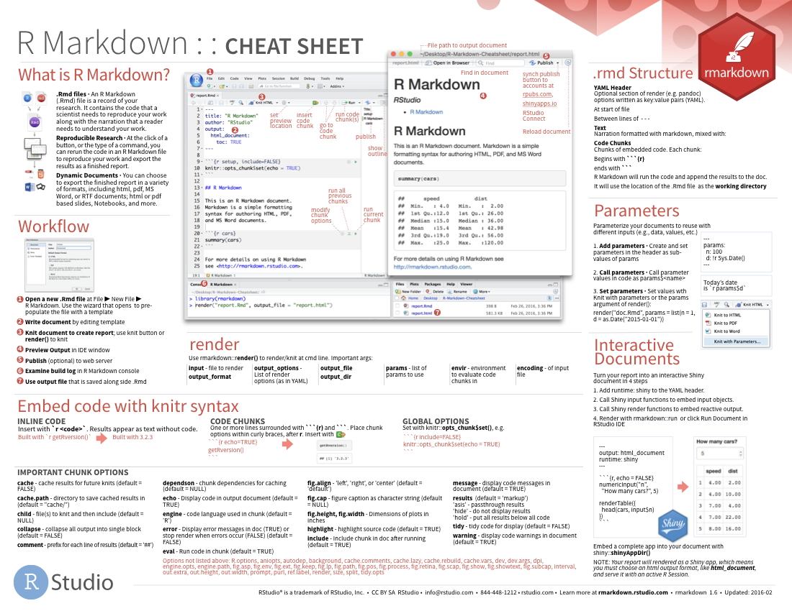
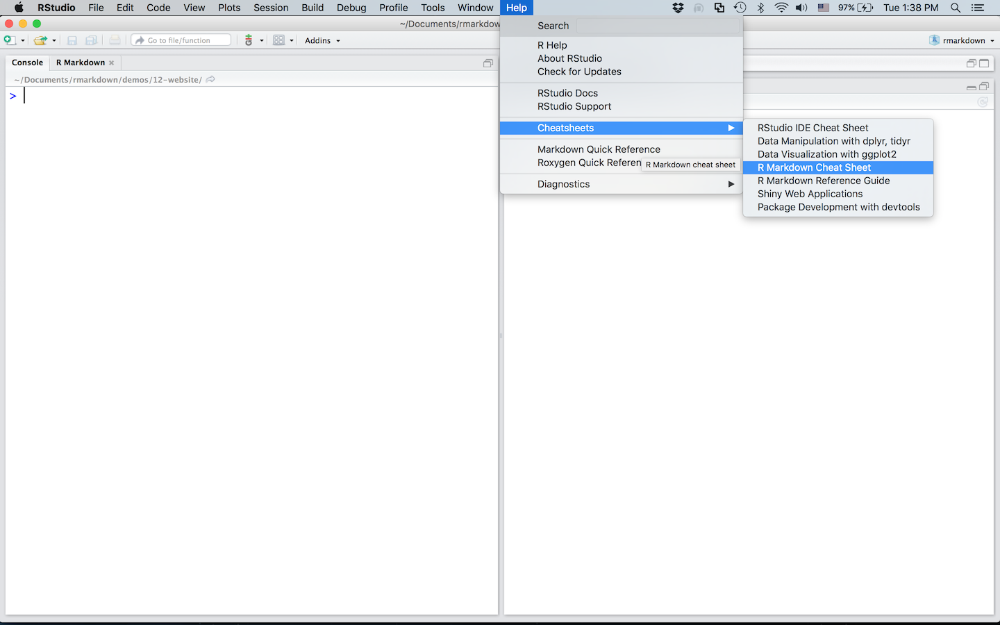
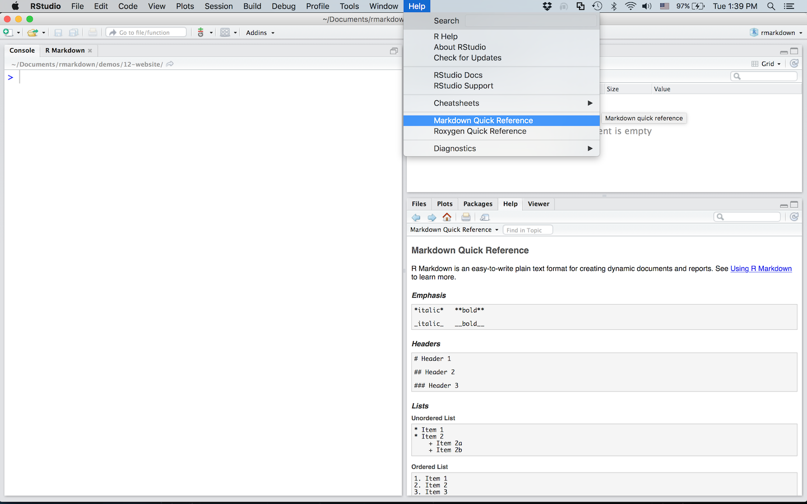

Use the cheatsheets that are built into the RStudio IDE to jog your memory about R Markdown.

 

Go to *File > Help > Cheatsheets > R Markdown Cheat Sheet* to open the main [R Markdown cheatsheet](https://github.com/rstudio/cheatsheets/raw/master/rmarkdown-2.0.pdf), pictured above.

 

Go to *File > Help > Markdown Quick Reference* to open the *Markdown Quick Reference* in your help pane.

 

****

## Visit the [Formats](formats.html) and [Articles](articles.html) tabs to learn more.{.continue-link}
