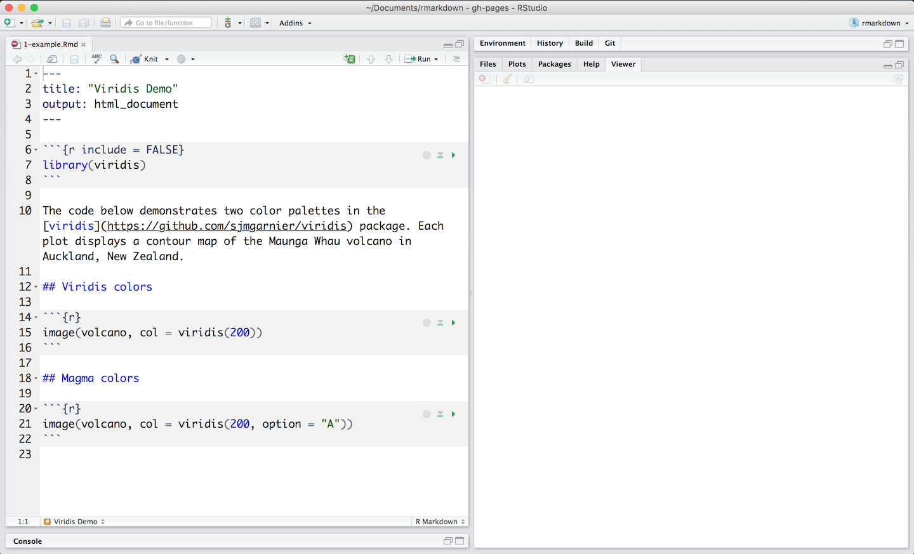
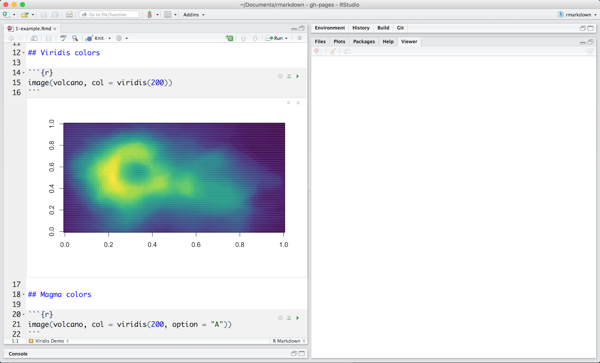
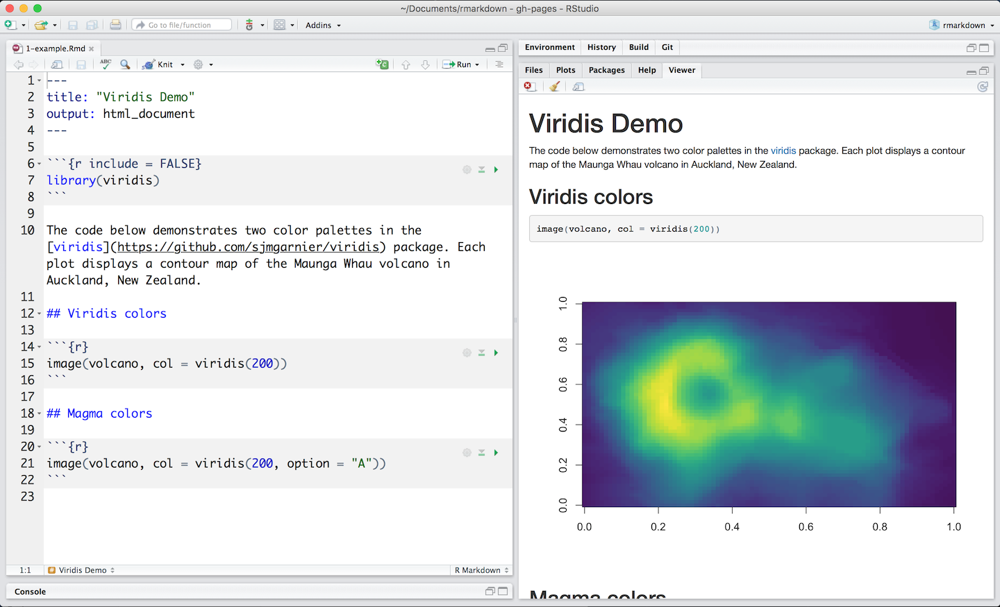

This is an R Markdown file, a plain text file that has the extension `.Rmd`. You can open a copy [here](https://rstudio.cloud/project/181856) on RStudio Cloud.


</br>

Notice that the file contains three types of content:

* An (optional) YAML header surrounded by `---`s
* R code chunks surrounded by <code>```</code>s
* text mixed with simple text formatting

## A Notebook Interface

When you open the file in the RStudio IDE, it becomes a [notebook interface for R](https://bookdown.org/yihui/rmarkdown/notebook.html). You can run each code chunk by clicking the  icon. RStudio executes the code and display the results inline with your file.


</br>

## Rendering output

To generate a report from the file, run the `render` command:

```{r eval = FALSE}
library(rmarkdown)
render("1-example.Rmd")
```

Better still, use the "Knit" button in the RStudio IDE to render the file and preview the output with a single click or keyboard shortcut (&#8679;&#8984;K).


</br>

R Markdown generates a new file that contains selected text, code, and results from the .Rmd file. The new file can be a finished [web page](https://bookdown.org/yihui/rmarkdown/html-document.html), [PDF](https://bookdown.org/yihui/rmarkdown/pdf-document.html), [MS Word](https://bookdown.org/yihui/rmarkdown/word-document.html) document, [slide show](https://bookdown.org/yihui/rmarkdown/ioslides-presentation.html), [notebook](https://bookdown.org/yihui/rmarkdown/notebook.html), [handout](https://bookdown.org/yihui/rmarkdown/tufte-handouts.html), [book](https://bookdown.org/), [dashboard](flexdashboard/index.html), [package vignette](https://bookdown.org/yihui/rmarkdown/r-package-vignette.html) or [other format](formats.html).

## How it works


</br>

When you run `render`, R Markdown feeds the .Rmd file to [knitr](http://yihui.name/knitr/), which executes all of the code chunks and creates a new markdown (.md) document which includes the code and it's output.

The markdown file generated by knitr is then processed by [pandoc](http://pandoc.org/) which is responsible for creating the finished format.

This may sound complicated, but R Markdown makes it extremely simple by encapsulating all of the above processing into a single `render` function.

***
## [Continue to Code Chunks](lesson-3.html){.continue-link}
