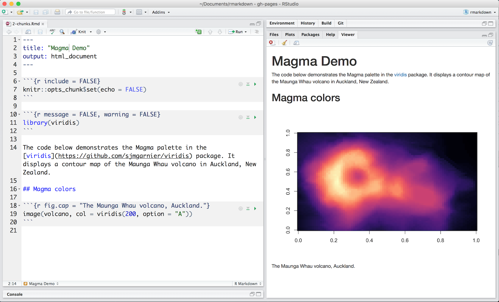

The R Markdown file [below](demos/2-chunks.Rmd) contains three code chunks.


</br>

You can quickly insert chunks like these into your file with 

* the keyboard shortcut **Ctrl + Alt + I** (OS X: **Cmd + Option + I**)
* the Add Chunk  command in the editor toolbar

or by typing the chunk delimiters ` ```{r} ` and ` ``` `.

When you render your .Rmd file, R Markdown will run each code chunk and embed the results beneath the code chunk in your final report.

## Chunk Options

Chunk output can be customized with [knitr options](http://yihui.name/knitr/options/), arguments set in the `{}` of a chunk header. Above, we use five arguments:

* `include = FALSE` prevents code and results from appearing in the finished file. R Markdown still runs the code in the chunk, and the results can be used by other chunks.
* `echo = FALSE` prevents code, but not the results from appearing in the finished file. This is a useful way to embed figures.
* `message = FALSE` prevents messages that are generated by code from appearing in the finished file.
* `warning = FALSE` prevents warnings that are generated by code from appearing in the finished.
* `fig.cap = "..."` adds a caption to graphical results.

See the [R Markdown Reference Guide](https://www.rstudio.com/wp-content/uploads/2015/03/rmarkdown-reference.pdf) for a complete list of knitr chunk options.

## Global Options

To set global options that apply to every chunk in your file, call `knitr::opts_chunk$set` in a code chunk. Knitr will treat each option that you pass to `knitr::opts_chunk$set` as a global default that can be overwritten in individual chunk headers.

## Caching

If document rendering becomes time consuming due to long computations you can use knitr caching to improve performance. [*Knitr chunk and package options*](http://yihui.name/knitr/options) describes how caching works and the [*Cache examples*](http://yihui.name/knitr/demo/cache/) provide additional details.

***
## [Continue to Inline Code](lesson-4.html){.continue-link}
