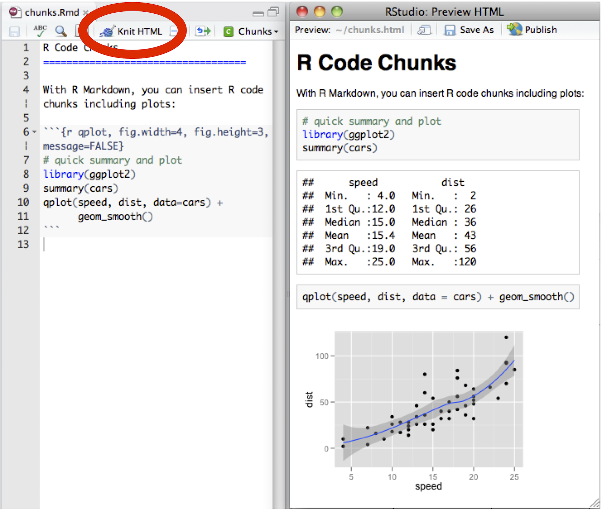

There are two ways to render an R Markdown document into it's final output format. If you are using RStudio, then the "Knit" button (Ctrl+Shift+K) will render the document and display a preview of it.



If you are not using RStudio then you simply need to call the `rmarkdown::render` function, for example:

```r
rmarkdown::render("input.Rmd")
```

You can learn more about the `render()` function by examining it's help page, `help(render, package = "rmarkdown")`.

Note that both methods use the same mechanism; RStudio's "Knit" button calls `rmarkdown::render()` under the hood.

## Exercise

Use the `rmarkdown::render()` function to render [your .Rmd file](lesson-exercises/exercise-4.Rmd). Be sure to give `rmarkdown::render()` the filepath to your .Rmd file. Set `render()`'s `output_file` to choose a custom name for the output file.

***

## Show Answer

## Model answer

```{r, eval = FALSE}
render("exercise-4.Rmd", output_file = "stocks.html")
```

## [Continue to next lesson](lesson-5.html)
