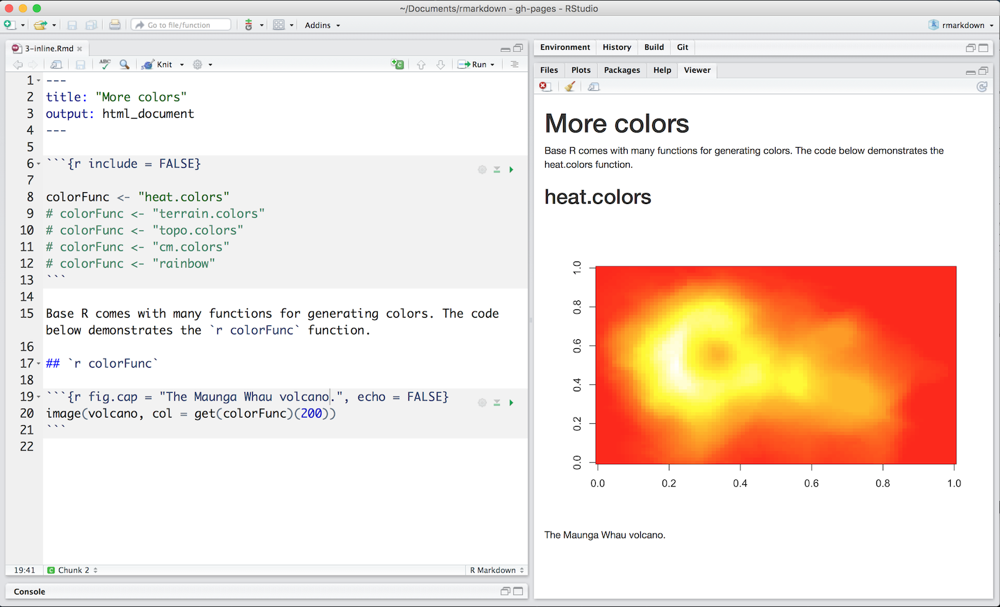

Code results can be inserted directly into the text of a .Rmd file by enclosing the code with `` `r `  ``. The [file below](demos/3-inline.Rmd) uses `` `r `  `` twice to call `colorFunc`, which returns "heat.colors."

 

This makes it easy to update the report to refer to another function. 

 

R Markdown will always 

* display the results of inline code, but not the code
* apply relevant text formatting to the results

As a result, inline output is indistinguishable from the surrounding text. Inline expressions do not take knitr options. 

***
## [Continue to Code Languages](lesson-5.html){.continue-link}
