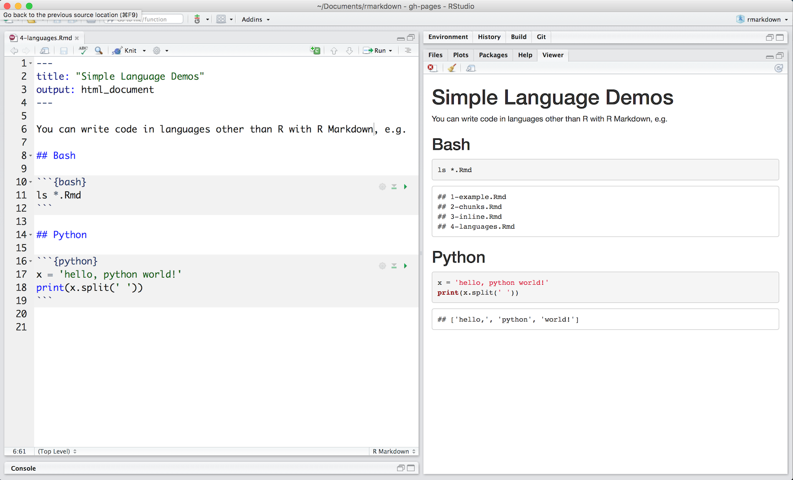

Notice how this .Rmd file executes code in bash and python. You can open the file [here](https://rstudio.cloud/project/181938) in RStudio Cloud.


</br>

[knitr](http://yihui.name/knitr/) can execute code in many languages besides R. Some of the available language engines include:

* Python
* SQL
* Bash
* Rcpp
* Stan
* JavaScript
* CSS

To process a code chunk using an alternate language engine, replace the `r` at the start of your chunk declaration with the name of the language:

```{r eval = FALSE}
```{bash}
```
```

Note that chunk options like `echo` and `results` are all valid when using a language engine like python. 

Learn more about using other languages with R Markdown in [knitr Language Engines](https://bookdown.org/yihui/rmarkdown/language-engines.html).

***

## [Continue to Parameters](lesson-6.html){.continue-link}
