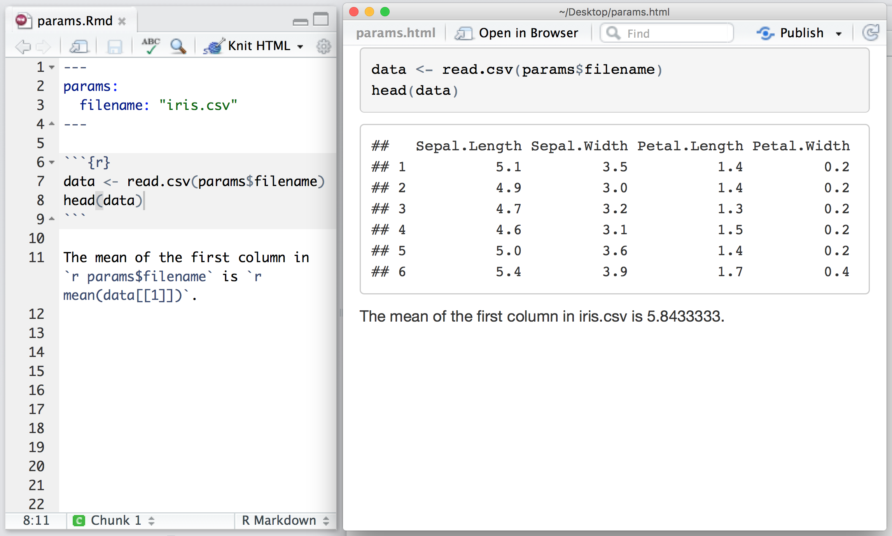
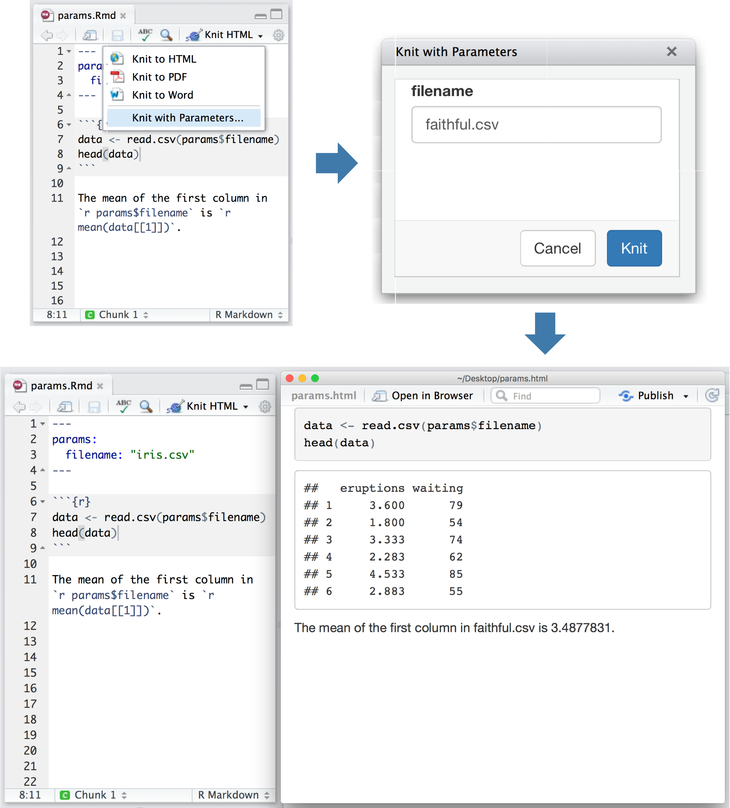

#### | **[ 1 ](lesson-1.html)** |  **[ 2 ](lesson-2.html)** |  **[ 3 ](lesson-3.html)** | **[ 4 ](lesson-4.html)** | Lesson 5 | **[ 6 ](lesson-6.html)** | **[ 7 ](lesson-7.html)** | **[ 8 ](lesson-8.html)** | **[ 9 ](lesson-9.html)** | **[ 10 ](lesson-10.html)** | **[ 11 ](lesson-11.html)** | **[ 12 ](lesson-12.html)** |
***

# Using Parameters

R Markdown documents can contain a metadata section that includes title, author, and date information as well as options for customizing output. For example, this metadata included at the top of an .Rmd file adds a title, author, and date to your document.

```
---
title: "Report with date"
author: "RStudio"
date: "2016-06-23"
---
```

You can add a `params:` field to the metadata to provide a list of values for your document to use. R Markdown will make the list available as `params` within any R code chunk in the report. For example, the file below takes a filename as a parameter and uses the name to read in a data set. To use multiple parameters, list each one on a new line under `params:`, indented two spaces.



Parameters let you quickly apply your data set to new data sets, models, and parameters. You can set new values for the parameters when you call `rmarkdown::render()`,

```r
rmarkdown::render("input.Rmd", params = list())
```

as well as when you press the "Knit" button:



You can learn more about params at [Paramaterized Reports](http://rmarkdown.rstudio.com/developer_parameterized_reports.html).

## Exercise

Add two parameters to [your report](lesson-exercises/exercise-5.Rmd), `symbol1` and `symbol2`. You can use "FB" (Facebook) and "GOOG" (Google) as their default values. Then replace every instance of `"AMZN"` or `"AAPL"` in your code with one of the parameters.

When you Knit with Parameters, R Markdown will let you choose two new stocks to examine. For now, your text will still refer to AMZN and AAPL, but your graphs will update.

## Model Answer

```{r echo = FALSE, comment = ""}
cat(htmltools::includeText("lesson-solutions/solution-5.Rmd"))
```
***
#### [Continue to lesson 6](lesson-6.html)
