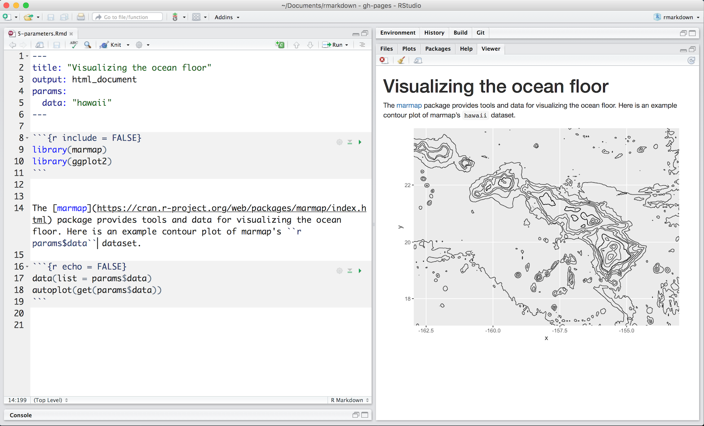
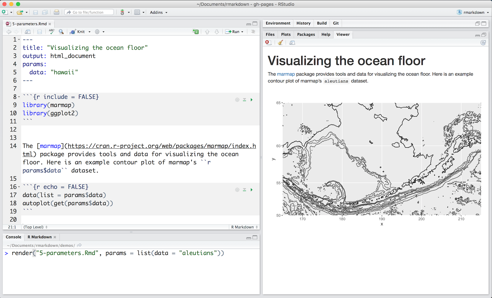
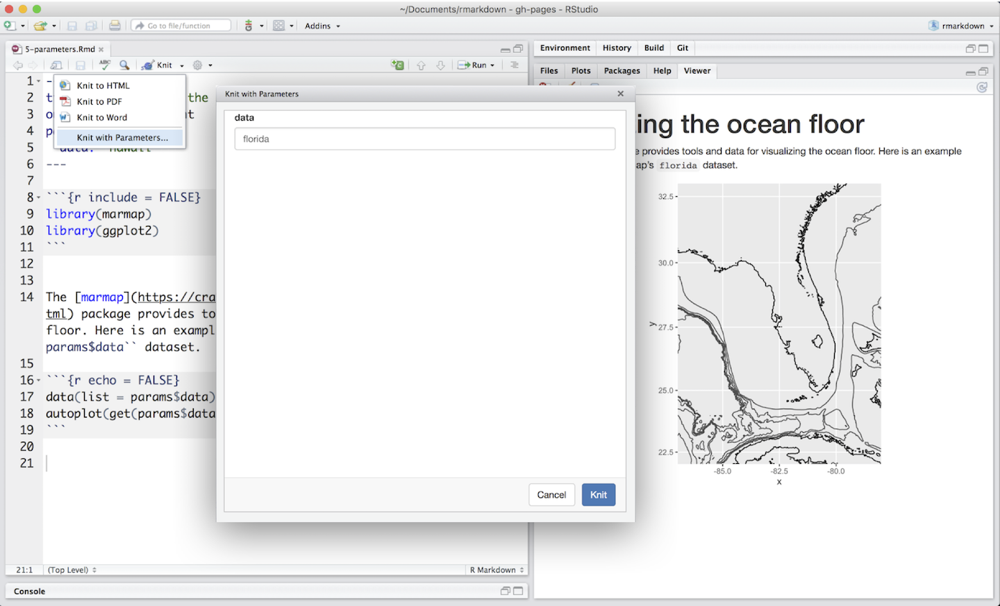

R Markdown documents can include one or more parameters whose values can be set when you render the report. For example, the file below, available [here](https://rstudio.cloud/project/181942), uses a `data` parameter that determines which data set to plot.


</br>

## Declaring Parameters

Parameters are declared using the `params` field within the YAML header of the document. For example, the file above creates the parameter `data` and assigns it the default value `"hawaii"`.

## Using Parameters in Code

Parameters are made available within the knit environment as a read-only list named `params`. To access a parameter in code, call `params$<parameter name>`.

## Setting Parameters values

Add a `params` argument to `render` to create a report that uses a new set of parameter values. Here we modify our report to use the `aleutians` data set with 

```{r eval = FALSE}
render("5-parameters.Rmd", params = list(data = "aleutians"))
```


</br>

Better yet, click the "Knit with Parameters" option in the dropdown menu next to the RStudio IDE knit button to set parameters, render, and preview the report in a single user friendly step.


</br>

Parameters are useful when you want to re-render the same report with distinct values for various key inputs, for example:

* Running a report specific to a department or geographic region.

* Running a report that covers a specific period in time.

* Running multiple versions of a report for distinct sets of core assumptions.

Learn more about parameters at [Paramaterized Reports](https://bookdown.org/yihui/rmarkdown/parameterized-reports.html).

***

## [Continue to Tables](lesson-7.html){.continue-link}
