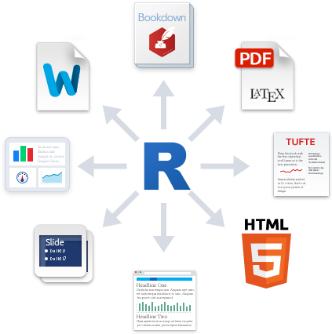
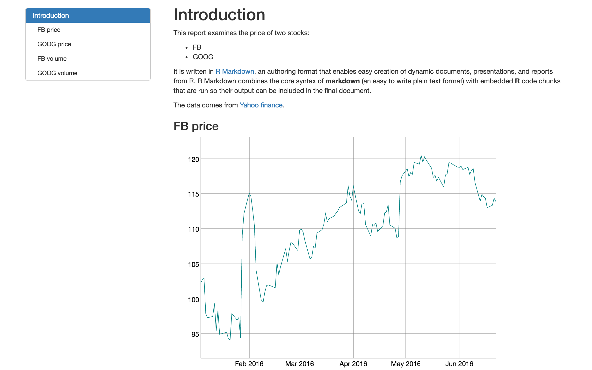

#### | **[ 1 ](lesson-1.html)** |  **[ 2 ](lesson-2.html)** |  **[ 3 ](lesson-3.html)** | **[ 4 ](lesson-4.html)** | **[ 5 ](lesson-5.html)** | **[ 6 ](lesson-6.html)** | Lesson 7 | **[ 8 ](lesson-8.html)** | **[ 9 ](lesson-9.html)** | **[ 10 ](lesson-10.html)** | **[ 11 ](lesson-11.html)** | **[ 12 ](lesson-12.html)** |
***

# Output Formats

</img>

You can create many types of output from a single .Rmd file. R Markdown has built in support for HTML, PDF, MS_Word, ODT, RTF, Markdown, and Github flavored Markdown documents; Beamer, slidy.js, ioslides, and reveal.js slideshows; and websites, dashboards, books, handouts, package vignettes, and Shiny apps. These formats can be specified in metadata, for example:

```
---
title: "Sample Document"
output: pdf_document
---
```

And you can set sub-options to customize each format:

```
---
title: "Sample Document"
output:
  pdf_document:
    toc: true
    highlight: zenburn
---
```

Multiple formats can be specified in metadata:

```
---
title: "Sample Document"
output:
  html_document:
    toc: true
    theme: united
  pdf_document:
    toc: true
    highlight: zenburn
---
```

If you are using `rmarkdown::render` then you can pass a format name to `render` to select from the available formats. For example:

```r
render("input.Rmd", "pdf_document")
```

You can also render all formats defined in an input file with:

```r
render("input.Rmd", "all")
```

You can learn more about each of R Markdown's formats, including whih sub-options the format supports at the following links:

* [HTML documents](http://rmarkdown.rstudio.com/html_document_format.html)
* [PDF documents](http://rmarkdown.rstudio.com/pdf_document_format.html)
* [MS Word documents](http://rmarkdown.rstudio.com/word_document_format.html)
* [OpenDocument Text files](http://rmarkdown.rstudio.com/odt_document_format.html)
* [Rich Text Format files](http://rmarkdown.rstudio.com/rtf_document_format.html)
* [Markdown documents](http://rmarkdown.rstudio.com/markdown_document_format.html)
* [Github compatible Markdown documents](http://rmarkdown.rstudio.com/github_document_format.html)
* [ioslides slideshows](http://rmarkdown.rstudio.com/ioslides_presentation_format.html)
* [reveal.js slideshows](http://rmarkdown.rstudio.com/revealjs_presentation_format.html)
* [slidy slideshows](http://rmarkdown.rstudio.com/slidy_presentation_format.html)
* [Beamer Slideshows](http://rmarkdown.rstudio.com/beamer_presentation_format.html)
* [websites](http://rmarkdown.rstudio.com/rmarkdown_websites.html)
* [dashboards](http://rmarkdown.rstudio.com/flexdashboard/)
* [books](https://bookdown.org/)
* [handouts](http://rmarkdown.rstudio.com/tufte_handout_format.html)
* [package vignettes](http://rmarkdown.rstudio.com/package_vignette_format.html)
* [Shiny apps](http://rmarkdown.rstudio.com/authoring_shiny.html)
.

## Exercise

Add table of contents to your [HTML document](lesson-exercises/exercise-7.Rmd) with `toc: true` then make the table of contents "float"  with `toc_float: true`.

***



***

## Model Answer

```{r echo = FALSE, comment = ""}
cat(htmltools::includeText("lesson-solutions/solution-7.Rmd"))
```
***
#### [Continue to lesson 8](lesson-8.html)
