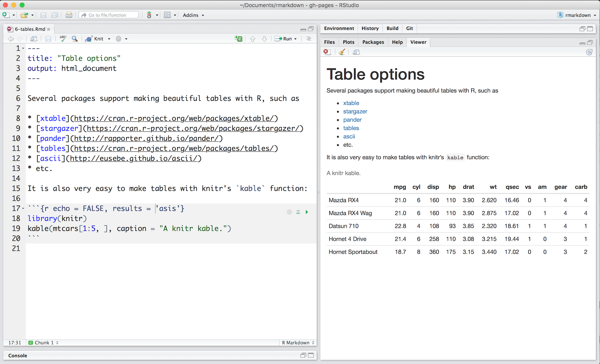

By default, R Markdown displays data frames and matrixes as they would be in the R terminal (in a monospaced font). If you prefer that data be displayed with additional formatting you can use the `knitr::kable` function, as in the [.Rmd file below](demos/6-tables.Rmd). 

Note the use of the `results='asis'` chunk option. This is required to ensure that the raw table output isn’t processed further by knitr.

***

## [Continue to Markdown Basics](lesson-8.html){.continue-link}
