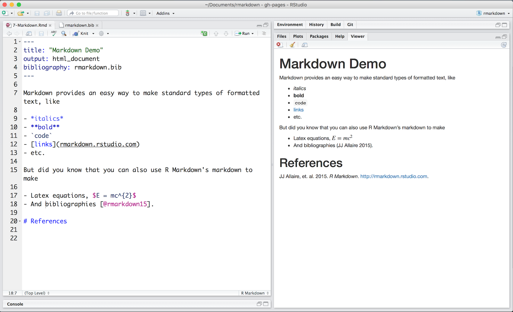

Format the text in your R Markdown file with [Pandoc's Markdown](authoring_pandoc_markdown.html), a set of markup annotations for plain text files. When you render your file, Pandoc transforms the [marked up text](demos/7-Markdown.Rmd) into formatted text in your final file format:

 

You can use Pandoc's Markdown to make:

* Headers
* Lists
* Links
* Images
* Block quotes
* Latex equations
* Horizontal rules
* Tables
* Footnotes
* Bibliographies and Citations
* Slide breaks
* Italicized text
* Bold text
* Superscripts
* Subscripts
* Strikethrough text

Read more about markdown at [Pandoc's Markdown](authoring_pandoc_markdown.html) or consult the quick reference in the [R Markdown Cheatsheet](https://www.rstudio.com/wp-content/uploads/2016/03/rmarkdown-cheatsheet-2.0.pdf).

***

## [Continue to Output Formats](lesson-9.html){.continue-link}

