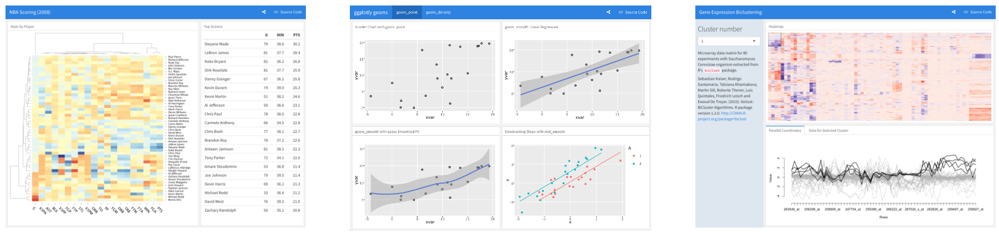
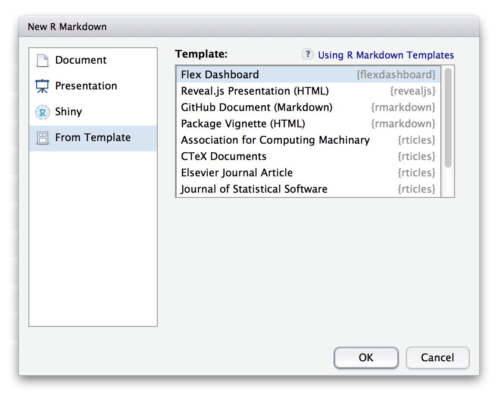
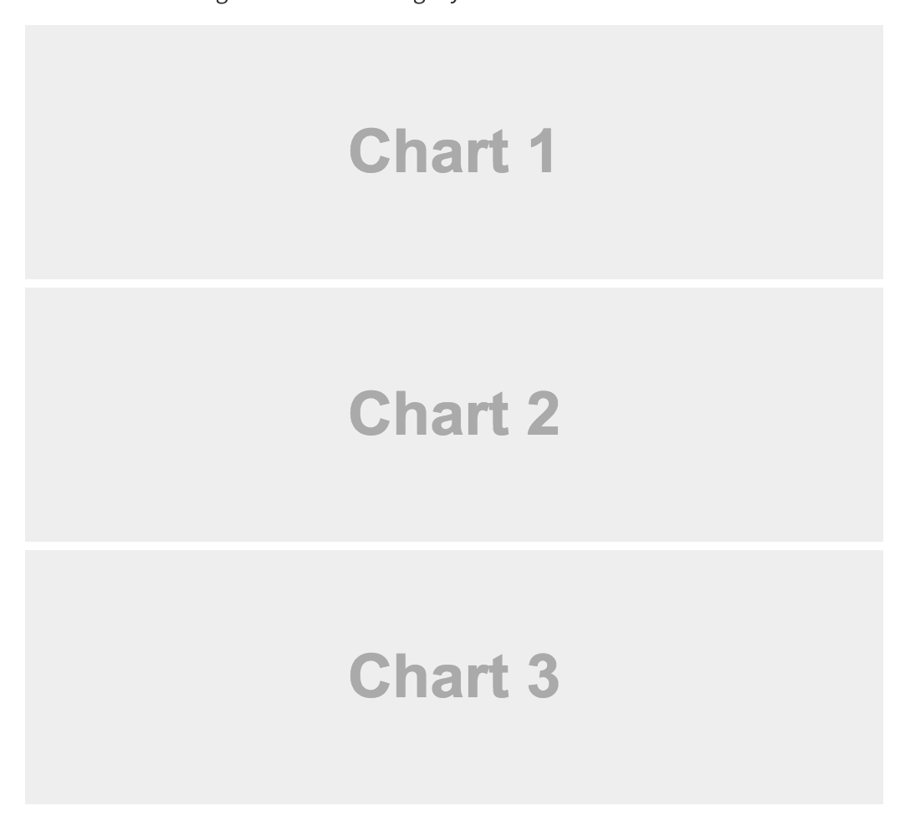
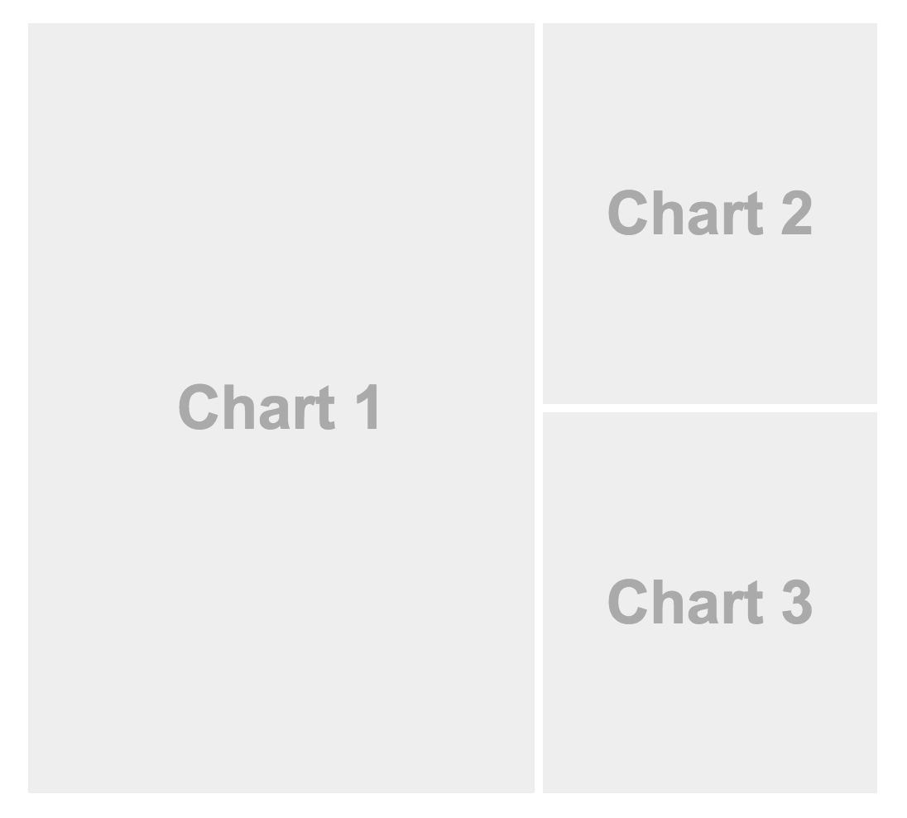
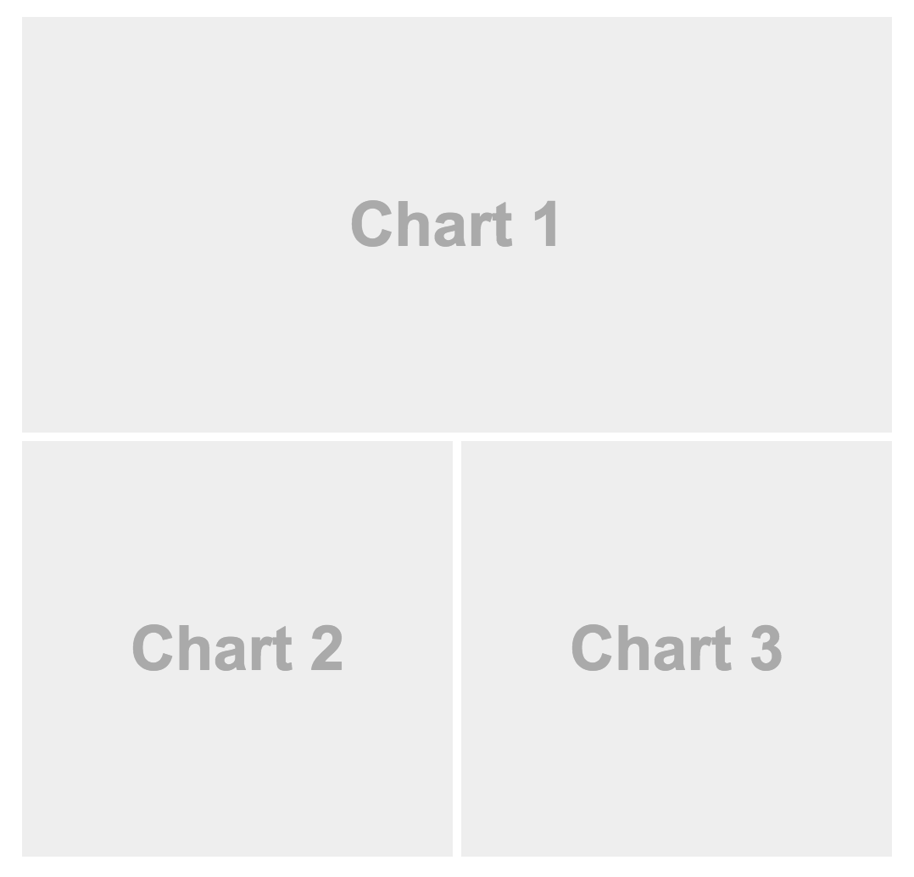
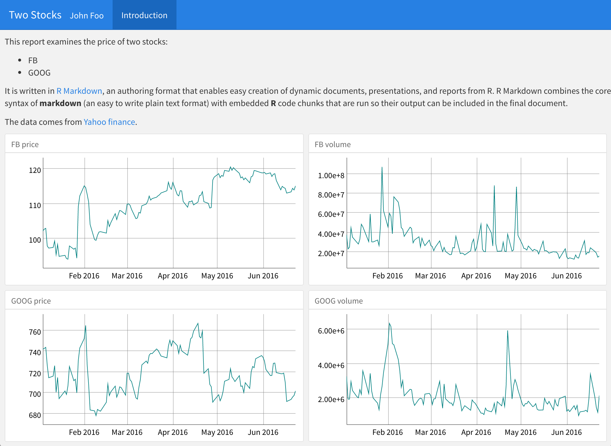

The **flexdashboard** package renders dashboards straight from your .Rmd files. Within your flexdashboard, you can place interactive JavaScript data visualizations based on [htmlwidgets](http://www.htmlwidgets.org), R graphics, tabular data, value boxes, gauges, and text annotations of various kinds.



To get started, install the flexdashboard package from CRAN as follows:

```r
install.packages("flexdashboard", type = "source")
```

To author a flexdashboard you create an [R Markdown](http://rmarkdown.rstudio.com) document with the `flexdashboard::flex_dashboard` output format, e.g. `output: flexdashboard::flex_dashboard`. You can do this from within RStudio using the **New R Markdown** dialog:

{width=579 height=465}

If you are not using RStudio, you can create a new `flexdashboard` R Markdown file from the R console:

```r
rmarkdown::draft("dashboard.Rmd", template = "flex_dashboard", package = "flexdashboard")
```

### Layout

#### Single Column

Dashboards group content into boxes that are separated by level 3 markdown headers (`###`). By default, dashboards are laid out within a single column, with boxes stacked vertically within a column and sized to fill available browser height. For example, this layout defines a single column with two charts that fills available browser space:

```{r echo = FALSE, comment = ""}
cat(htmltools::includeText("lesson9-examples/example-1.Rmd"))
```



#### Multiple Columns

You use level 2 markdown headers (`--------------` or `##`) to group boxes into separate columns. For example, this dashboard displays 3 charts split across two columns:

```{r echo = FALSE, comment = ""}
cat(htmltools::includeText("lesson9-examples/example-2.Rmd"))
```



#### Row Orientation

You can also choose to orient dashboards row-wise rather than column-wise by specifying the `orientation: rows` option. For example, this layout defines two rows, the first of which has a single chart and the second of which has two charts:

```{r echo = FALSE, comment = ""}
cat(htmltools::includeText("lesson9-examples/example-3.Rmd"))
```



## Exercise

Remove all of the line breaks from [your document](lesson-exercises/exercise-9.Rmd). Then turn it into a [flexdashboard](http://rmarkdown.rstudio.com/flexdashboard/) like the one below. The price graphs are in their own column, as are the volume graphs.

***



***

## Show Answer

## Model Answer

```{r echo = FALSE, comment = ""}
cat(htmltools::includeText("lesson-solutions/solution-9.Rmd"))
```
***
## [Continue to next lesson](lesson-10.html)
