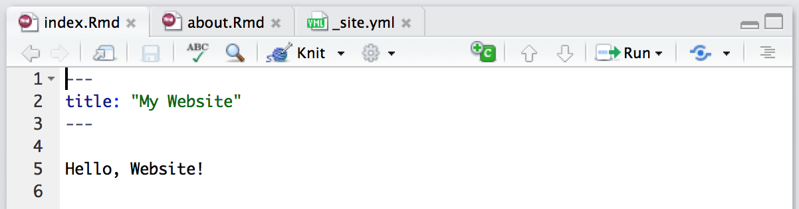
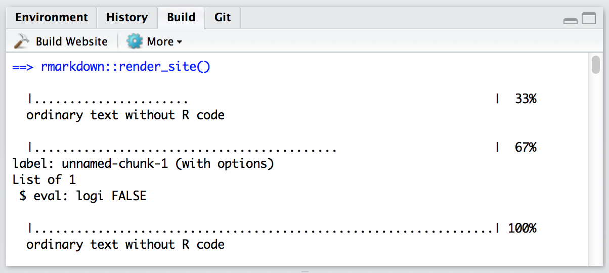
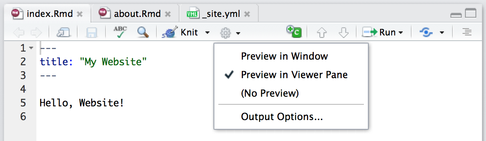

```{r setup, include=FALSE}
knitr::opts_chunk$set(echo = TRUE)
```

## Overview

You can render collections of R Markdown documents as a website using the `rmarkdown::render_site` function. This article describes the basics of creating websites with R Markdown and provides some examples which you can use as a starting point for your own websites.

The features described here are available only within the most recent version of the **rmarkdown** package (v0.9.6) which you can install from CRAN as follows:

```r
install.packages("rmarkdown")
```

The RStudio IDE also includes integrated support for developing R Markdown websites. These features are available in version 1.0 or higher of RStudio so you should be sure to update RStudio prior to using R Markdown websites. You can download the latest version of RStudio here: <https://www.rstudio.com/products/rstudio/download/>.

## Simple Example

To start with let's walk through a very simple example, a website that includes two pages (Home and About) and a navigation bar to switch between them:

**\_site.yml**

```yaml
name: "my-website"
navbar:
  title: "My Website"
  left:
    - text: "Home"
      href: index.html
    - text: "About"
      href: about.html
```

**index.Rmd**

```markdown
---
title: "My Website"
---

Hello, Website!
```

**about.Rmd**

```markdown
---
title: "About This Website"
---

More about this website.
```

Note that the minimum requirement for any website is that it have an `index.Rmd` file as well as a `_site.yml` file. If you execute the `rmarkdown::render_site` function from within the directory containing the website the following will occur:

1. All of the Rmd and md files in the root website directory will be rendered into HTML. Note however that markdown files beginning with "_" are not rendered (this is a convention to designate files that are included by top level documents).

2. The generated HTML files and any supporting files (e.g. CSS and JavaScript) are copied into an output directory (`_site` by default).

The HTML files within the `_site` directory are now ready to deploy as a standalone static website. 

The full source code for simple example above can be found here: <https://github.com/rstudio/rmarkdown-website-examples/tree/master/hello-website>.


## Site Authoring

### RStudio

RStudio includes a variety of features intended to make developing R Markdown websites more productive. These features are available in version 1.0 or higher of RStudio so you should be sure to update RStudio prior to using R Markdown websites. You can download the latest version of RStudio here: <https://www.rstudio.com/products/rstudio/download/>.

#### Website Project

Note that all of the RStudio features for website authoring described below require the use of an RStudio Project tied to your website's directory. See the documentation on [RStudio Projects](https://support.rstudio.com/hc/en-us/articles/200526207-Using-Projects) for additional information on how to create and use projects.

#### Individual Pages

As you work on the individual pages of your website you can render them using the **Knit** button just as you do with conventional standalone R Markdown documents:



Knitting an individual page will only render and preview that page, not the other pages in the website.

#### Entire Website

To render all of the pages in the website you use the **Build** pane, which calls `rmarkdown::render_site` to build and then preview the entire site:



#### Supporting Files

RStudio supports "live preview" of changes that you make to supporting files within your website (e.g. CSS, JavaScript, Rmd partials, R scripts, YAML config files, etc.). 

Changes to CSS and JavaScript files always result in a refresh of the currently active page preview. Changes to other files (e.g. shared scripts and config files) trigger a re-knit of the active page preview (this behavior can be disabled via the options dialog available from the Build pane). 

Note that only the active page is re-knit so once you are happy with the results of rendering you should be sure to rebuild the entire site from the **Build** pane to ensure that all pages inherit your changes.

#### Side by Side Preview

When working iteratively on a page you might find it more convenient to preview it side-by-side with the editor rather than in an external window. You can configure RStudio to do this using the options menu on the editor toolbar:



### Command Line

#### Rendering

If you aren't working within RStudio and/or want to build sites from the command line you can call the `render_site` function directly from within the website directory. Pass no arguments to render the entire site or a single file in order to render just that file:

```r
# render the entire site
rmarkdown::render_site()

# render a single file only
rmarkdown::render_site("about.Rmd")
```

#### Cleaning Up

To clean up all of the files generated via `render_site` you can call the `clean_site` function, which will remove all files generated by rendering your site's markdown documents including knitr `_cache` directories. You can specify the `preview = FALSE` option to just list the files to be removed rather than actually removing them:

```r
# list which files will be removed
rmarkdown::clean_site(preview = TRUE)

# actually remove the files
rmarkdown::clean_site()
```

### knitr Caching

If your website is time consuming to render you may want to enable [knitr caching](authoring_rcodechunks.html#caching) during the development of the site so that you can more rapidly preview changes. To enable caching for an individual chunk just add the `cache = TRUE` chunk option:

<pre class="markdown"><code>&#96;&#96;&#96;{r, cache = TRUE}
data <- longComputation()
&#96;&#96;&#96;
</code></pre>

To enable caching for an entire document add `cache = TRUE` to the global chunk option defaults:

<pre class="markdown"><code>&#96;&#96;&#96;{r setup, include=FALSE}
knitr::opts_chunk$set(cache=TRUE)
&#96;&#96;&#96;
</code></pre>

Note that when knitr caching is enabled for an Rmd it's `_files` directory will be copied rather than moved to the `_site` directory (since the cache requires references to generated figures in the `_files` directory).

## Common Elements

### Content

Typically when creating a website there are various common elements you want to include in all pages (e.g. output options, CSS styles, header and footer elements, etc.). Here's some additions to the example above that makes use of common elements:

**\_site.yml**

```yaml
name: "my-website"
navbar:
  title: "My Website"
  left:
    - text: "Home"
      href: index.html
    - text: "About"
      href: about.html
output:
  html_document:
    theme: cosmo
    highlight: textmate
    include:
      after_body: footer.html
    css: styles.css
```

**footer.html**

```html
<p>Copyright &copy; 2016 Skynet, Inc. All rights reserved.</p>
```

**styles.css**

```css
blockquote {
  font-style: italic
}
```

Note that we've included an `output` element within our **\_site.yml** file. This defines shared output options for all R Markdown documents within a site. Note that individual documents can also include their own output options, which will be merged with the common options at render time.

As part of our common output options we've specified an HTML footer (via the `include: after-body:` option) and CSS stylesheet. Note that you can also include HTML before the body or in the document `<head>`, see the documentation on [includes](html_document_format.html#includes) for more details.


In addition to whatever common options you define, the are two output options which are automatically set when rendering a site:

1. The `self_contained` option is set `FALSE`; and

2. The `lib_dir` option is set to `site_libs`.

These options are set so that dependent files (e.g jQuery, Bootstrap, HTML widget libraries, etc.) are shared across all documents within the site rather than redundantly embedded within each document.

### R Scripts

If you have R code that you'd like to share across multiple R Markdown documents within your site you can simply create an R script (e.g. "utils.R") and then source it within your Rmd files. For example:

<pre class="markdown"><code>&#96;&#96;&#96;{r}
source("utils.R")
&#96;&#96;&#96;
</code></pre>

### Rmd Partials

You may have common fragments of R Markdown that you want to share across pages within your site. To share Rmd fragments you should name them with a leading underscore (`_`) then include them within their parent Rmd document using the `child` chunk option. For example:

**about.Rmd**

<pre class="markdown">---
title: "About This Website"
---

More about this website.

<code>&#96;&#96;&#96;{r, child="_sessioninfo.Rmd"}
&#96;&#96;&#96;
</code></pre>

**\_sessioninfo.Rmd**

<pre class="markdown">Session information:

<code>&#96;&#96;&#96;{r}
sessionInfo()
&#96;&#96;&#96;
</code></pre>

The leading underscore is an indicator to the site generation engine that the Rmd is a partial document to be included in other documents so it's not Knit as a standalone document during site rendering.

The full source code for the above example can be found here: <https://github.com/rstudio/rmarkdown-website-examples/tree/master/common-elements>

## Site Navigation

The `navbar` element of **\_site.yml** can be used to define a common navigation bar for your website. You can include internal and external links on the navigation bar as well as drop-down menus for sites with a large number of pages.

Here's a navigation bar definition that makes use of a variety of features: 

**\_site.yml**

```yaml
name: "my-website"
navbar:
  title: "My Website"
  type: inverse
  left:
    - text: "Home"
      icon: fa-home
      href: index.html
    - text: "About"
      icon: fa-info
      href: about.html
    - text: "More"
      icon: fa-gear
      menu:
        - text: "Heading 1"
        - text: "Page A"
          href: page_a.html
        - text: "Page B"
          href: page_b.html
        - text: "---------"
        - text: "Heading 2"
        - text: "Page C"
          href: page_c.html
        - text: "Page D"
          href: page_d.html
  right:
    - icon: fa-question fa-lg
      href: https://example.com
```

This example demonstrates a number of capabilities of navigation bars:

1. You can use the `type` field to choose between the "default" and "inverse" navigation bar style (each theme includes distinct colors for "default" and "inverse" navigation bars).

2. You can align navigational items either to the `left` or to the `right`.

3. You can include menus on the navigation bar, and those menus can have separators (`text: "--------------"`) and internal headings (`text` without a corresponding `href`).

4. You can include both internal and external links on the navigation bar.

5. You can use icons on the navigation bar. Icons from three different icon sets are available.
    - [Font Awesome](https://fortawesome.github.io/Font-Awesome/icons/)
    - [Ionicons](http://ionicons.com/)
    - [Bootstrap Glyphicons](https://getbootstrap.com/components/#glyphicons)


    When referring to an icon you should use it's full name including the icon set prefix (e.g. "fa-github", "ion-social-twitter", "glyphicon-time", etc.). 

### HTML Navigation Bar {.toc-ignore}

If you want to have even more control over the appearance and behavior of the navigation bar you can define it in HTML rather than YAML. If you include a file named **\_navbar.html** in your website directory it will be used as the navigation bar. Here's an example of navigation bar defined in HTML: <https://github.com/rstudio/rmarkdown-website/blob/master/_navbar.html>.

Full documentation on syntax of Bootstrap navigation bars can be found here: <http://getbootstrap.com/components/#navbar>.


## HTML Generation

R Markdown includes many facilities for generation of HTML content from R objects, including:

- The conversion to HTML of standard R output types (e.g. textual output, plots, etc.) within code chunks done automatically by knitr.

- A variety of ways to generate HTML tables, including the `knitr::kable` function and the **xtable** package.

- A large number of available [HTML widgets](http://www.htmlwidgets.org) that provide rich JavaScript data visualizations.

As a result, for many R Markdown websites you won't need to worry about generating HTML output at all (since it's created automatically).

### htmltools Package {.toc-ignore}

If the facilities described above don't meet your requirements, you can also generate custom HTML from your R code using the **htmltools** package. The **htmltools** package enables you to write HTML using a convenient R based syntax (this is the same core HTML generation facility used by the [shiny](http://shiny.rstudio.com) package).

Here's an example of an R function that creates a [Bootstrap](https://getbootstrap.com) thumbnail div:

```r
library(htmltools)
thumbnail <- function(title, img, href, caption = TRUE) {
  div(class = "col-sm-4",
      a(class = "thumbnail", title = title, href = href,
        img(src = img),
        div(class = ifelse(caption, "caption", ""),
          ifelse(caption, title, "")
        )
      )
  )
}
```

You can write functions which build HTML like the one above then call them from other R code which combines them with your data to produce dynamic HTML. An R code chunk that makes use of this function might look like this:

<pre class="markdown"><code>&#96;&#96;&#96;{r, echo=FALSE}
thumbnail("Apple", "images/apple.png", "https://en.wikipedia.org/wiki/Apple")
thumbnail("Grape", "images/grape.png", "https://en.wikipedia.org/wiki/Grape")
thumbnail("Peach", "images/peach.png", "https://en.wikipedia.org/wiki/Peach")
&#96;&#96;&#96;
</code></pre>


## Site Configuration

The **\_site.yml** file has a number of options that affect site output including where it is written and what files are included and excluded from the site. Here's an example that makes use of a few of these options:

```yaml
name: "my-website"
output_dir: "_site"
include: ["import.R"]
exclude: ["docs.txt", "*.csv"]
```

The `name` field provides a suggested URL path for your website when it is published (by default this is just the name of the directory containing the site). 

The `output_dir` field indicates which directory to copy site content into ("_site" is the default if none is specified). Note that this can be "." to keep all content within the root website directory alongside the source code.

### Included Files {.toc-ignore}

The `include` and `exclude` fields enable you to override the default behavior visa-vi what files are copied into the output directory. By default, all files within the website directory are copied into the output directory (e.g. "_site") save for the following:

1. Files beginning with "." (hidden files).

2. Files beginning with "_"

3. Files known to contain R source code (e.g. ".R", ".s", ".Rmd"), R data (e.g. ".RData", ".rds"), or configuration data (e.g. ".Rproj", "rsconnect")).

The `include` and `exclude` fields of **\_site.yml** can be used to override this default behavior (wildcards can be used to specify groups of files to be included or excluded).

Note that `include` and `exclude` are *not* used to determine which Rmd files are rendered (all of them in the root directory save for those named with the `_` prefix will be rendered).

## Publishing Websites

R Markdown websites are static HTML sites that can be deployed to any standard web server. All site content (generated documents and supporting files) are copied into the `_site` directory so deployment is simply a matter of moving that directory to the appropriate directory of a web server.

This section provides additional documentation on publishing websites to several popular hosting services. 

### GitHub Pages {.toc-ignore}

R Markdown websites are can be hosted using [GitHub Pages](https://pages.github.com/) with two additions to the standard site configuration:

1. Add a file named `.nojekyll` to your site source code directory (this tells GitHub Pages to not process your site with the Jekyll engine).

2. Change your output directory to "." within **\_site.yml**. For example:

        output_dir: "."
      
This keeps all of your output side-by-side with your source code in the root of your website (rather than writing it to the `_site` directory).
   
Note that when deploying to GitHub Pages using this configuration your source code, data, and everything else in your repository is all publicly available alongside your generated website content.

Alternatively, you can [configure GitHub Pages](https://help.github.com/articles/configuring-a-publishing-source-for-github-pages/#publishing-your-github-pages-site-from-a-docs-folder-on-your-master-branch) to publish from a `/docs` subdirectory of your repository. If you work in this configuration you should change your output directory to "docs" within **\_site.yml**. For example:

        output_dir: "docs"
      
You can find an example of a minimal R Markdown website configured for publishing to GitHub Pages here: <https://github.com/rstudio/rmarkdown-website-examples/tree/master/gh-pages>.

### Amazon S3 {.toc-ignore}

If you have an [Amazon Web Services](http://aws.amazon.com/) account, you can deploy your R Markdown website directly to the S3 storage service. S3-based websites have global replication, support custom domains, and can be accelerated via the use of the Amazon CloudFront CDN.

For additional information on deploying websites to S3 see: <http://docs.aws.amazon.com/gettingstarted/latest/swh/website-hosting-intro.html>.

### Other Web Hosts {.toc-ignore}

There are a wide variety of options for static web hosting, all of which are compatible with R Markdown websites. This guide includes an overview of several of the more popular services: <http://alignedleft.com/resources/cheap-web-hosting>.


## Additional Examples

Here are some additional examples of websites created with R Markdown: 

Site|Description|Source
|----------|--------------------------------------------------|---------|
[rmarkdown](http://rmarkdown.rstudio.com) | This website was created using R Markdown. There are a large number of pages (over 40) that are organized using sub-menus on the navigation bar. Disqus comments are included on each page via an after_body include.| [View code](https://github.com/rstudio/rmarkdown/tree/gh-pages) 
[flexdashboard](https://rstudio.github.io/flexdashboard) | Documentation for the flexdashboard R package. Illustrates using an R script to dynamically generate HTML thumbnails of flexdashboard examples from YAML. | [View code](https://github.com/rstudio/flexdashboard/tree/gh-pages)
[bookdown](https://bookdown.org) | Home page for the bookdown R package and publishing service. Illustrates creating a site with a completely custom theme (no use of Bootstrap). | [View code](https://github.com/rstudio/bookdown/tree/master/inst/homepage)


