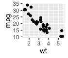

This is an R Markdown Notebook.

```{r chunk-one}
summary(cars)
```

This is a plot.

```{r chunk-two}
plot(cars)
```

This plot is static.



This is an HTML widget.

```{r chunk-three}
if (requireNamespace("dygraphs", quietly = TRUE)) {
  dygraphs::dygraph(nhtemp, main = "New Haven Temperatures") %>% 
    dygraphs::dyRangeSelector(dateWindow = c("1920-01-01", "1960-01-01"))
}
```

```{r chunk-four}
# The R code in here is ignored; we're
# just going to inject some arbitrary HTML.
```

For more details on using R Markdown see <http://rmarkdown.rstudio.com>.
