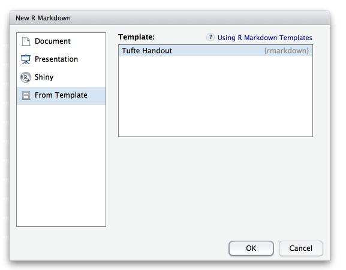

## Overview

Tufte Handouts are documents formatted in the style that Edward Tufte uses in his books and handouts. Tufte’s style is known for its extensive use of sidenotes, tight integration of graphics with text, and well-set typography:

<div class="row">
<div class="thumbnail span9 offset1">

</div>
</div>

<br/>

Tufte Handouts can create either HTML or PDF output. You can see a full examples documents produced with the Tufte Handout template here:

* [Tufte Handout (HTML)](http://rstudio.github.io/tufte/)
* [Tufte Handout (PDF)](examples/tufte-handout.pdf)

These documents serve not only as examples but also documention of the various techniques used for formatting footnotes, sidenotes, figures, tables, etc.

## Getting Started

### Installation

Note that the `tufte_handout` format is not contained within the **rmarkdown** package but rather in a separate **tufte** package. You can use this format in R Markdown documents by installing this package as follows:

```r
install.packages("tufte")
```

### Creating a Handout

You can create a new Tufte Handout from within the RStudio **New R Markdown** dialog:



If you are not using RStudio then you can use the `rmarkdown::draft` function as follows:

```{r, eval=FALSE}
library(rmarkdown)
draft("my_handout.Rmd", template = "tufte_html", package = "tufte")
```

The newly created document will include the various HTML and LaTeX based tufte handout formats as shown here:

    ---
    title: "Tufte Handout"
    subtitle: "An implementation in R Markdown"
    author: "JJ Allaire and Yihui Xie"
    date: "`r Sys.Date()`"
    output:
      tufte::tufte_html: default
      tufte::tufte_handout:
        citation_package: natbib
        latex_engine: xelatex
      tufte::tufte_book:
        citation_package: natbib
        latex_engine: xelatex
    bibliography: skeleton.bib
    link-citations: yes
    ---

## Figure Options

There are a number of options that affect the output of figures within PD documents:

* `fig_width` and `fig_height` can be used to control the default figure width and height (6 x 4.5 is used by default)

* `fig_crop` controls whether the the pdfcrop utility (if available) is automatically applied to pdf figures (this is true by default).

For example:

    ---
    title: "Tufte Handout"
    output:
      tufte::tufte_handout:
        fig_width: 4
        fig_height: 4
    ---

## Syntax Highlighting

The `highlight` option specifies the syntax highlighting style. Supported styles include "default", "tango", "pygments", "kate", "monochrome", "espresso", "zenburn", and "haddock" (specify null to prevent syntax highlighting):

For example:

    ---
    title: "Tufte Handout"
    output:
      tufte::tufte_handout:
        highlight: tango
    ---

## Advanced Customization

### Intermediate TeX

R Markdown documents are converted to PDF by first converting to a TeX file and then calling the LaTeX engine to convert to PDF. By default this TeX file is removed, however if you want to keep it (e.g. for an article submission) you can specify the `keep_tex` option. For example:

    ---
    title: "Tufte Handout"
    output:
      tufte::tufte_handout:
        keep_tex: true
    ---

### Includes

You can do more advanced customization of PDF output by including additional LaTeX directives and/or content or by replacing the core pandoc template entirely. To include content in the document header or before/after the document body you use the `includes` option as follows:

    ---
    title: "Tufte Handout"
    output:
      tufte::tufte_handout:
        includes:
          in_header: header.tex
          before_body: doc_prefix.tex
          after_body: doc_suffix.tex
    ---

### Pandoc Arguments

If there are pandoc features you want to use that lack equivilants in the YAML options described above you can still use them by passing custom `pandoc_args`. For example:

    ---
    title: "Tufte Handout"
    output:
      tufte::tufte_handout:
        pandoc_args: [
          "--no-tex-ligatures"
        ]
    ---

Documentation on all available pandoc arguments can be found in the [pandoc user guide](http://johnmacfarlane.net/pandoc/README.html#options).

## Shared Options

If you want to specify a set of default options to be shared by multiple documents within a directory you can include a file named `_output.yaml` within the directory. Note that no YAML delimeters or enclosing output object are used in this file. For example:

**\_output.yaml**

```yaml
tufte::tufte_handout:
  toc: true
```

All documents located in the same directory as `_output.yaml` will inherit it's options. Options defined explicitly within documents will override those specified in the shared options file.


